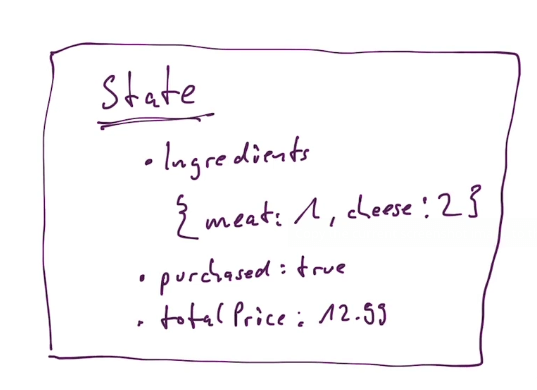
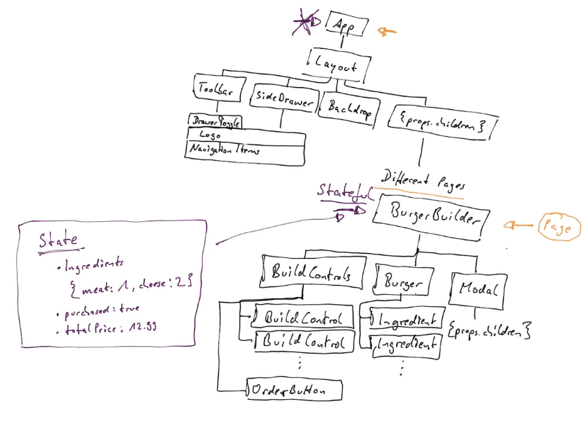

## Where manage state

So the `BurgerBuilder` should be a **stateful** component.

Why? Because the state I listed here on the right is really just related to building a burger, if we later add a new check out page or something like that, then we will basically have a page where we want to see all orders of the user, and we're not interested of the ingredients of the burger the user currently builds.

All other components can be dumb components, `stateless` components.

Now the `App` component by default in the new project is a `stateful` one, created with the class keyword. We can of course always leave it to be one, but we can also turn it into a dumb component if we wanted to.

Now if we're thinking about `pureComponents` or `shouldComponentUpdate`, we'll both as a rule implement this as we built the application and see if we can identify some places where we need to optimize our update cycle. But due to the simplicity of our state and the structure of our application here, it might also be the case that we never need to implement pure component because we know that if the state or some props changes, it did really change, that we don't have a button which might just set the state to something it was already at.
