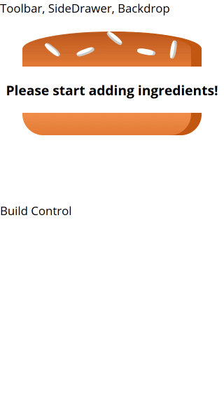

## Burger.js

```jsx title="Burger.js" {6,11-18}
import React from "react";
import classes from "./Burger.module.css";
import BurgerIngredient from "./BurgerIngredient/BurgerIngredient";

const burger = (props) => {
  let transformedIngredients = Object.keys(props.ingredients)
    .map((igKey) => {
      return [...Array(props.ingredients[igKey])].map((_, i) => {
        return <BurgerIngredient key={igKey + i} type={igKey} />;
      });
    })
    .reduce((arr, el) => {
      return arr.concat(el);
    }, []);
  console.log(transformedIngredients);
  if (transformedIngredients.length === 0) {
    transformedIngredients = <p>Please start adding ingredients!</p>;
  }
  return (
    <div className={classes.Burger}>
      <BurgerIngredient type="bread-top" />
      {transformedIngredients}
      <BurgerIngredient type="bread-bottom" />
    </div>
  );
};

export default burger;
```

## BurgerBuilder.js

```jsx title="BurgerBuilder.js" {11-14}
import React, { Component, Fragment } from "react";
import Burger from "../components/Burger/Burger";

class BurgerBuilder extends Component {
  // constructor(props) {
  //     super(props);
  //     this.state = {...}
  // }
  state = {
    ingredients: {
      salad: 0,
      bacon: 0,
      cheese: 0,
      meat: 0,
    },
  };
  render() {
    return (
      <Fragment>
        <Burger ingredients={this.state.ingredients} />
        <div>Build Control</div>
      </Fragment>
    );
  }
}
export default BurgerBuilder;
```
