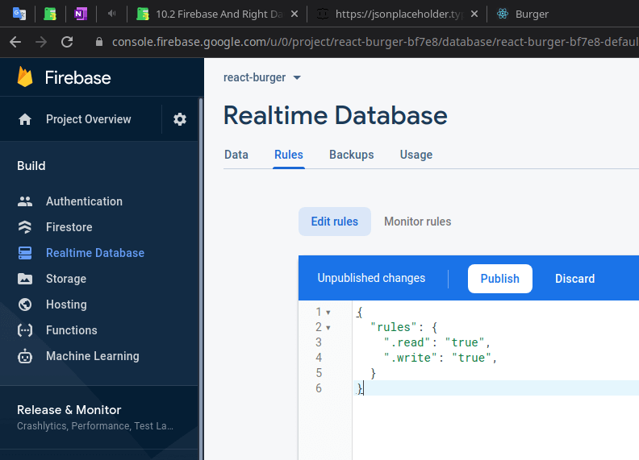

## Project Configure

Google Firebase Console: <a href='https://console.firebase.google.com/u/0/project/react-burger-bf7e8/database/react-burger-bf7e8-default-rtdb/rules' class='external'>console.firebase.google.com: Rules</a>

Now for this to be available, there's one thing we need to set up under rules here, on database rules you should set read and write access simply to `true` (and then press `Publish`):

