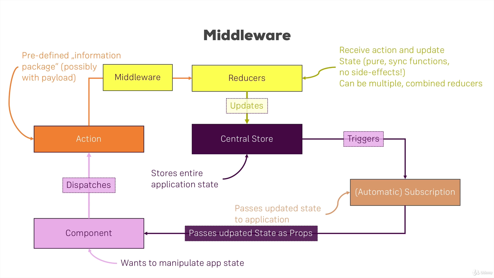

## `index.js`

```jsx title="index.js" {4,16-27}
import React from "react";
import ReactDOM from "react-dom";
import { Provider } from "react-redux";
import { applyMiddleware, combineReducers, createStore } from "redux";
import App from "./App";
import "./index.css";
import registerServiceWorker from "./registerServiceWorker";
import counterReducer from "./store/reducers/counter";
import resultReducer from "./store/reducers/result";

const rootReducer = combineReducers({
  ctr: counterReducer,
  res: resultReducer,
});

const logger = (store) => {
  return (next) => {
    return (action) => {
      console.log("[Middleware] Dispatching", action);
      const result = next(action);
      console.log("[Middleware] next state", store.getState());
      return result;
    };
  };
};

const store = createStore(rootReducer, applyMiddleware(logger));

ReactDOM.render(
  <Provider store={store}>
    <App />
  </Provider>,
  document.getElementById("root")
);
registerServiceWorker();
```
