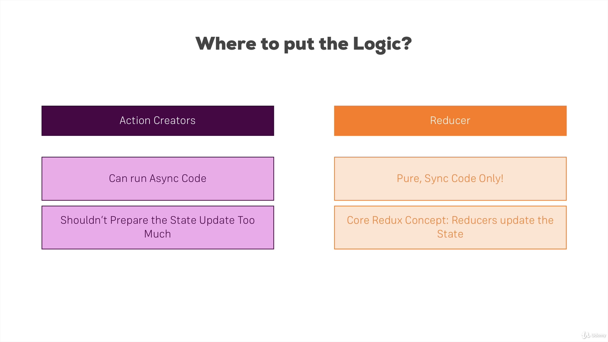

## `result.js` in Action Creators

```jsx title="src\store\actions\result.js" {4}
import * as actionTypes from "./actionTypes";

export const saveResult = (res) => {
  // const updatedResult = res * 2
  return {
    type: actionTypes.STORE_RESULT,
    result: res,
  };
};

export const storeResult = (res) => {
  return (dispatch) => {
    setTimeout(() => {
      dispatch(saveResult(res));
    }, 2000);
  };
};

export const deleteResult = (resElId) => {
  return {
    type: actionTypes.DELETE_RESULT,
    resultElId: resElId,
  };
};
```

## `result.js` in Reducer

```jsx title="src\store\reducers\result.js" {10}
import * as actionTypes from "../actions/actionTypes";

const initialState = {
  results: [],
};

const reducer = (state = initialState, action) => {
  switch (action.type) {
    case actionTypes.STORE_RESULT:
      // Change data
      return {
        ...state,
        results: state.results.concat({ id: new Date(), value: action.result }),
      };
    case actionTypes.DELETE_RESULT:
      // const id = 2;
      // const newArray = [...state.results];
      // newArray.splice(id, 1);
      const updatedArray = state.results.filter(
        (result) => result.id !== action.resultElId
      );
      return {
        ...state,
        // results: newArray,
        results: updatedArray,
      };
    default:
  }
  return state;
};

export default reducer;
```
