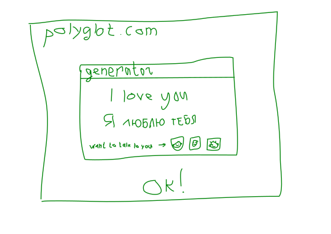

Development and implementation of API for interaction between social networks and training portals.

1. Social network (WordPress CMS <a href='https://cupidrus.com/datingsite/?renc=msg&id=SWN4MDV3UHZLbGZ5amloL3pJSGVOdz09' class='external'>cupidrus.com</a>)

## Abstraction Levels

- front-end and back-end: site with login database ( )
- API which can embed:
  - generator
  - data blocks
- Interface for embedding (like CodePen <a href='https://css-tricks.com/change-color-of-svg-on-hover/#svg-symbol-use' class='external'>css-tricks.com</a>)

## Code Embedded in Love


Excessive motivation:

- You are looking for a husband/wife of a foreigner. You go to foreign love chats and speak their native language.
- You are looking for a sex partner. If he/she lives near you (in your city), the foreign language will be an additional barrier.
- In both, you won't talk to anyone.

## Love Embedded in Code

]

Additional motivation:

- You are studying a foreign language. You are looking for a conversation. You are not interested in a relationship. But if you like a partner, then why not?
- You will talk to anyone!

### Love Editor

```jsx live
function tick() {
  const element = (
    <div>
      <h1>Hello, world!</h1>
      <h2>It is {new Date().toLocaleTimeString()}.</h2>
    </div>
  );
  // highlight-next-line
  ReactDOM.render(element, document.getElementById('root'));
}

setInterval(tick, 1000);
```

```jsx live
function Clock(props) {
  const [date, setDate] = useState(new Date());
  useEffect(() => {
    var timerID = setInterval(() => tick(), 1000);

    return function cleanup() {
      clearInterval(timerID);
    };
  });

  function tick() {
    setDate(new Date());
  }

  return (
    <div>
      <h2>It is {date.toLocaleTimeString()}.</h2>
    </div>
  );
}

```
