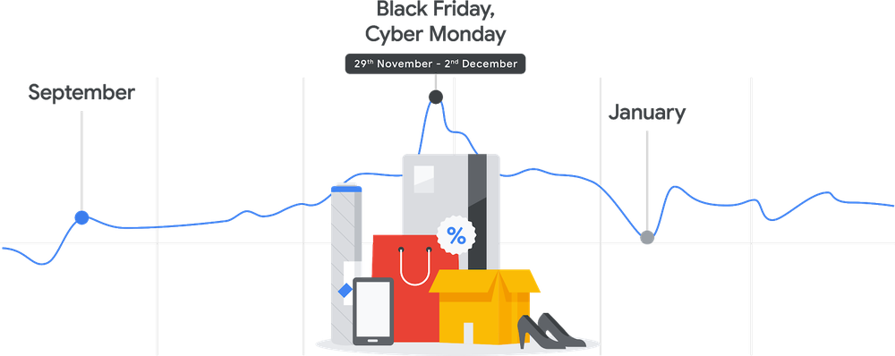

 Build your PC with the right components at the rigth time!

## Architecture

- [motherboard](motherboard)
- [cpu](cpu)
- [memory](memory)
- [disk](disk)
- [sets](sets)

## Video Card

- [video card](videocard)

## Housing

- [cables](cables)
- [adapters](adapters)
- [power supply](power-supply)
- [housing](housing)
- [coolers](coolers)

## Peripherals

- [keyboard](keyboard)
- [mouse](mouse)
- [wi-fi](wi-fi)
- [webcam](webcam)
- [audio speakers](audio-speakers)
- [headphones](headphones)
- [microphone](microphone)

## Display

- [display](display)

## Network

- [network](network)

## Consumables

- [thermal paste](thermal-paste)

## Read more

- [New computer build](new-computer-build)
- [Videos](videos)

## Cashback

[YooMoney](https://yoomoney.ru/promo/offer/4164-aliexpress?viewId=35ed027c-5ff6-c4e4-ce58-2dbb000f0000)

## Track

[GdePosylka](#)
