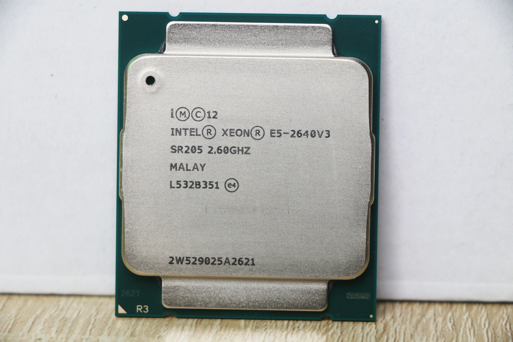
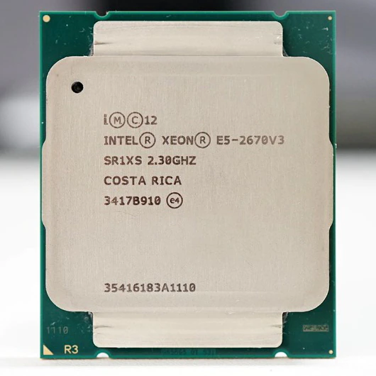
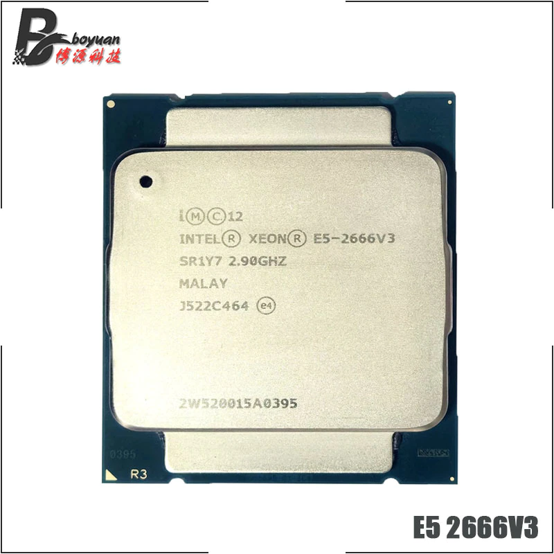
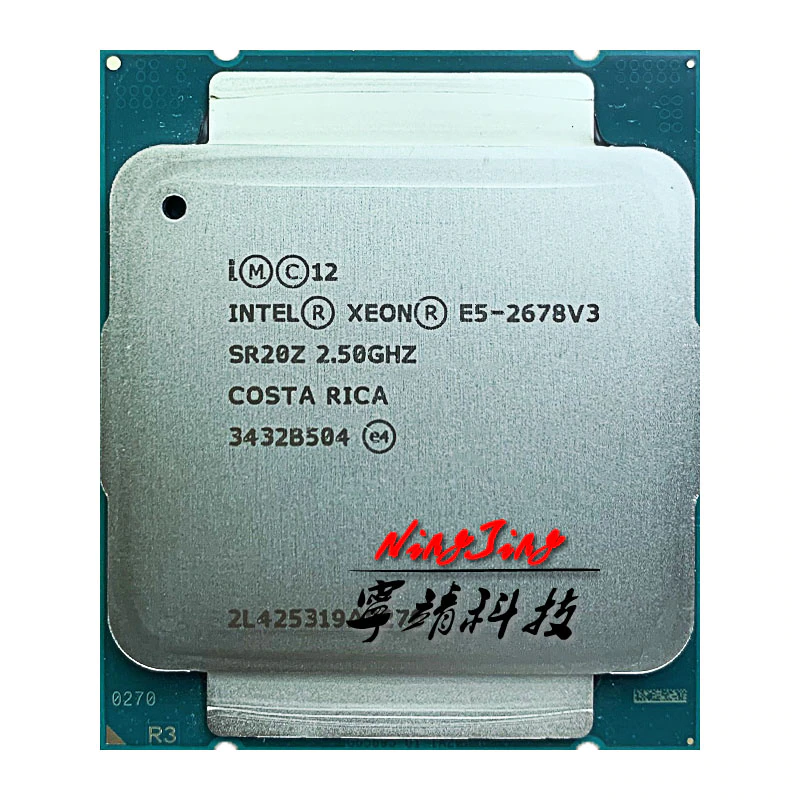
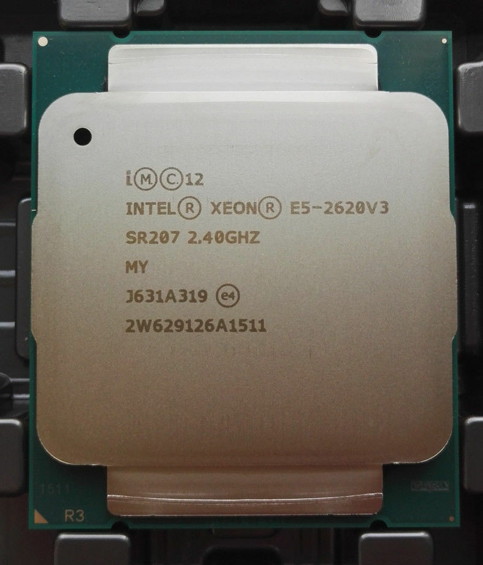
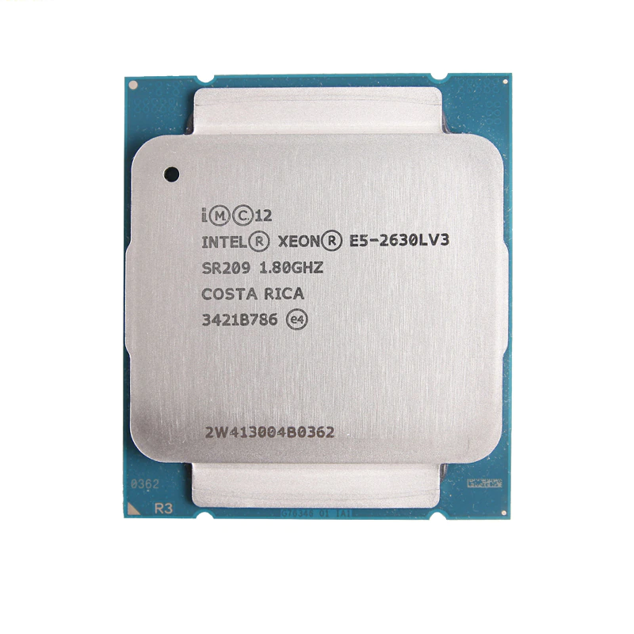

## Price Dynamics

### 2023

<small class="tab-img-w-200 col-w-0">

| # | name | photo | store | 2023/01 | 2023/02 | 2023/03 | 2023/04 | 2023/05 |
| --- | --- | --- | --- | --- | --- | --- | --- | --- |
| 4 | E5-2640V3 |  | [5](https://aliexpress.ru/item/1005004534402848.html 'YZSH Store') | 01:1294 02:1294 03:1298 04:1318 05:1422 06:1344 07:1347 08:1347 09:1277 10:1235 11:1247 12:1216 13:1206 14:1271 15:1271 16:1225 17:1218 18:1234 19:1232 20:1203 21:1204 22:1204 23:1201 24:1204 25:1206 26:1223 27:1220 28:1220 29:1220 30:1305 31:1323 | 01:1316 02:1309 03:1318 04:1317 05:1317 06:1319 07:1329 08:1332 09:1371 10:1364 11:1333 12:1333 13:1283 14:1291 15:1290 16:1309 17:1313 18:1365 19:1340 20:1328 21:1261 22:1228 23:1234 24:1235 25:1240 26:1240 27:1247 28:1228 | 01:1248 02:1245 03:1251 04:1250 05:1165 06:1113 08:1114 10:946 11:949 14:995 16:911 18:918 20:807 22:805 24:797 28:824 | 02:810 06:837 14:760 25:760 | 15:735 |
| 5 | E5-2670V3 |  | [6](https://aliexpress.ru/item/1005004535907493.html 'SZNU Store') | 01:1331 02:1331 03:1335 04:1355 05:1360 06:1383 07:1385 08:1385 09:1313 10:1270 11:1282 12:1250 13:1240 14:1307 15:1307 16:1260 17:1253 18:1269 19:1267 20:1237 21:1238 22:1238 23:1235 24:1239 25:1240 26:1257 27:1254 28:1255 29:1255 30:1342 31:1360 | 01:1353 02:1346 03:1355 04:1355 05:1355 06:1357 07:1367 08:1370 09:1410 10:1403 11:1401 12:1401 13:1348 14:1356 15:1356 16:1375 17:1380 18:1434 19:1452 20:1341 21:1273 22:1114 23:1119 24:1121 25:1125 26:1125 27:1131 28:1114 03:1200 | 01:1198 02:1195 03:1200 04:1199 05:1165 06:1113 08:1090 10:1115 11:1118 14:1173 16:915 18:922 20:863 22:861 24:853 28:882 | 02:894 06:923 14:763 25:813 | 15:733 |
| 6 | E5-2666V3 |  | [7](https://aliexpress.ru/item/1005003644967394.html 'BY168 Store') | 01:2298 02:2298 03:2305 04:2340 05:2348 06:2387 07:2392 08:2392 09:2267 10:2193 11:2213 12:2158 13:2142 14:2256 15:2256 16:2176 17:2163 18:2190 19:2188 20:2136 21:2137 22:2137 23:2132 24:~~2138~~ 25:~~2141~~ 26:~~2171~~ 27:~~2166~~ 28:~~2166~~ 29:~~2166~~ 30:~~2317~~ 31:~~2348~~ | 01:~~2336~~ 02:~~2324~~ 03:~~2340~~ 04:2572 05:2572 06:2577 07:2478 08:2483 09:~~not~~ 10:2441 11:2357 12:2357 13:2268 14:2282 15:2195 16:~~sold~~ ... 20:2303 21:2162 22:2156 23:2166 24:2169 25:2177 26:2177 27:2188 28:2155 | 01:2350 02:2337 03:2349 04:2346 05:2346 06:2241 08:2183 10:2233 11:2240 14:2349 16:2357 18:2375 20:2223 22:2188 24:2136 28:2207 | 02:2237 06:2311 14:2204 25:2268 | 15:2141 |

</small>

### 2022

<small class="tab-img-w-100 col-w-0">

| # | name | photo | store | 2022/11 | 2022/12 |
| --- | --- | --- | --- | --- | --- |
| 4 | E5-2640V3 |  | [5](https://aliexpress.ru/item/1005004534402848.html 'YZSH Store') | 01:1079 10:1100 11:1066 13:1126 14:1123 16:1201 17:1196 18:1205 19:1341 20:1341 21:1343 22:1353 23:1341 24:1290 25:1290 26:1290 27:1290 28:1292 29:1313 30:1309 | 01:1291 02:1299 03:1303 04:1233 05:1250 06:1249 07:1254 08:1247 09:1244 10:1242 11:1242 12:1242 13:1253 14:1257 15:1264 16:1272 17:1273 18:1273 19:1285 20:1322 21:1322 22:1388 23:1388 25:1323 26:1365 27:1342 28:1386 29:1374 30:1354 31:1328 |
| 5 | E5-2670V3 |  | [6](https://aliexpress.ru/item/1005004535907493.html 'SZNU Store') | 01:907 10:954 11:924 13:976 14:974 16:1182 17:1177 18:1186 19:1170 20:1170 21:1172 22:1316 23:1305 24:1255 25:1255 26:1255 27:1255 28:1258 29:1278 30:1274 | 01:1291 02:1299 03:1303 04:1226 05:1243 06:1242 07:1247 08:1240 09:1237 10:1235 11:1235 12:1235 13:1246 14:1250 15:1268 16:1276 17:1277 18:1277 19:1289 20:1326 21:1326 22:1392 23:1298 25:1284 26:1325 27:1303 28:1346 29:1413 30:1392 31:1365 |
| 6 | E5-2666V3 |  | [7](https://aliexpress.ru/item/1005003644967394.html 'BY168 Store') | 01:2137 10:1796 11:1739 13:1837 14:1832 16:1814 17:1806 18:1820 19:1821 20:1821 21:1825 22:1837 23:1821 24:1752 25:1752 26:1849 27:1849 28:1853 29:1882 30:1876 | 01:1959 02:1971 03:~~sold~~ 04:1977 05:2003 06:2003 07:2010 08:2000 09:1994 10:2043 11:2043 12:2096 13:2114 14:2121 15:2152 16:2165 17:2167 18:2167 19:2188 20:2250 21:2250 22:2362 23:2274 25:2251 26:2323 27:2284 28:2358 29:2440 30:2403 31:2357 |

</small>

### 2021

<small class="tab-img-w-100 col-w-0">

| # | name | photo | store | 2021/01 |
| --- | --- | --- | --- | --- |
| 1 | E5-2678V3 |  | [1](https://aliexpress.ru/item/4000414556215.html 'CPU Store') [2](https://aliexpress.ru/item/4000756196146.html 'SZCPU Store') | 01:6879 04:6908 05:7063 09:7126 15:6963 |
| 2 | E5-2620V3 |  | [3](https://aliexpress.ru/item/4000265198909.html 'CPU Top Store') [4](https://aliexpress.ru/item/4000081460972.html 'JSF CPU Technologies Co Ltd store') | 04:1628 05:1634 09:1749 15:1709 |
| 3 | E5-2630LV3 |  | [3](https://aliexpress.ru/item/1005001870728450.html 'CPU Top Store') | 15:1431 |

</small>

## Camparison

<small class="col-1b-maxw-100 col-w-0">

| CPU | Intel Xeon E5-2640V3 | Intel Xeon E5-2670V3 | Intel Xeon E5-2666V3 |
| --- | --- | --- | --- |
| Photo |  |  |  |
| Vertical Segment | Server | Server | Server |
| Status | Launched | Discontinued |  |
| Introduction date | Q3'2014 | Q3'2014 | Q1'2015 |
| Lithography | 22 nm | 22 nm | 22 nm |
| Use Conditions | Server/Enterprise |  |  |
| Price at introduction | $939 | $1589 |  |
| Total Core | 8 | 12 | 10 |
| Total Threads | 16 | 24 | 20 |
| Max Turbo Frequency | 3.40 GHz | 3.10 GHz | 3.50 GHz |
| Processor Base Frequency | 2.60 GHz | 2.30 GHz | 2.90 GHz |
| Cache | 20 MB | 30 MB | 25 MB |
| Bus speed | 8 GT/s | 9.6 GT/s | ? |
| TDP | 90 W | 120 W | 135 W |
| Max memory size | 768 GB | 768 GB | 768 GB |
| Memory type | DDR4 1600/1866 | DDR4 1600/1866/2133 | DDR4 1600/1866/2133 |
| Max # of Memory Channels | 4 | 4 | 4 |
| Max Memory Bandwidth | 59 GB/s | 68 GB/s | 68 GB/s |
| Physical Address Extensions | 46-bit | 46-bit |  |
| ECC Memory Supported | Yes | Yes | Yes |
| PCIe Revision | 3.0 | 3.0 | 3.0 |
| PCIe Configuration Support | x4, x8, x16 | x4, x8, x16 | x4, x8, x16 |
| Sockets upported | LGA2011-3 | LGA2011-3 | LGA2011-3 |
| Max temperature | 74.3°C | 84.5°C | 79°C |
| Recommended Power Supply Unit |  |  | 650W |

[camparison all 3 above (with benchmarks)](https://www.chaynikam.info/cpu_comparison.html?Xeon_E5-2640_v3&Xeon_E5-2670_v3&Xeon_E5-2666_v3)

</small>
