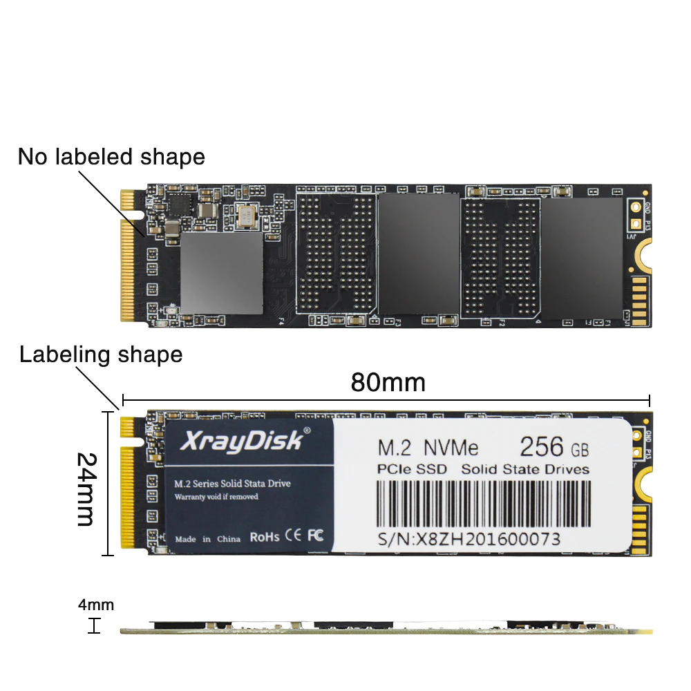
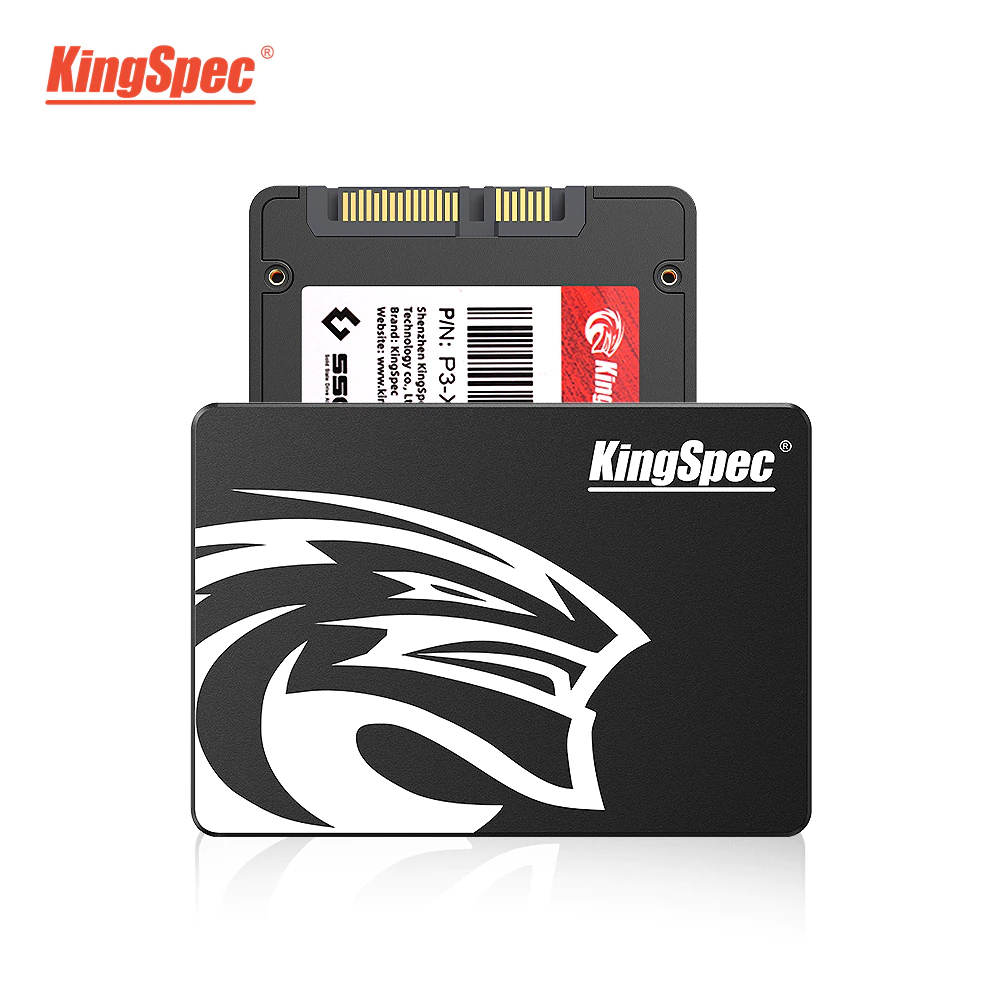
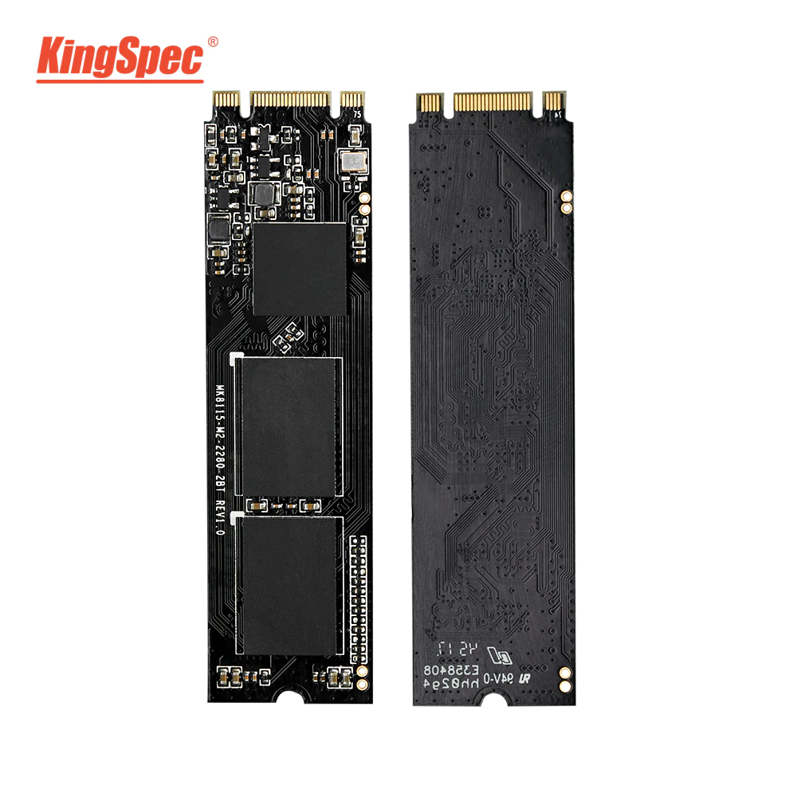
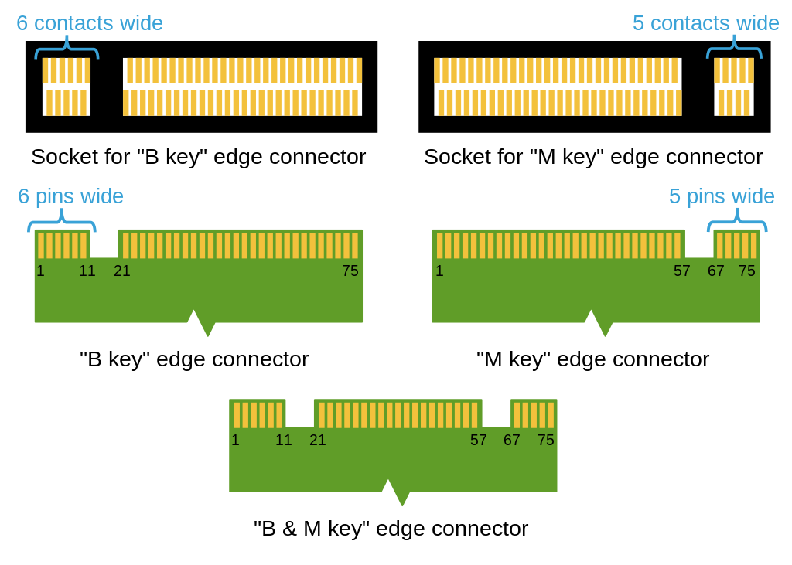

## Price Dynamics

### 2023

<small class="tab-img-w-200 col-w-0">

| # | name | photo | store | 2023/01 | 2023/02 | 2023/03 | 2023/04 | 2023/05 |
| --- | --- | --- | --- | --- | --- | --- | --- | --- |
| 4 | m2 nvme (PCIe3.0x4) 2280 240Gb ~~256Gb~~ |  | [5](https://aliexpress.ru/item/4000956226768.html 'Xraydisk Official Store') | 01:1432 02:1432 03:1437 04:1458 05:1463 06:1488 07:1491 08:1491 09:1392 10:1346 11:1359 12:1325 13:1315 14:1406 15:1406 16:1356 17:1348 18:1365 19:1363 20:1331 21:1332 22:1332 23:1329 24:1333 25:1334 26:1353 27:1350 28:1350 29:1350 30:1444 31:1464 | 01:1456 02:1448 03:1458 04:1457 05:1457 06:1460 07:1471 08:1474 09:1517 10:1509 11:1507 12:1507 13:1450 14:1459 15:1459 16:1479 17:1485 18:1543 19:1543 20:1530 21:1453 22:1449 23:1455 24:1458 25:1463 26:1463 27:1471 28:1448 | 01:1579 02:1575 03:1583 04:1581 05:1581 06:1488 08:1490 10:1523 11:1528 14:1627 16:1632 18:1645 20:1400 22:1398 24:1384 28:1573 | 02:1594 06:1497 14:1428 25:1428 | 15:1428 |
| 5 | -//- 480Gb ~~512Gb pro~~ | -//- | -//- | 01:~~sold~~ 02:~~sold~~ 03:~~sold~~ 04:~~sold~~ 05:~~sold~~ 06:~~sold~~ 07:~~sold~~ 08:~~sold~~ 09:~~sold~~ 10:~~sold~~ 11:~~sold~~ 12:~~sold~~ 13:~~sold~~ 14:~~sold~~ 15:~~sold~~ 16:~~sold~~ 17:~~sold~~ 18:~~sold~~ 19:~~sold~~ 20:~~sold~~ 21:~~sold~~ 22:~~sold~~ 23:~~sold~~ 24:~~sold~~ 25:2102 26:2131 27:2126 28:2126 29:2126 30:2275 31:2305 | 01:2293 02:2281 03:2297 04:2296 05:2296 06:2300 07:2317 08:2322 09:~~not~~ 10:2377 11:2374 12:2374 13:2285 14:~~sold~~ 16:3478 17:2143 18:2227 19:2227 20:2208 21:2097 22:2091 23:2100 24:2103 25:2111 26:2111 27:2122 28:2090 | 01:2449 02:2442 03:2454 04:2452 05:2452 06:2308 08:2311 10:2363 11:2370 14:2523 16:2531 18:2551 20:2211 22:2206 24:2185 28:2229 | 02:2259 06:2158 14:2058 25:2058 | 15:1974 |
| 6 | -//- 960Gb ~~1Tb~~ | -//- | -//- | 01:3829 02:3829 03:3840 04:3899 05:3912 06:3977 07:3985 08:3985 09:3722 10:3599 11:3633 12:3542 13:3515 14:3759 15:3759 16:3625 17:3604 18:3649 19:3645 20:3559 21:3561 22:3561 23:3553 24:3563 25:3567 26:3617 27:3608 28:3609 29:3609 30:3861 31:3913 | 01:3892 02:3872 03:3899 04:3896 05:3896 06:3903 07:3932 08:3941 09:4054 10:4035 11:4030 12:4030 13:3878 14:3901 15:3899 16:3955 17:3970 18:4126 19:4126 20:4092 21:3885 22:3873 23:3891 24:3897 25:3912 26:3912 27:3922 28:3872 | 01:3970 02:3959 03:3979 04:3975 05:3975 06:3470 08:3745 10:3830 11:3842 14:4089 16:4103 18:4135 20:3627 22:3619 24:3585 28:3617 | 02:3666 06:3786 14:3360 25:3360 | 15:3612 |

</small>

### 2022

<small class="tab-img-w-100 col-w-0">

| # | name | photo | store | 2022/11 | 2022/12 |
| --- | --- | --- | --- | --- | --- |
| 4 | m2 nvme (PCIe3.0x4) 2280 240Gb ~~256Gb~~ |  | [5](https://aliexpress.ru/item/4000956226768.html 'Xraydisk Official Store') | 10:1466 11:1419 13:1522 14:1519 15:1461 16:1456 17:1450 18:1461 19:1462 20:1462 21:1465 22:1475 23:1462 24:1386 25:1386 26:1386 27:1386 28:1389 29:1410 30:1406 | 01:1409 02:1449 03:1504 04:1504 05:1501 06:1501 07:1506 08:1499 09:1494 10:1514 11:1514 12:1486 13:1499 14:1504 15:1526 16:1536 17:1537 18:1537 19:1552 20:1596 21:1596 22:1675 23:1613 25:1597 26:1648 27:1620 28:1673 29:1731 30:1704 31:1469 |
| 5 | -//- 480Gb ~~512Gb~~ | -//- | -//- | 10:2416 11:2340 13:2509 14:2503 15:2284 16:2276 17:2267 18:2284 19:2286 20:2286 21:2290 22:2305 23:2286 24:2166 25:2166 26:2166 27:2166 28:2170 29:2204 30:~~sold~~ | 01:2329 02:2343 03:~~sold~~ 04:~~sold~~ 05:2346 06:~~sold~~ 07:2354 08:~~sold~~ 09:~~sold~~ 10:~~sold~~ 11:~~sold~~ 12:2297 13:2317 14:2324 15:2658 16:~~sold~~ 17:~~sold~~ 18:~~sold~~ 19:~~sold~~ 20:~~sold~~ 21:~~sold~~ 22:~~sold~~ 23:~~sold~~ 25:~~sold~~ 26:2546 27:2503 28:2585 29:~~sold~~ 30:~~sold~~ 31:~~sold~~ |
| 6 | -//- 960Gb ~~1Tb~~ | -//- | -//- | 10:4382 11:4244 13:4550 14:4539 15:4045 16:4031 17:4014 18:4045 19:4048 20:4048 21:4055 22:4083 23:4048 24:3835 25:3835 26:3835 27:3835 28:3843 29:3903 30:3891 | 01:4124 02:4150 03:4163 04:4163 05:4155 06:4154 07:4169 08:4147 09:4135 10:4192 11:4192 12:3843 13:3876 14:3888 15:3945 16:3970 17:3974 18:3974 19:4011 20:4125 21:4125 22:4330 23:4170 25:4128 26:4095 27:4027 28:4157 29:4301 30:4236 31:3927 |

</small>

### 2021

<small class="tab-img-w-100 col-w-0">

| # | name | photo | Store | 2021/01 |
| --- | --- | --- | --- | --- |
| 1 | SATA3 240Gb |  | [1](https://aliexpress.ru/item/32958542268.html 'KingSpec Factory Store') [2](https://aliexpress.ru/item/4001289893938.html 'KingSpec SSD store') [3](https://aliexpress.ru/item/32595324956.html 'KingSpec Official Store') [4](https://aliexpress.ru/item/32619568729.html 'Computer&SSD Storage Factory Store') | 01:1887 15:1943 |
| 2 | M.2(NGFF) SATA 240Gb |  | [3](https://aliexpress.ru/item/32364627961.html 'KingSpec Official Store') | 01:2090 15:2190 |
| 3 | M.2(NGFF) NVMe (PCIe-GEN3-X4) 240Gb |  | [1](https://aliexpress.ru/item/32958542268.html 'KingSpec Factory Store') | 15:2574 |

</small>

## How to recognize the M.2 type

### M.2 keying notches

|  |
| --- |

M.2 keying notches in B and M positions; the offsetting of the pins on different sides of an M.2 module is also visible

source: https://en.wikipedia.org/wiki/M.2#Form_factors_and_keying

### M.2 module keying and provided interfaces

<small>

| Key ID | Notched pins | Provided interfaces |
| --- | --- | --- |
| A | 8–15 | 2 of PCIe ×1, USB 2.0, I2C and DP ×4 |
| B | 12–19 | PCIe ×2, SATA, USB 2.0 and 3.0, audio, UIM, HSIC, SSIC, I2C and SMBus |
| C | 16–23 | Reserved for future use |
| D | 20–27 | -//- |
| E | 24–31 | 2 of PCIe ×1, USB 2.0, I2C, SDIO, UART, PCM and CNVi |
| F | 28–35 | Future Memory Interface (FMI) |
| G | 39–46 | Reserved for custom use (unused in the M.2 specification) |
| H | 43–50 | Reserved for future use |
| J | 47–54 | -//- |
| K | 51–58 | -//- |
| L | 55–62 | -//- |
| M | 59–66 | PCIe ×4, SATA and SMBus |

</small>

### Ответ на superuser.com

source (in English): https://superuser.com/a/1646824

Не существует такого понятия, как «контроллер M.2». Слот M.2 обеспечивает прямые интерфейсы PCI-Express и SATA AHCI — диски NVMe являются полноценными устройствами PCI-Express, а контроллер NVMe находится на самом диске. Есть слоты M.2, которые обеспечивают только SATA, но не PCI-Express, или наоборот, и хотя (насколько мне известно) это редкость на реальных материнских платах ПК, это, кажется, очень распространено для адаптеров M.2-to-USB — многие из которые поддерживают только SATA, потому что добавление поддержки PCIe было бы намного дороже. (А те, которые поддерживают PCIe, часто опускают SATA...) Поэтому, если в спецификациях USB-устройства явно не указано, что оно поддерживает NVMe, велика вероятность, что это не так.

Существуют также материнские платы, которые предоставляют PCIe и SATA для слота M.2, но если вы используете определенный слот для карты расширения, он отключает возможность PCIe, поскольку слот M.2 и слот для карты расширения используют одни и те же линии PCIe.

Это на самом деле очень распространено. Большинство материнских плат с более чем одним слотом M.2 имеют только один выделенный слот PCIe x4 NVMe M.2, а любые дополнительные слоты M.2 предназначены либо только для SATA, либо только для PCIe x2. Эти линии PCIe также обычно используются совместно со слотом PCIe, если на плате имеется много слотов PCIe. (И иногда линии SATA будут использоваться совместно с физическим портом SATA на плате, поэтому вы можете использовать кабель M.2 или SATA.)

Конечно, есть корпуса USB M.2, которые поддерживают как SATA, так и NVMe SSD, и они работают, если вы подключаете любой тип.

Теоретически любой хост, совместимый с M.2 (то, к чему вы подключаете карту M.2), будет работать с любым устройством, совместимым с M.2 (самой картой), при условии, что ключи модулей совпадают. Ключ модуля (точное физическое расположение и размеры выреза в краевом разъеме карты) должен указывать точные интерфейсы, доступные через разъем, и интерфейсы, которые устройство предполагает наличие. Например, карта с М-ключом (норма для большинства твердотельных накопителей M.2) может использовать некоторую комбинацию до 4 линий PCIe, одного интерфейса SATA и одного интерфейса SMBus, в то время как хост с М-ключом ожидается, что он предоставит именно этот набор интерфейсов. Аналогично для карт с ключом B (норма почти для всех других карт M.2) и хостов (хотя список предоставляемых интерфейсов намного длиннее и имеет меньше линий PCIe). Однако на практике довольно редко можно увидеть, как мост USB-to-M.2 с M-ключом, который фактически предоставляет линии PCIe, продается как «адаптер USB-M.2». Их намного дешевле производить без поддержки PCIe, потому что соединение USB с PCIe далеко не тривиально, поэтому многие производители делают дешевые модели, которые этого не делают. Термин, который вы хотите использовать при поиске, — «адаптер USB-NVMe». Они будут немного дороже и почти всегда являются устройствами USB-C, но почти всегда будут работать с любой картой NVMe, которую вы получите, и если вы найдете хорошую карту, она также будет отлично работать с устаревшими картами SATA и поддерживать Thunderbolt 3 восходящего соединения в дополнение к обычному USB.
