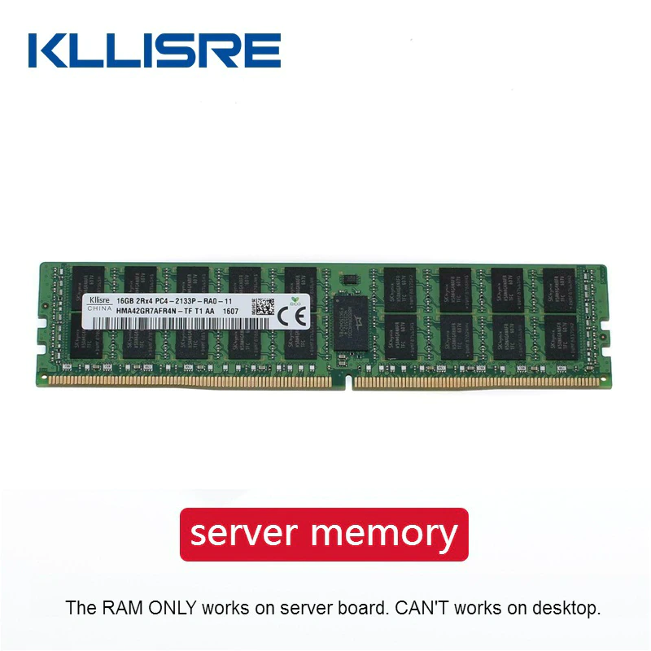
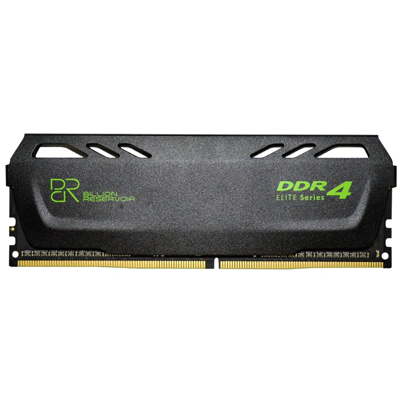

## Price Dynamics

### 2023

<small class="tab-img-w-200 col-w-0">

| # | name | photo | store | 2023/01 | 2023/02 | 2023/03 | 2023/04 | 2023/05 |
| --- | :-: | --- | --- | --- | --- | --- | --- | --- |
| 4 | DDR4 8Gb 2133MHg ECC-REG |  | [8](https://aliexpress.ru/item/33002249520.html 'RE Store') | 01:1370 02:1370 03:1374 04:1395 05:1400 06:1423 07:1426 08:1426 09:1352 10:1307 11:1320 12:1287 13:1277 14:1345 15:1345 16:1297 17:1290 18:1306 19:1304 20:1274 21:1274 22:1274 23:1271 24:1275 25:1276 26:1294 27:1291 28:1291 29:1291 30:1382 31:1400 | 01:1393 02:1309 03:1318 04:1317 05:1317 06:1319 07:1329 08:1332 09:1371 10:1364 11:1362 12:1362 13:1311 14:1210 15:1209 16:1226 17:1231 18:1279 19:1279 20:1269 21:1205 22:1201 23:1206 24:1208 25:1213 26:1213 27:1219 28:1201 | 01:1309 02:1305 03:1312 04:1311 05:1311 06:1252 08:1254 10:1282 11:1286 14:1348 16:1353 18:1364 20:1234 22:1232 24:1220 28:1220 | 02:1236 06:1135 14:1168 25:1168 | 15:1117 |
| 5 | DDR4 8Gb 3200MHz Desktop (not x99) |  | [9](https://aliexpress.ru/item/1005004564683502.html 'BillionR Store') | 01:1548 02:1548 03:1553 04:1576 05:1582 06:1608 07:1611 08:1611 09:1492 10:1443 11:1456 12:1420 13:1409 14:1520 15:1520 16:1466 17:1457 18:1475 19:1474 20:1439 21:1440 22:1440 23:1436 24:1440 25:1442 26:1462 27:1459 28:1459 29:1459 30:1561 31:1582 | 01:1574 02:1565 03:1576 04:1575 05:1575 06:1578 07:1590 08:1593 09:1639 10:1631 11:1629 12:1629 13:1568 14:1577 15:1577 16:1599 17:1605 18:1668 19:1668 20:1577 21:1497 22:1493 23:1500 24:1502 25:1508 26:1508 27:1515 28:1493 | 01:1627 02:1622 03:1630 04:1629 05:1629 06:1480 08:1482 10:1515 11:1520 14:1716 16:1722 18:1736 20:1509 22:1506 24:1491 28:1659 | 02:1682 06:1737 14:1657 25:1657 | 15:1657 |

</small>

### 2022

<small class="tab-img-w-100 col-w-0">

| # | name | photo | store | 2022/11 | 2022/12 |
| --- | :-: | --- | --- | --- | --- |
| 4 | DDR4 8Gb 2133MHg ECC-REG |  | [8](https://aliexpress.ru/item/33002249520.html 'RE Store') | 01:1077 10:1043 13:1102 14:1099 15:1092 16:1088 17:1084 18:1092 19:1093 20:1093 21:1095 22:1102 23:1093 24:1051 25:1051 26:1051 27:1051 28:1053 29:1070 30:1066 | 01:1113 02:1120 03:1124 04:1124 05:1138 06:1138 07:~~sold~~ 08:1212 09:1209 10:1207 11:1207 12:1180 13:1260 14:1264 15:1283 16:1291 17:1292 18:1292 19:1304 20:1341 21:1341 22:1408 23:1356 25:1342 26:1385 27:1362 28:1406 29:1455 30:1433 31:1405 |
| 5 | DDR4 8Gb 3200MHz Desktop (not x99) |  | [9](https://aliexpress.ru/item/1005004564683502.html 'BillionR Store') | 1<:1300 01:1281 10:1241 13:1311 14:1403 15:1394 16:1389 17:1383 18:1394 19:1395 20:1395 21:1397 22:1407 23:1395 24:1311 25:1311 26:1311 27:1311 28:1314 29:1334 30:1330 | 01:3230 02:3250 03:3260 04:3260 05:1354 06:1354 07:1359 08:1352 09:1348 10:1412 11:1412 12:1412 13:1424 14:1428 15:1449 16:1458 17:1460 18:1460 19:1474 20:1515 21:1551 22:1591 23:1532 24:1516 26:1565 27:1539 28:1589 29:1643 30:1619 31:1588 |

</small>

### 2021

<small class="col-w-0">

| # | name | store | 2021/01 |
| --- | :-: | --- | --- |
| 0 | 8Gb 1866GHz DDR3 ECC-REG | [1](https://aliexpress.ru/item/32858884585.html 'Yao Yue Store') [5](https://www.aliexpress.com/item/32831327978.html 'adkg816 Store') | 18:$25 22:$24 |
| 1 | 8Gb 2666GHz DDR4 ECC-REG | [1](https://aliexpress.ru/item/33009776003.html 'Yao Yue Store') [6](https://www.aliexpress.com/item/4000595417045.html 'CPU Store') | 18:$31 22:$29 |
| 2 | 8Gb 2666GHz DDR4 Desktop | [2](https://www.aliexpress.com/item/1005001627188360.html 'RASALAS - RA Store') [3](https://www.aliexpress.com/item/32963414963.html 'TANBASSH - TANBASSH Official Store') [4](https://aliexpress.ru/item/4000796954250.html 'Kingston - YONGXINSHENG YongXinSheng Store') [7](https://aliexpress.ru/item/4001056861459.html 'ANKOWALL - YksMemory Store') | 18:$30 22:$29 |

</small>

### 2020

<small>

| # | 4G 2133 | 4G 2400 | 4G 2666 | 8G 2133 | 8G 2400 | 8G 2666 | 8G 3200 | 16G 2133 | 16G 2400 | 16G 2666 | 16G 3200 | 32G 2133 | 32G 2400 | 32G 2666 |
| --- | --- | --- | --- | --- | --- | --- | --- | --- | --- | --- | --- | --- | --- | --- |
| 1 | 1340 |  |  | 2174 | 2250 | `3755` |  | 3452 | 3995 | 4894 |  |  | 7549 |
| 2 | 1356 | 1432 | 3793 | 2115 | 2267 | 4324 |  | 3489 | 4096 | 4931 |  | 7275 | 7578 | 9559 |
| 3 | 1280 | 1356 | 1432 | 2039 | 2115 | 2191 | 2267 | 3481 | 3557 | 3663 | 3784 | 7047 | 7275 | 7578 |

1. [ShenZhen CPU Store](https://aliexpress.ru/item/4000770450335.html 4.9 (1400)
2. [CPU Store](https://www.aliexpress.com/item/4000542795972.html 4.9 (939)
3. [CPU Store](https://aliexpress.ru/item/4000595417045.html 4.9 (2780) Server Memory

</small>
