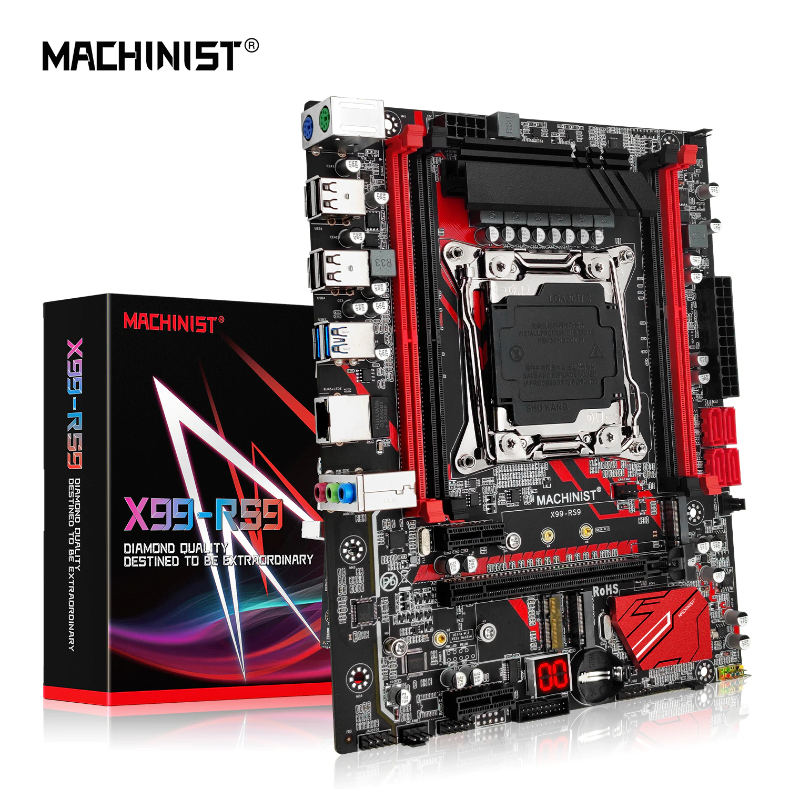
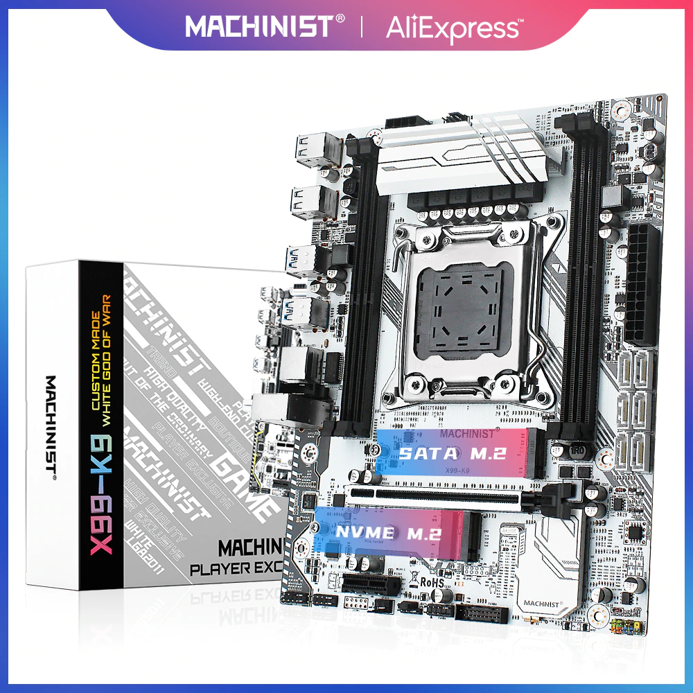
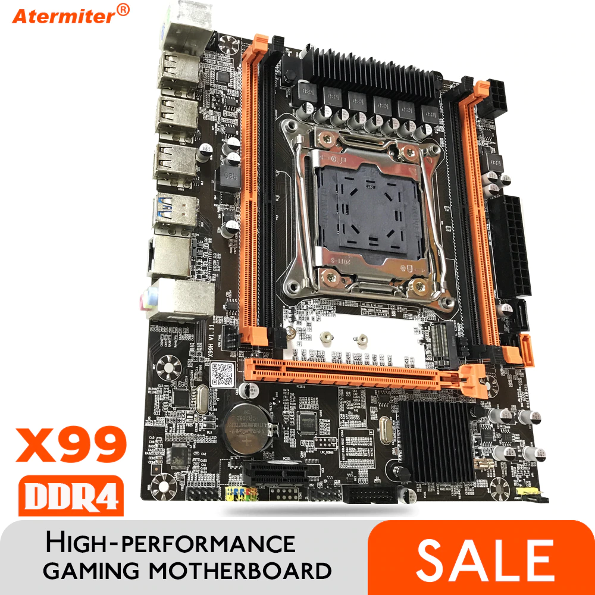
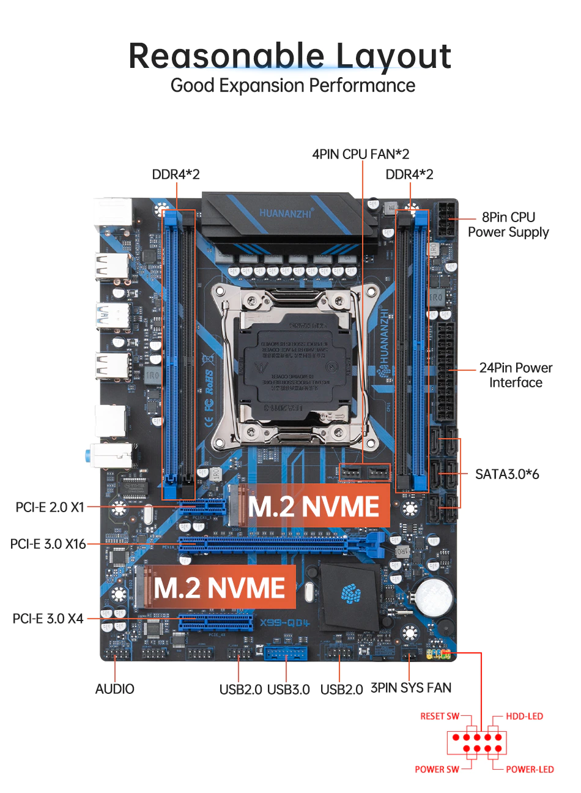
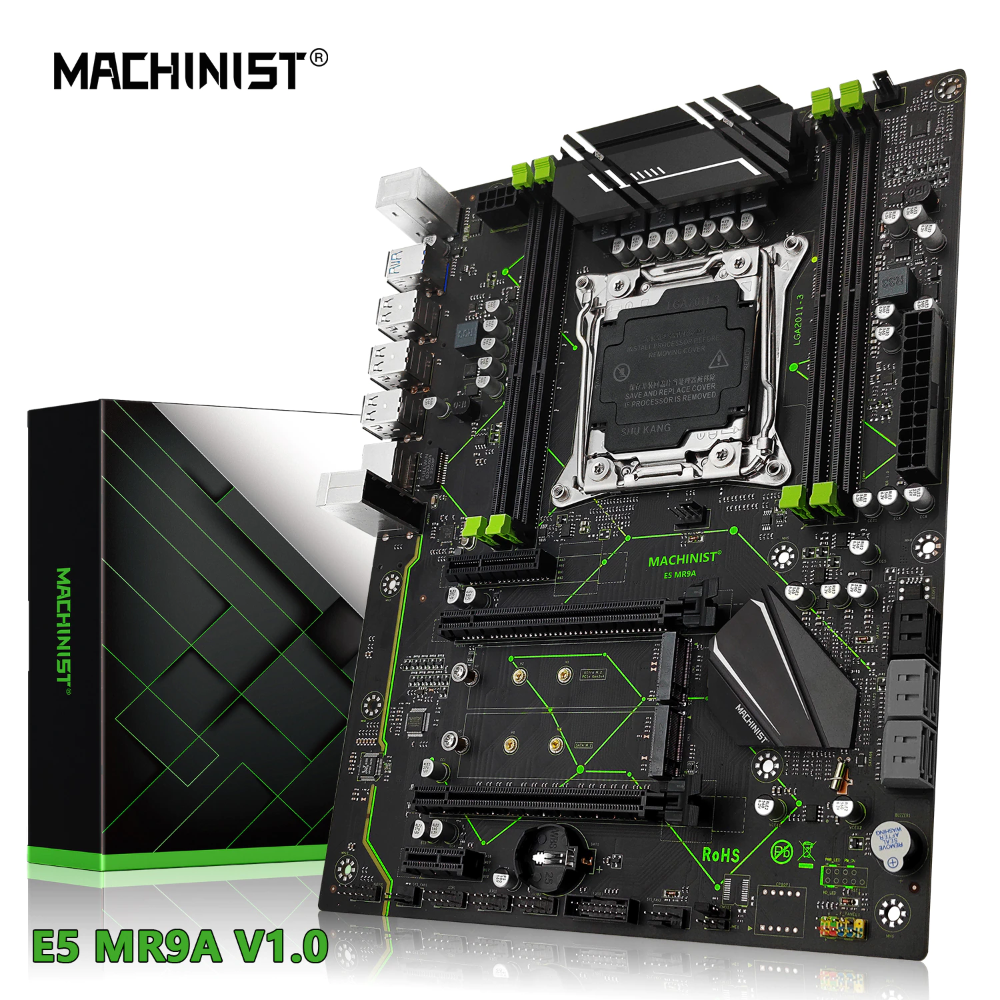
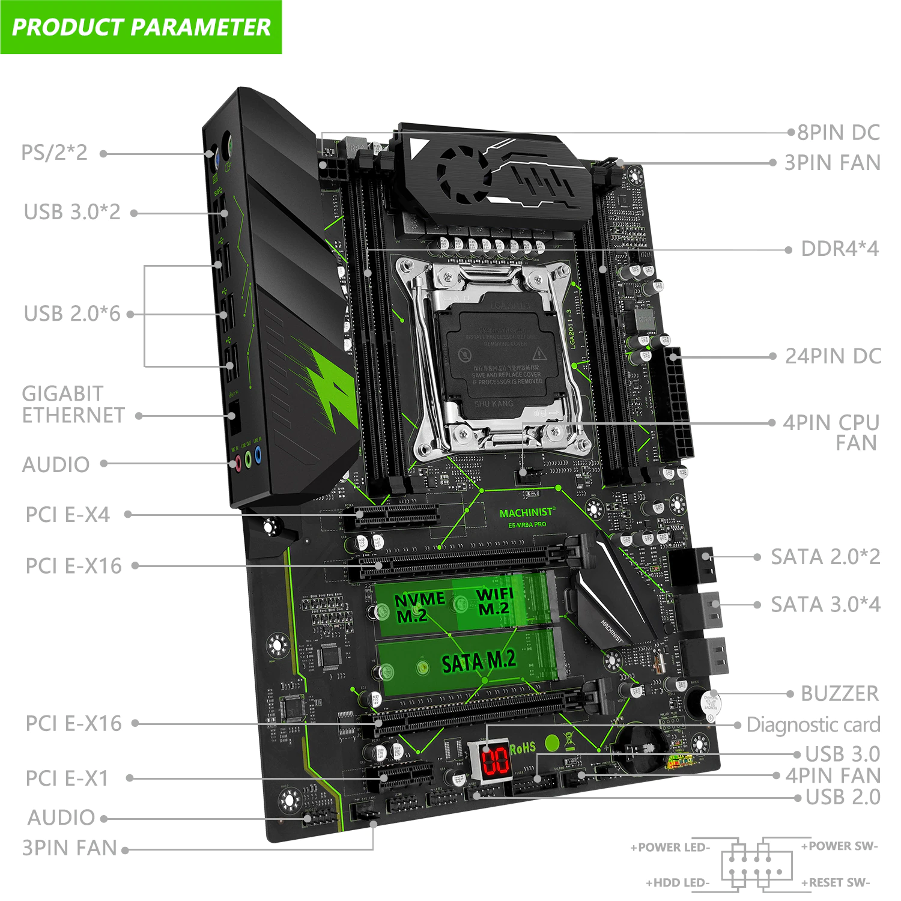
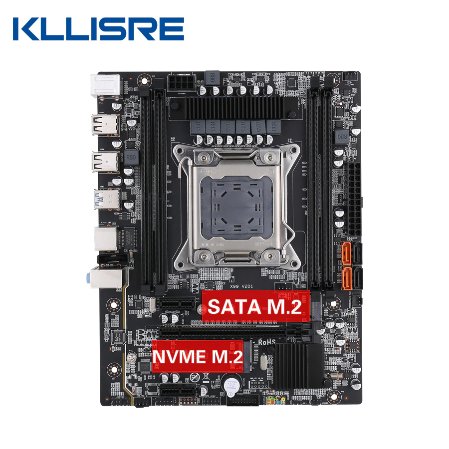

## Ali Scrape

<small class="tab-img-w-200 col-w-0">

<table class="nested">
  <thead>
    <tr>
      <th>#</th>
      <th>name</th>
      <th>photo</th>
      <th>store</th>
      <th>2022/11</th>
    </tr>
  </thead>
  <tbody>
    <tr>
      <td>1</td>
      <td>MACHINIST X99 RS9 red</td>
      <td></td>
      <td><a href="https://aliexpress.ru/item/4000750170401.html" title="MACHINIST Store">2</a></td>
      <td>
        <j>
          <z>11</z><z>3837</z>
        </j>
        <j>
          <z>12</z><z>3835</z>
        </j>
        <j>
          <z>13</z><z>4536</z>
        </j>
      </td>
    </tr>
    <tr>
      <td>2</td>
      <td>MACHINIST X99 K9 white</td>
      <td></td>
      <td><a href="https://aliexpress.ru/item/4000383007258.html" title="MACHINIST Store">2</a></td>
      <td><j><z>11</z><z>4779</z></j><j><z>12</z><z>4777</z></j></td>
    </tr>
    <tr>
      <td>3</td>
      <td>Atermiter X99 D4 2-channel</td>
      <td></td>
      <td><a href="https://aliexpress.ru/item/1005002988276402.html" title="atermiter Store">4</a></td>
      <td>
        <j>
          <z>01</z><z>3459</z>
        </j>
      </td>
    </tr>
    <tr>
      <td></td>
      <td></td>
      <td></td>
      <td></td>
      <td></td>
    </tr>
    <tr>
      <td></td>
      <td></td>
      <td></td>
      <td></td>
      <td></td>
    </tr>
  </tbody>
</table>

</small>

## Price Dynamics

### 2023

<small class="tab-img-w-200 col-w-0">

| # | name | photo | store | 2023/01 |
| --- | --- | --- | --- | --- |
| 2 | MACHINIST X99 RS9 red |  | [2](https://aliexpress.ru/item/4000750170401.html 'MACHINIST Store') | 01:4904 02:4904 03:4919 04:4993 05:5010 06:5093 07:5104 08:5104 09:4704 10:4549 11:4591 12:4477 13:4443 14:4680 15:4680 |
| 3 | MACHINIST X99 K9 white |  | [2](https://aliexpress.ru/item/4000383007258.html 'MACHINIST Store') | 01:5530 02:5530 03:5546 04:5630 05:5650 06:5185 07:5195 08:5195 09:5810 10:5619 11:5671 12:5530 13:5487 14:5781 15:5781 |
| 4 | Atermiter X99 D4 2-channel |  | [4](https://aliexpress.ru/item/1005002988276402.html 'atermiter Store') | 01:3829 02:3829 03:3840 04:3899 05:3912 06:3977 07:3985 08:3985 09:3778 10:3654 11:3688 12:3596 13:3568 14:3759 15:3759 |
| 5 | HUANANZHI X99 QD4 |  | [5](https://aliexpress.ru/item/1005004533446321.html 'iworld Store') | 01:5201 02:5201 03:5217 04:5296 05:5314 06:5402 07:5413 08:5413 09:5132 10:4963 11:5009 12:4884 13:4847 14:5106 15:5106 |
| 6 | Machinist X99 MR9A |  | [6](https://aliexpress.ru/item/1005003197164283.html 'MACHINIST official Store') | 01:5813 02:5813 03:5831 04:5919 05:5939 06:6038 07:6050 08:6050 09:5736 10:5547 11:5599 12:5459 13:5417 14:5707 15:5707 |
| 7 | Machinist X99 MR9Av2  (E5-MR9A-PRO) |  | [6](https://aliexpress.ru/item/1005004005435696.html 'MACHINIST official Store') | 01:6290 02:6290 03:6310 04:6405 05:6427 06:6534 07:6547 08:6547 09:6207 10:6003 11:6058 12:5908 13:5862 14:6176 15:6176 |

~~999~~ - sold out  
`n<` - n months ago  
**6158** - website page buttons are not active

</small>

### 2022

<small class="tab-img-w-100 col-w-0">

| # | name | photo | store | 2022/11 | 2022/12 |
| --- | --- | --- | --- | --- | --- |
| 2 | MACHINIST X99 RS9 red |  | [2](https://aliexpress.ru/item/4000750170401.html 'MACHINIST Store') | 11:3837 12:3835 13:4536 14:4525 15:4494 16:4479 17:4461 18:4494 19:4498 20:4498 21:4506 22:4537 23:4498 24:4327 25:4327 26:4327 27:4384 28:4393 29:4462 30:4448 | 01:4644 02:4673 03:4687 04:4687 05:4687 06:4687 07:4703 08:4678 09:4664 10:4720 11:4720 12:4720 13:4511 14:4525 15:4592 16:4620 17:4625 18:4625 19:4668 20:4800 21:4800 22:5040 23:4853 25:4804 26:4957 27:4874 28:5032 29:5206 30:5128 31:5030 |
| 3 | MACHINIST X99 K9 white |  | [2](https://aliexpress.ru/item/4000383007258.html 'MACHINIST Store') | 11:4779 12:4777 13:5047 14:5035 15:5001 16:4984 17:4963 18:5000 19:5005 20:5005 21:5014 22:5048 23:5005 24:4489 25:4489 26:4489 27:4489 28:4498 29:4568 30:4554 | 01:4755 02:4784 03:4799 04:4799 05:4510 06:4510 07:4526 08:4502 09:5997 10:6457 11:6457 12:6457 13:6135 14:6155 15:6245 16:6284 17:6290 18:6290 19:6350 20:6529 21:6529 22:5130 23:5473 25:5417 26:5590 27:5496 28:5675 29:5871 30:5782 31:5672 |
| 4 | Atermiter X99 D4 2-channel |  | [4](https://aliexpress.ru/item/1005002988276402.html 'atermiter Store') | 01:3459 10:3324 11:3220 12:3218 13:3400 14:3392 15:3369 16:3358 17:3344 18:3369 19:3372 20:3372 21:3378 22:3401 23:3372 24:3244 25:3244 26:3243 27:3243 28:3250 29:3301 30:3291 | 01:3435 02:3457 03:3468 04:3468 05:3513 06:3513 07:3526 08:3507 09:3497 10:3492 11:3492 12:3492 13:3522 14:3533 15:3585 16:3607 17:3611 18:3611 19:3645 20:3748 21:3748 22:3935 23:3789 25:3751 26:3870 27:3806 28:3929 29:4065 30:4004 31:3927 |
| 5 | HUANANZHI X99 QD4 |  | [5](https://aliexpress.ru/item/1005004533446321.html 'iworld Store') | 2<:3700 01:4699 10:4515 11:4373 12:4372 13:4619 14:4608 15:4576 16:4561 17:4542 18:4576 19:4581 20:4581 21:4589 22:4620 23:4581 24:4406 25:4406 26:4406 27:4406 28:4414 29:4484 30:4470 | 01:4667 02:4696 03:4710 04:4710 05:4773 06:4772 07:4789 08:4764 09:4750 10:4743 11:4743 12:4743 13:4784 14:4800 15:4870 16:4900 17:4905 18:4905 19:4951 20:5091 21:5091 22:5345 23:5147 25:5095 26:5257 27:5170 28:5338 29:5522 30:5439 31:5335 |
| 6 | Machinist X99 MR9A |  | [6](https://aliexpress.ru/item/1005003197164283.html 'MACHINIST official Store') | 01:4641 10:4664 11:4518 12:4516 13:5163 14:5150 15:5115 16:5098 17:5077 18:5115 19:5120 20:5120 21:5129 22:5164 23:5120 24:4551 25:4551 26:4551 27:4551 28:4560 29:4632 30:4921 | 01:5216 02:5249 03:5265 04:5265 05:5253 06:5253 07:5272 08:5244 09:5228 10:5301 11:5301 12:5302 13:5266 14:5283 15:5361 16:5477 17:5483 18:5483 19:5534 20:5691 21:5691 22:5974 23:5753 25:5695 26:5787 27:5690 28:5875 29:6172 30:6079 31:5963 |
| 7 | Machinist X99 MR9Av2  (E5-MR9A-PRO) |  | [6](https://aliexpress.ru/item/1005004005435696.html 'MACHINIST official Store') | 01:5389 10:~~4786~~ 13:~~5298~~ 18:~~5249~~ 21:5964 22:6005 23:5954 24:5727 25:~~5727~~ 26:~~5727~~ 27:~~5727~~ 28:~~5738~~ 29:~~5828~~ 30:~~5722~~ | 01:6066 02:6104 03:5697 04:5697 05:5772 06:5772 07:5792 08:5762 09:5745 10:5737 11:5737 12:5737 13:5786 14:5805 15:5890 16:5927 17:5933 18:5933 19:5989 20:**6158** 21:6158 22:6465 23:6226 25:6162 26:6359 27:6252 28:6456 29:6679 30:6578 31:6452 |

</small>

### 2021

<small class="tab-img-w-100 col-w-0">

| # | name | photo | store | 2021/01 |
| --- | --- | --- | --- | --- |
| 1 | X99 v201 2-channel |  | [1](https://aliexpress.ru/item/4000868280446.html 'RE Store') | 01:5149 06:5246 09:5313 12:5210 15:5116 |
| 2 | X99 RS9 red MACHINIST |  | [2](https://aliexpress.ru/item/4000750170401.html 'MACHINIST Store') | 01:5310 06:5332 09:5400 12:5374 15:5277 |
| 3 | X99 K9 white MACHINIST |  | [2](https://aliexpress.ru/item/4000383007258.html 'MACHINIST Store') | 01:6061 06:6085 09:6163 12:6133 15:6022 |

</small>

## Comparison

### LGA2011-3 (socket)

<small class="col-w-0">

| Motherboard | Atermiter X99 D4 [4](https://aliexpress.ru/item/1005002988276402.html 'atermiter Store') | Huananzhi X99 QD4 [5](https://aliexpress.ru/item/1005004533446321.html 'iworld Store') | Machinist X99 RS9 red [2](https://aliexpress.ru/item/4000750170401.html 'MACHINIST Store') | Machinist X99 MR9A [6](https://aliexpress.ru/item/1005003197164283.html 'MACHINIST official Store') | Machinist X99 MR9Av2 [6](https://aliexpress.ru/item/1005004005435696.html 'MACHINIST official Store') |
| --- | :-: | :-: | :-: | :-: | :-: |
| Photo |  |  |  |  |  |
| Memory channel | 2-channel | 4-channel | 4-channel | 4-channel? | 4-channel |
| Memory type, max | DDR4, 64Gb | 128Gb | DDR4, DDR4&nbsp;ECC, <=2133MHz 64Gb | DDR4, desktop, server, 128Gb | DDR4, desktop, server, 128Gb |
| M.2(NGFF) slots (NVMe:32Mbit/s) (SATAe:20Mbit/s) | 1xNVMe | 2xNVMe | 1xNVMe 1xSATAe | 2xNVMe | 1xNVMe 1xSATAe |
| Form factor | microATX | microATX 245x190mm | microATX 235x185mm | ATX 280x215mm | ATX 285x215mm |
| CPU | > 2620v3, **2640v3** up to 2660v3, **2670v3** < ~~2666v3~~ |  | Intel Core i7, Xeon e5 v3,v4 | LGA2011-3 tdp<=105w tdp<=120w? | > **2666v3**, 2696v3 |
| Videocard, slots |  |  | PCIe&nbsp;X16, PCIe&nbsp;X1 |  |  |
| LAN, max | 100Mbit/s | 1000Mbit/s | Realtek8111 Gigabit network card |  | 1000Mbit/s |
| Postcode indicator |  |  | + |  | + |
| Power Supply | 6-phase | 6-phase | 6-phase | 6-phase | 8-phase |
| Unlock turbo boost | + | native |  | no native |  |
| Controlled coolers | 2 |  |
| SATA3.0 (6Gb/s) slots |  | 6 | 4 |  | 4 |
| Audio | 2.1 | 5.1 |  |  | 5.1 |
| Wi-Fi M.2, support wireless network card |  |  | 2.5MHz |  | + |

</small>

## Motherboard form factors

<small>

| Form factors | Max. size   width x depth | notes |
| :-: | --- | --- |
| microATX | 244x244mm (9.6×9.6in) | A smaller variant of the ATX form factor (about 25% shorter). Compatible with most ATX cases, but has fewer slots than ATX, for a smaller power supply unit. Very popular for desktop and small form factor computers as of 2017. |
| ATX | 305×244mm (12×9.6in) | Created by Intel in 1995. As of 2017, it is the most popular form factor for commodity motherboards. Typical size is 9.6×12in although some companies extend that to 10×12in. |

source: [wikipedia](https://en.m.wikipedia.org/wiki/Motherboard_form_factor#Comparisons)

</small>
