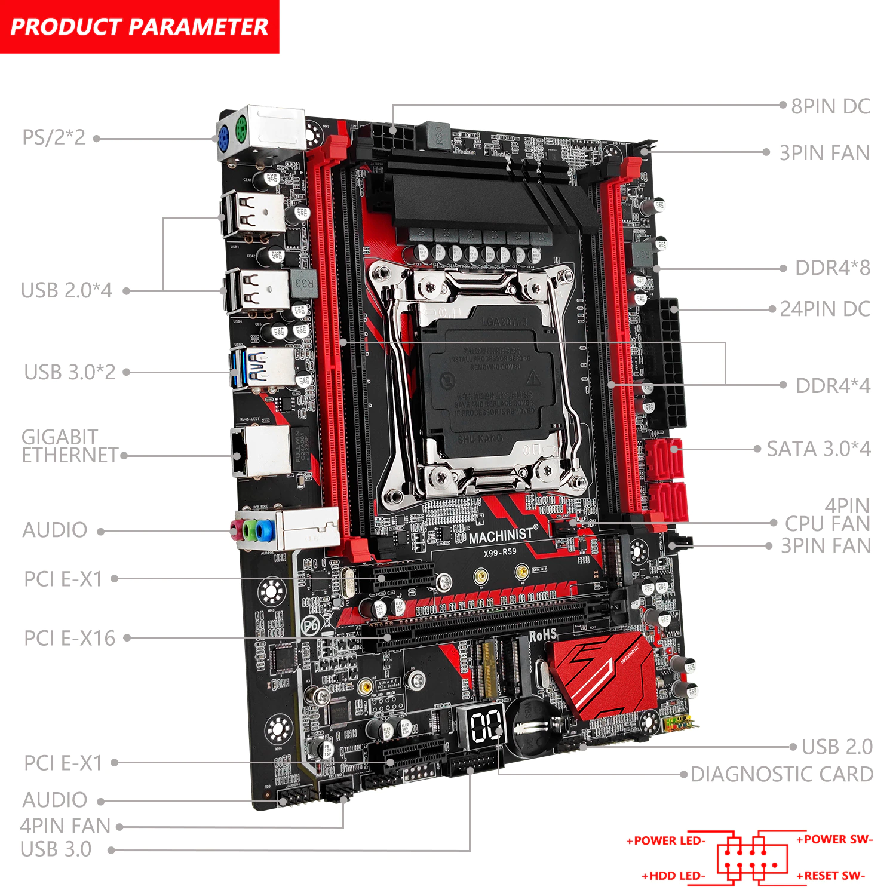
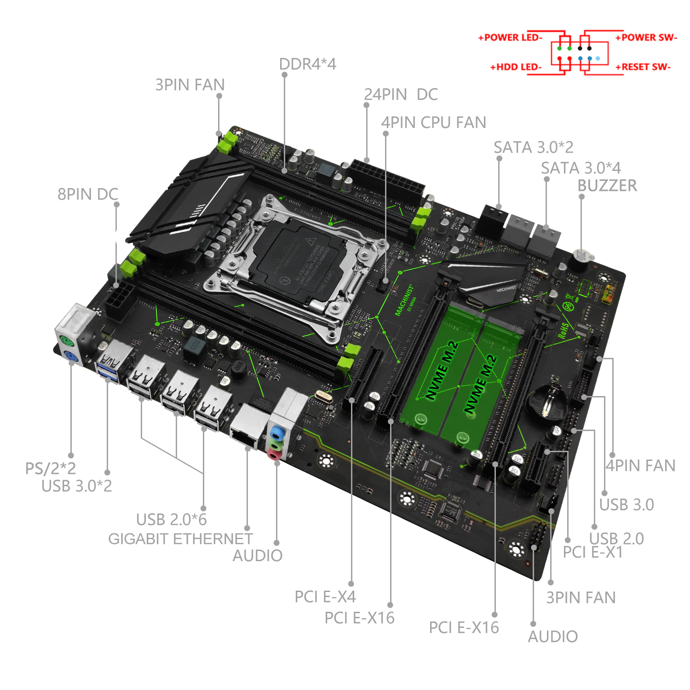

### Form factors

[wikipedia](https://en.m.wikipedia.org/wiki/Motherboard_form_factor#Comparisons)

| Form factors | Max. size width x depth | notes |
| --- | --- | --- |
| microATX | 244x244mm (9.6×9.6in) | A smaller variant of the ATX form factor (about 25% shorter). Compatible with most ATX cases, but has fewer slots than ATX, for a smaller power supply unit. Very popular for desktop and small form factor computers as of 2017. |
| ATX | 305×244mm (12×9.6in) | Created by Intel in 1995. As of 2017, it is the most popular form factor for commodity motherboards. Typical size is 9.6×12in although some companies extend that to 10×12in. |

## LGA2011-3 (chip slot)

<small>

| Motherboard | Atermiter X99 D4 [4](https://aliexpress.ru/item/1005002988276402.html 'atermiter Store') | HUANANZHI X99 QD4 [5](https://aliexpress.ru/item/1005004533446321.html 'iworld Store') | MACHINIST X99 RS9 red [2](https://aliexpress.ru/item/4000750170401.html 'MACHINIST Store') | Machinist X99 MR9A [6](https://aliexpress.ru/item/1005003197164283.html 'MACHINIST official Store') | Machinist X99 MR9Av2 [6](https://aliexpress.ru/item/1005004005435696.html 'MACHINIST official Store') |
| --- | :-: | :-: | :-: | :-: | :-: |
| Photo |  |  |  |  |  |
| Memory channel | 2-channel | 4-channel | 4-channel | 4-channel | 4-channel |
| Memory | DDR4, max:64Gb | max:128Gb | DDR4, DDR4 ECC, max:64Gb | DDR4, max:128Gb | DDR4, max:128Gb |
| Disk | 1xM.2 | 2xM.2 | 2xM.2 | 2xM.2 | 2xM.2 |
| Form factor | microATX | microATX 245x190mm | microATX 235x185mm | ATX 283x216mm | ATX 283x216mm |
| CPU | Xeon E5 v3, v4 |  | Intel Core i7, Xeon e5 v3,v4 | LGA2011-3 (tdp<=105w) |  |
| Videocard, slots |  |  | PCI-E X16, PCI-E X1 |  |  |
| LAN, max | 100Mbit/s |

</small>

| # | motherboard | form-factor | power supply system | for cpu | memory canal | bios | others |
| --- | --- | --- | --- | --- | --- | --- | --- |
| 1 | Atermiter X99 D4 | microATX | 6-phase | from e5&nbsp;2620v3, **e5&nbsp;2640v3** - to e5&nbsp;2660v3, **e5&nbsp;2670v3**, ~~e5&nbsp;2666v3~~ | 2-channel (only 2 memory slots make sense to use) | turbo boost unlock with timings | 2 controlled coolers (for cpu and case) |
| 2 | HUANANZHI X99 QD4 | microATX (245x190mm) | 6-phase | for any cpu up to **e5&nbsp;2666v3** (e5&nbsp;2666v3 requires additional case coolers in addition to the CPU cooler) | 4-channel | native bios with timings |  |
| 3 | MACHINIST X99 RS9 red |  |  | ~~e5&nbsp;2666v3~~ |  |  |  |
| 4 | Machinist X99 MR9A | ATX (280x215mm) | 6-phase | **e5&nbsp;2666v3** |  | no native bios with timings |  |
| 5 | Machinist X99 MR9Av2 | ATX (285x215mm) | 8-phase | > **e5&nbsp;2666v3**, e5&nbsp;2696v3 |  |  | post-codes indicator |

## Price Dynamics

### 2021

| # | name | photo | 01/01 | 06/01 | 09/01 | 12/01 | 15/01 |
| --- | --- | --- | --- | --- | --- | --- | --- |
| 1 | X99 v201 2-channel [1](https://aliexpress.ru/item/4000868280446.html 'RE Store') |  | 5149 | 5246 | 5313 | 5210 | 5116 |
| 2 | X99 RS9 red MACHINIST [2](https://aliexpress.ru/item/4000750170401.html 'MACHINIST Store') |  | 5310 | 5332 | 5400 | 5374 | 5277 |
| 3 | X99 K9 white MACHINIST [2](https://aliexpress.ru/item/4000383007258.html 'MACHINIST Store') |  | 6061 | 6085 | 6163 | 6133 | 6022 |

### 2022

| # | name | photo | 09 | 11 |
| --- | --- | --- | --- | --- |
| 1 | X99 v201 2-channel [1](https://aliexpress.ru/item/4000868280446.html 'RE Store') |  |  | s/o:6429 |
| 2 | X99 RS9 red MACHINIST [2](https://aliexpress.ru/item/4000750170401.html 'MACHINIST Store') |  |  | 11:3837 12:3835 |
| 3 | X99 K9 white MACHINIST [2](https://aliexpress.ru/item/4000383007258.html 'MACHINIST Store') |  |  | 11:4779 12:4777 |
| 4 | Atermiter X99 D4 [4](https://aliexpress.ru/item/1005002988276402.html 'atermiter Store') |  |  | 01:3459 10:3324 11:3220 12:3218 |
| 5 | HUANANZHI X99 QD4 [5](https://aliexpress.ru/item/1005004533446321.html 'iworld Store') |  | 16:3700 | 01:4699 10:4515 11:4373 12:4372 |
| 6 | Machinist X99 MR9A [6](https://aliexpress.ru/item/1005003197164283.html 'MACHINIST official Store') |  |  | 01:4641 10:4664 11:4518 12:4516 |
| 7 | Machinist X99 MR9Av2 [6](https://aliexpress.ru/item/1005004005435696.html 'MACHINIST official Store') |  |  | 01:5389 10:4786 11:s/o |
