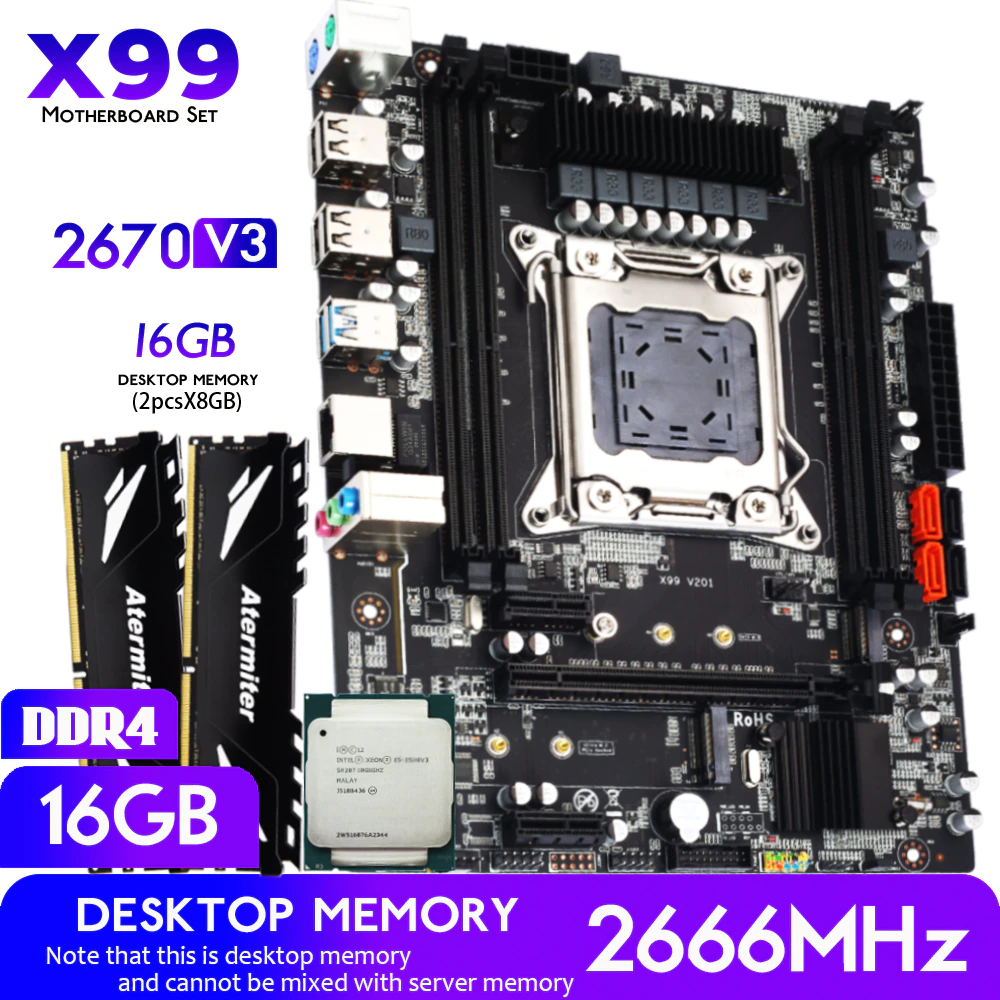

## Price Dynamics

### 2023

<small class="tab-img-w-200 col-w-0">

| # | mother | cpu | memory | photo | store | 2023/01 | 2023/02 | 2023/03 | 2023/04 | 2023/05 |
| --- | :-: | :-: | :-: | :-: | --- | --- | --- | --- | --- | --- |
| 1 | Huananzhi X99 BD4 -> Atermiter X99 D4 | 2678V3 -> 2666V3 | 2x8Gb DDR4 3200MHz ECC-REG |  | [1](https://www.aliexpress.com/item/4000542296880.html 'CPU Store') | 01:11298 02:11298 03:11332 04:11504 05:11262 06:11449 07:11472 08:11472 09:10875 10:10519 11:10616 12:10351 13:10272 14:10821 15:10821 16:10436 17:10375 18:10505 19:10493 20:10246 21:10252 22:10252 23:10228 24:10256 25:10269 26:10412 27:10387 28:10389 29:10389 30:11116 31:11264 | 01:11205 02:11147 03:11223 04:11216 05:11216 06:11236 07:11320 08:11344 09:11672 10:11616 11:11600 12:11600 13:11163 14:11231 15:10946 16:11100 17:11141 18:11579 19:11579 20:11189 21:10622 22:10592 23:10641 24:10657 25:10698 26:10698 27:10751 28:10589 | 01:11543 02:11512 03:11569 04:10992 05:10992 06:10500 08:9703 10:9926 11:9291 14:9742 16:9775 18:9853 20:9223 22:9204 24:9116 28:9419 | 02:9548 06:9861 14:9288 25:9171 | 15:8936 |
|  |  |  |  |  |  |  |
| 2 | Huananzhi X99-8M-F D4 -> Atermiter Turbo X99 D4 | 2620V3 -> 2680V3 | 1x16Gb DDR4 2666MHz ECC-REG -> 1x16Gb DDR4 3200MHz ECC-REG |  | [1](https://aliexpress.ru/item/4000931520719.html 'CPU Store') | 01:9576 02:9576 03:9606 04:9632 05:9666 06:9826 07:9846 08:9846 09:9334 10:9027 11:9111 12:8884 13:8816 14:9288 15:9288 16:8957 17:8905 18:9016 19:9006 20:8794 21:8799 22:8799 23:8779 24:8803 25:8813 26:8936 27:8915 28:8916 29:8916 30:9540 31:9667 | 01:9616 02:9567 03:9632 04:9626 05:9626 06:9644 07:9715 08:9736 09:10017 10:9970 11:9956 12:9956 13:9581 14:9639 15:9397 16:9529 17:9565 18:9941 19:9941 20:9734 21:9241 22:9214 23:9257 24:9271 25:9306 26:9306 27:9353 28:9212 | 01:10042 02:10015 03:9677 04:9723 05:9723 06:9288 08:9300 10:9513 11:9591 14:10004 16:10038 18:10118 20:9471 22:9451 24:8776 28:9068 | 02:9191 06:9493 14:8572 25:8451 | 15:8451 |
|  |  |  |  |  |  |  |
| 3 | MACHINIST X99 K9 white | 2620V3 | 1x16Gb DDR4 2400MHz REG-ECC |  | [8](https://aliexpress.ru/item/4000842821384.html 'Good Luck 7 Store') | 01:~~13970~~ 02:~~13970~~ 03:~~14013~~ 04:~~13225~~ 05:~~14274~~ 06:~~14511~~ 07:~~14540~~ 08:~~14540~~ 09:~~13784~~ 10:~~13331~~ 11:~~13455~~ 12:~~13120~~ 13:~~13019~~ 14:~~13716~~ 15:~~13716~~ 16:~~13227~~ 17:~~13151~~ 18:~~13315~~ 19:none 20:~~12986~~ 21:~~12994~~ 22:~~12994~~ 23:~~12964~~ 24:~~13000~~ 25:~~13016~~ 26:~~13197~~ 27:~~13165~~ 28:~~13168~~ 29:~~13168~~ 30:~~14089~~ 31:~~14276~~ | 01:~~14201~~ 02:~~14129~~ 03:~~14225~~ 04:~~14216~~ 05:~~14216~~ 06:~~14241~~ 07:**not** |  |
|  |  |  |  |  |  |  |
| 4 | Atermiter x99 D4 | 2670v3 | 2x8Gb DDR4 2666MHz Desktop |  | [1](https://aliexpress.ru/item/4000483492857.html 'CPU Store') | 01:7947 02:7947 03:7971 04:8092 05:8120 06:8254 07:8271 08:8271 09:7652 10:7400 11:7469 12:7283 13:7227 14:7614 15:7614 16:7343 17:7300 18:7391 19:7383 20:7209 21:7213 22:7213 23:7197 24:7216 25:7225 26:7326 27:7308 28:7310 29:7310 30:7821 31:7925 | 01:7884 02:7843 03:7897 04:7892 05:7892 06:7906 07:7965 08:7982 09:8212 10:8173 11:8162 12:8162 13:7854 14:7902 15:7899 16:8010 17:8041 18:8253 19:8253 20:8083 21:7674 22:7651 23:7686 24:7600 25:7630 26:7630 27:7668 28:7553 | 01:8233 02:8211 03:8251 04:8201 05:8201 06:7834 08:7844 10:8024 11:8047 14:8438 16:8467 18:8534 20:7788 22:7772 24:7698 28:7954 | 02:8062 03:8007 14:7637 25:7536 | 15:7128 |
|  |  |  |  |  |  |  |
| 5 | HUANANZHI X99 QD4 | 2640v3 | 2x8Gb DDR4 2666MHz Desktop |  | [6](https://aliexpress.ru/item/1005004759137992.html 'atermiter Store') | 01:8525 02:8525 03:8551 04:8681 05:8711 06:8855 07:8873 08:8873 09:8412 10:8135 11:8211 12:8006 13:7945 14:8370 15:8370 16:8072 17:8025 18:8125 19:8116 20:7925 21:7929 22:7929 23:7911 24:7933 25:7943 26:8053 27:8034 28:8035 29:8035 30:8598 31:8712 | 01:8666 02:8622 03:8681 04:8675 05:8675 06:8691 07:8756 08:8774 09:9028 10:8985 11:8972 12:8972 13:8634 14:8687 15:8373 16:8491 17:8514 18:8858 19:8858 20:8785 21:8134 22:8110 23:8148 24:8057 25:8087 26:8087 27:8128 28:8006 | 01:8727 02:8703 03:8746 04:8683 05:8683 06:8294 08:8304 10:8495 11:8520 14:8934 16:8964 18:9035 20:8350 22:8333 24:8253 28:8528 | 02:8644 06:8470 14:8080 25:7970 | 15:7861 |
|  |  |  |  |  |  |  |
| 6 | MACHINIST X99 MR9A [7](https://aliexpress.ru/item/1005003197164283.html 'MACHINIST official Store') | 2666v3 [9](https://aliexpress.ru/item/1005003644967394.html 'BY168 Store') | 2x8Gb DDR4 2133MHz ?ECC-REG [11](https://aliexpress.ru/item/33002249520.html 'RE Store') |  | [7](https://aliexpress.ru/item/1005004029196934.html 'MACHINIST official Store') | 01:10985 02:10985 03:11018 04:11185 05:11223 06:11410 07:11433 08:11433 09:10838 10:10482 11:10580 12:10316 13:10237 14:10785 15:10785 16:10400 17:10340 18:10469 19:10457 20:10211 21:10217 22:10217 23:10193 24:10221 25:10234 26:10376 27:10352 28:10354 29:10354 30:11078 31:11225 | 01:11166 02:11109 03:11185 04:11178 05:11178 06:11198 07:11281 08:11306 09:11632 10:11577 11:11561 12:11561 13:11125 14:11193 15:11188 16:11346 17:11388 18:11836 19:11836 20:11738 21:11143 22:11111 23:11163 24:11180 25:11222 26:11222 27:11278 28:11108 | 01:12109 02:11519 03:11898 04:11886 05:11886 06:11354 08:11368 10:11628 11:11662 14:12229 16:12271 18:12368 20:11577 22:11553 24:11443 28:10697 | 02:10843 06:11199 14:10682 25:10529 | 15:10529 |
|  |  |  |  |  |  |  |
| 7 | MACHINIST X99 MR9Av2 [7](https://aliexpress.ru/item/1005004005435696.html 'MACHINIST official Store') | 2666v3 [9](https://aliexpress.ru/item/1005003644967394.html 'BY168 Store') | 4x8Gb DDR4 2666MHz Desktop [10](https://aliexpress.ru/item/1005004564683502.html 'BillionR Store') |  | [7](https://aliexpress.ru/item/1005004695673494.html 'MACHINIST official Store') | 01:14991 02:14991 03:15036 04:15264 05:15317 06:15571 07:15602 08:? 09:14791 10:14305 11:14438 12:14079 13:13970 14:14718 15:14718 16:14193 17:14111 18:14287 19:14271 20:13935 21:13943 22:13943 23:13911 24:13949 25:13966 26:14161 27:14127 28:14130 29:14130 30:15118 31:15319 | 01:15239 02:15161 03:15264 04:15255 05:15255 06:15282 07:15396 08:15429 09:15874 10:15799 11:15777 12:15777 13:15182 14:15275 15:15268 16:15483 17:15541 18:16152 19:16152 20:16019 21:15207 22:15163 23:15234 24:15257 25:15315 26:15315 27:15391 28:15159 | 01:16525 02:16481 03:16562 04:16546 05:16546 06:15806 08:15127 10:15473 11:15518 14:16273 16:16328 18:16458 20:15168 22:15137 24:14992 28:15733 | 02:15947 06:16471 14:13806 25:13806 | 15:13806 |
|  |  |  |  |  |  |  |

</small>

### 2022

<small class="tab-img-w-100 col-w-0">

| # | mother | cpu | memory | photo | store | 2022/11 | 2022/12 |
| --- | :-: | :-: | :-: | :-: | --- | --- | --- |
| 1 | Huananzhi X99 BD4 | 2678V3 | 2x8Gb DDR4 3200MHz ECC-REG |  | [1](https://www.aliexpress.com/item/4000542296880.html 'CPU Store') | 13:9789 14:9766 15:9699 16:9666 17:9627 18:9699 19:9708 20:9708 21:9725 22:9791 23:9708 24:9338 25:9338 26:9337 27:9337 28:9356 29:9502 30:9474 | 01:9890 02:9952 03:9982 04:9982 05:10114 06:10114 07:10149 08:10096 09:10066 10:10052 11:10052 12:10052 13:10139 14:~~10172~~ 15:~~10321~~ 16:~~10385~~ 17:10656 18:10656 19:10756 20:11060 21:11060 22:11611 23:11182 25:11068 26:11420 27:11230 28:11595 29:11995 30:11815 31:11589 |
|  |  |  |  |  |  |  |
| 2 | Huananzhi X99-8M-F D4 | 2620V3 | 1x16Gb DDR4 2666MHz ECC-REG |  | [1](https://aliexpress.ru/item/4000931520719.html 'CPU Store') | 13:8509 14:8589 15:8530 16:8501 17:8466 18:8530 19:8538 20:8538 21:8553 22:8611 23:8537 24:8212 25:8212 26:8212 27:8212 28:8228 29:8357 30:8332 | 01:8698 02:8752 03:8779 04:8779 05:8895 06:8895 07:8926 08:8879 09:8853 10:8840 11:8840 12:8841 13:8917 14:8838 15:8967 16:9023 17:9032 18:9032 19:9117 20:9375 21:9375 22:9842 23:9478 25:9381 26:9680 27:9519 28:9828 29:10167 30:10014 31:9823 |
|  |  |  |  |  |  |  |
| 3 | MACHINIST X99 K9 white | 2620V3 | 1x16Gb DDR4 2400MHz REG-ECC |  | [8](https://aliexpress.ru/item/4000842821384.html 'Good Luck 7 Store') | 13:8189 14:8169 15:8113 16:8086 17:8053 18:8113 19:8120 20:8120 21:8135 22:8191 23:8120 24:7811 25:7811 26:7811 27:7811 28:7826 29:7949 30:7925 | 01:8273 02:8325 03:8350 04:8350 05:8461 06:8460 07:8490 08:8446 09:8420 10:8408 11:8408 12:8409 13:8481 14:8509 15:8634 16:8687 17:8796 18:8696 19:8778 20:9026 21:9026 22:9476 23:9125 25:9032 26:~~14122~~ 27:~~13886~~ 28:~~14337~~ 29:~~14833~~ 30:~~14609~~ 31:~~14330~~ |
|  |  |  |  |  |  |  |
| 4 | Atermiter x99 D4 | 2670v3 | 2x8Gb DDR4 2666MHz Desktop |  | [1](https://aliexpress.ru/item/4000483492857.html 'CPU Store') | 10:6401 11:6199 13:6803 14:6786 15:6740 16:6717 17:6690 18:6740 19:6746 20:6746 21:6758 22:6804 23:6746 24:6489 25:6489 26:6489 27:6489 28:6501 29:6603 30:6583 | 01:6873 02:6916 03:6937 04:6937 05:7029 06:7028 07:7053 08:7016 09:6995 10:6985 11:6985 12:6985 13:7046 14:7069 15:7172 16:7217 17:7224 18:7495 19:7566 20:7779 21:7779 22:8167 23:7865 25:7785 26:8033 27:7899 28:8156 29:8437 30:8310 31:8151 |
|  | 11:3215 13:3400 | 11:924 13:976 | 11:2x1043 13:2x1102 |  |  | 11:6225 13:6580 |
| 5 | HUANANZHI X99 QD4 | 2640v3 | 2x8Gb DDR4 2666MHz Desktop |  | [6](https://aliexpress.ru/item/1005004759137992.html 'atermiter Store') | 10:7402 11:7169 13:8023 14:8004 15:7680 16:7655 17:7623 18:7680 19:7687 20:7687 21:7701 22:7754 23:7687 24:7394 25:7394 26:7394 27:7394 28:7409 29:7525 30:7502 | 01:7832 02:7881 03:7905 04:7905 05:8009 06:8009 07:8037 08:7995 09:7991 10:7960 11:7960 12:7960 13:8029 14:8055 15:8173 16:8224 17:8232 18:8232 19:8310 20:8544 21:8544 22:8970 23:8639 25:8550 26:8823 27:8676 28:8958 29:9267 30:9127 31:8745 |
|  | 11:4373 13:4619 | 11:1066 13:1126 | 11:2x1241 13:2x1311 |  |  | 11:7921 13:8367 |
| 6 | MACHINIST X99 MR9A [7](https://aliexpress.ru/item/1005003197164283.html 'MACHINIST official Store') | 2666v3 [9](https://aliexpress.ru/item/1005003644967394.html 'BY168 Store') | 2x8Gb DDR4 2133MHz ?ECC-REG [11](https://aliexpress.ru/item/33002249520.html 'RE Store') |  | [7](https://aliexpress.ru/item/1005004029196934.html 'MACHINIST official Store') | 10:9686 11:9381 13:9908 14:9885 15:9817 16:9784 17:9744 18:9817 19:9826 20:9826 21:9840 22:9908 23:9823 25:9449 26:9448 27:9448 28:9467 29:9615 30:9441 | 01:10008 02:10070 03:10101 04:10101 05:10080 06:10080 07:10115 08:10062 09:10032 10:10018 11:10018 12:10172 13:10104 14:10137 15:10286 16:10509 17:10519 18:10519 19:10618 20:**10918** 21:10753 22:11289 23:10872 25:10761 26:10932 27:10750 28:11099 29:11663 30:11487 31:11267 |
|  | 11:4518 13:5163 16:5098 17:5077 | 11:1739 13:1837 16:1814 17:1806 | 11:2x1241 13:2x1311 |  |  | 11:8739 13:9622 14:9449 |
| 7 | MACHINIST X99 MR9Av2 [7](https://aliexpress.ru/item/1005004005435696.html 'MACHINIST official Store') | 2666v3 [9](https://aliexpress.ru/item/1005003644967394.html 'BY168 Store') | 4x8Gb DDR4 2666MHz Desktop [10](https://aliexpress.ru/item/1005004564683502.html 'BillionR Store') |  | [7](https://aliexpress.ru/item/1005004695673494.html 'MACHINIST official Store') | 11:12143 13:13843 14:13810 15:13715 16:13669 17:13613 18:13715 19:13727 20:13727 21:13751 22:13846 23:13727 24:12233 25:12233 26:12233 27:12233 28:12257 29:12449 30:12805 | 01:13985 02:14073 03:14116 04:14116 05:14092 06:14091 07:14140 08:14066 09:14024 10:14214 11:14214 12:14215 13:14337 14:14384 15:14595 16:14685 17:14700 18:14700 19:14839 20:**14675** 21:14675 22:15407 23:14837 25:14685 26:14930 27:14681 28:15158 29:15916 30:15676 31:15377 |
|  | 11:~~4636~~ 13:~~5298~~ | 11:1739 13:1837 16:1814 17:1806 | 11:4x1241 13:4x1311 16:4x1212 17:4x1207 |  |  | 11:11342 13:12379 |

</small>

### 2021

<small class="tab-img-w-100 col-w-0">

| # | mother | cpu | memory | photo | store | 16/01 | 28/01 |
| --- | --- | --- | --- | --- | --- | --- | --- |
| 1 | Huananzhi X99 BD4 | 2678V3 | 2x8Gb DDR4 ECC-REG |  | [1](https://www.aliexpress.com/item/4000542296880.html 'CPU Store') | $230 €194 ₽17342 | $237 |
| - | $96 |  |  |  | [4](https://www.aliexpress.com/item/1005001966780350.html "Computerman's Store") [6](https://aliexpress.ru/item/1005001639191630.html 'Motherboard manufacturer Store') | $89 | $87 |
| - |  | $93 |  |  | [3](https://www.aliexpress.com/item/33002946609.html 'Yao Yue Store') | $93 | $93 |
| - |  |  | $56 |  | [3](https://www.aliexpress.com/item/33009776003.html 'Yao Yue Store') [5](https://www.aliexpress.com/item/32601791617.html 'CPU TOP Store') | $56 | $56 |
| - |  |  |  |  |  | $238(₽17505) | $236 |
| 2 | Huananzhi X99-8M-F D4 | 2620V3 | 1x16Gb DDR4 |  | [1](https://aliexpress.ru/item/4000931520719.html 'CPU Store') | $133 | $136 |
| - | $65 |  |  |  | [5](https://aliexpress.ru/item/4000115002701.html 'CPU TOP Store') | $65 | $65 |
| - |  | $23 |  |  | [5](https://aliexpress.ru/item/4000265198909.html 'CPU TOP Store') | $23 | $23 |
| - |  |  | $53 |  | [5](https://aliexpress.ru/item/32601791617.html 'CPU TOP Store') | $53 | $54 |
| - |  |  |  |  |  | $141 | $142 |
| 3 | Dual-X99 | 2x2678V3 | 4x16Gb DDR4 |  | [1](https://aliexpress.ru/item/4001327167349.html 'CPU Store') | $482 €407 ₽36342 | $482 |
| - | $165 [2](https://aliexpress.ru/item/1005001431965342.html 'SZMZ Official Store') | 2x$93 | 4x$58 |  |  | $261(₽19198) | $567 |

</small>
