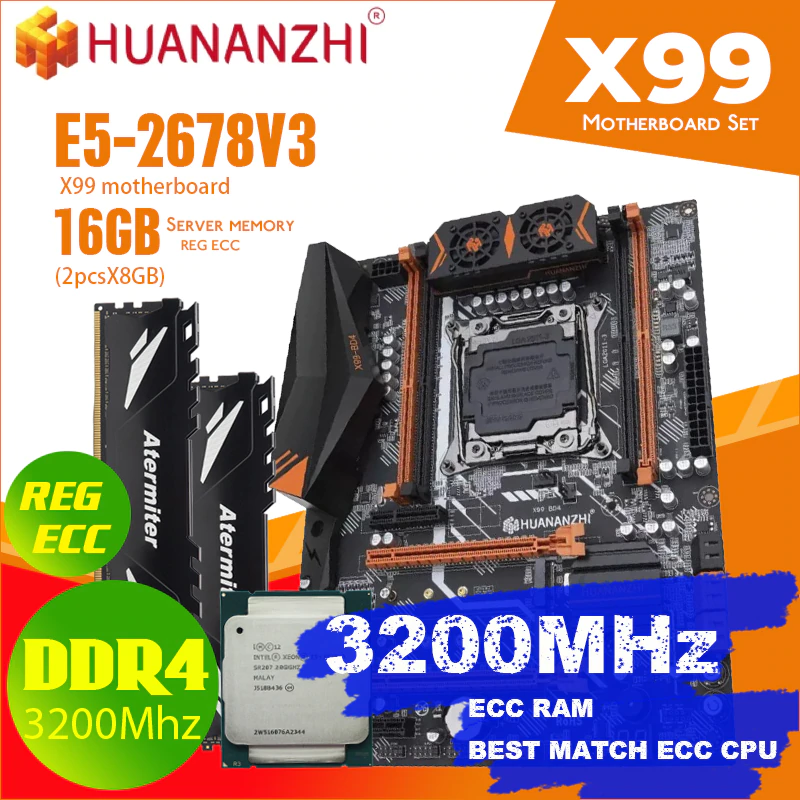
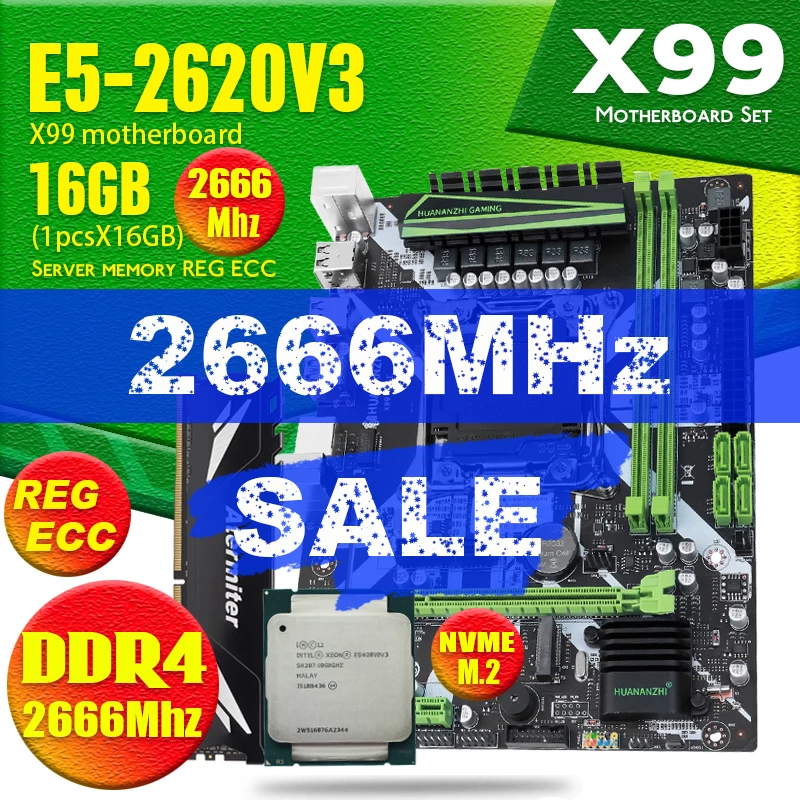
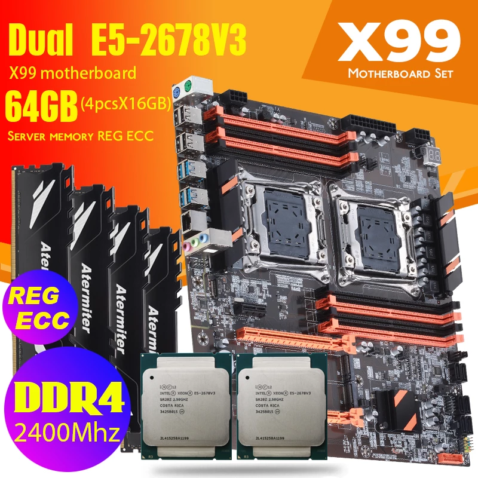

## Price Dynamics

### 2022

<small class="tab-img-w-200 col-w-0">

| # | mother | cpu | memory | photo | store | 2022/11 | 2022/12 |
| --- | :-: | :-: | :-: | :-: | --- | --- | --- |
| 1 | Huananzhi X99 BD4 | 2678V3 | 2x8Gb DDR4 3200MHz ECC-REG |  | [1](https://www.aliexpress.com/item/4000542296880.html 'CPU Store') | 13:9789 14:9766 15:9699 16:9666 17:9627 18:9699 19:9708 20:9708 21:9725 22:9791 23:9708 24:9338 25:9338 26:9337 27:9337 28:9356 29:9502 30:9474 | 01:9890 02:9952 03:9982 04:9982 05:10114 06:10114 07:10149 08:10096 |
|  |  |  |  |  |  |  |
| 2 | Huananzhi X99-8M-F D4 | 2620V3 | 1x16Gb DDR4 2666MHz ECC-REG |  | [1](https://aliexpress.ru/item/4000931520719.html 'CPU Store') | 13:8509 14:8589 15:8530 16:8501 17:8466 18:8530 19:8538 20:8538 21:8553 22:8611 23:8537 24:8212 25:8212 26:8212 27:8212 28:8228 29:8357 30:8332 | 01:8698 02:8752 03:8779 04:8779 05:8895 06:8895 07:8926 08:8879 |
|  |  |  |  |  |  |  |
| 3 | MACHINIST X99 K9 white | 2620V3 | 1x16Gb DDR4 2400MHz REG-ECC |  | [8](https://aliexpress.ru/item/4000842821384.html 'Good Luck 7 Store') | 13:8189 14:8169 15:8113 16:8086 17:8053 18:8113 19:8120 20:8120 21:8135 22:8191 23:8120 24:7811 25:7811 26:7811 27:7811 28:7826 29:7949 30:7925 | 01:8273 02:8325 03:8350 04:8350 05:8461 06:8460 07:8490 08:8446 |
|  |  |  |  |  |  |  |
| 4 | Atermiter x99 D4 | 2670v3 | 2x8Gb DDR4 2666MHz Desktop |  | [1](https://aliexpress.ru/item/4000483492857.html 'CPU Store') | 10:6401 11:6199 13:6803 14:6786 15:6740 16:6717 17:6690 18:6740 19:6746 20:6746 21:6758 22:6804 23:6746 24:6489 25:6489 26:6489 27:6489 28:6501 29:6603 30:6583 | 01:6873 02:6916 03:6937 04:6937 05:7029 06:7028 07:7053 08:7016 |
|  | 11:3215 13:3400 | 11:924 13:976 | 11:2x1043 13:2x1102 |  |  | 11:6225 13:6580 |
| 5 | HUANANZHI X99 QD4 | 2640v3 | 2x8Gb DDR4 2666MHz Desktop |  | [6](https://aliexpress.ru/item/1005004759137992.html 'atermiter Store') | 10:7402 11:7169 13:8023 14:8004 15:7680 16:7655 17:7623 18:7680 19:7687 20:7687 21:7701 22:7754 23:7687 24:7394 25:7394 26:7394 27:7394 28:7409 29:7525 30:7502 | 01:7832 02:7881 03:7905 04:7905 05:8009 06:8009 07:8037 08:7995 |
|  | 11:4373 13:4619 | 11:1066 13:1126 | 11:2x1241 13:2x1311 |  |  | 11:7921 13:8367 |
| 6 | MACHINIST X99 MR9A [7](https://aliexpress.ru/item/1005003197164283.html 'MACHINIST official Store') | 2666v3 [9](https://aliexpress.ru/item/1005003644967394.html 'BY168 Store') | 2x8Gb DDR4 2133MHz ?ECC-REG [11](https://aliexpress.ru/item/33002249520.html 'RE Store') |  | [7](https://aliexpress.ru/item/1005004029196934.html 'MACHINIST official Store') | 10:9686 11:9381 13:9908 14:9885 15:9817 16:9784 17:9744 18:9817 19:9826 20:9826 21:9840 22:9908 23:9823 25:9449 26:9448 27:9448 28:9467 29:9615 30:9441 | 01:10008 02:10070 03:10101 04:10101 05:10080 06:10080 07:10115 08:10062 |
|  | 11:4518 13:5163 16:5098 17:5077 | 11:1739 13:1837 16:1814 17:1806 | 11:2x1241 13:2x1311 |  |  | 11:8739 13:9622 14:9449 |
| 7 | MACHINIST X99 MR9Av2 [7](https://aliexpress.ru/item/1005004005435696.html 'MACHINIST official Store') | 2666v3 [9](https://aliexpress.ru/item/1005003644967394.html 'BY168 Store') | 4x8Gb DDR4 2666MHz Desktop [10](https://aliexpress.ru/item/1005004564683502.html 'BillionR Store') |  | [7](https://aliexpress.ru/item/1005004695673494.html 'MACHINIST official Store') | 11:12143 13:13843 14:13810 15:13715 16:13669 17:13613 18:13715 19:13727 20:13727 21:13751 22:13846 23:13727 24:12233 25:12233 26:12233 27:12233 28:12257 29:12449 30:12805 | 01:13985 02:14073 03:14116 04:14116 05:14092 06:14091 07:14140 08:14066 |
|  | 11:~~4636~~ 13:~~5298~~ | 11:1739 13:1837 16:1814 17:1806 | 11:4x1241 13:4x1311 16:4x1212 17:4x1207 |  |  | 11:11342 13:12379 |

</small>

### 2021

<small class="tab-img-w-100 col-w-0">

| # | mother | cpu | memory | photo | store | 16/01 | 28/01 |
| --- | --- | --- | --- | --- | --- | --- | --- |
| 1 | Huananzhi X99 BD4 | 2678V3 | 2x8Gb DDR4 ECC-REG |  | [1](https://www.aliexpress.com/item/4000542296880.html 'CPU Store') | $230 €194 ₽17342 | $237 |
| - | $96 |  |  |  | [4](https://www.aliexpress.com/item/1005001966780350.html "Computerman's Store") [6](https://aliexpress.ru/item/1005001639191630.html 'Motherboard manufacturer Store') | $89 | $87 |
| - |  | $93 |  |  | [3](https://www.aliexpress.com/item/33002946609.html 'Yao Yue Store') | $93 | $93 |
| - |  |  | $56 |  | [3](https://www.aliexpress.com/item/33009776003.html 'Yao Yue Store') [5](https://www.aliexpress.com/item/32601791617.html 'CPU TOP Store') | $56 | $56 |
| - |  |  |  |  |  | $238(₽17505) | $236 |
| 2 | Huananzhi X99-8M-F D4 | 2620V3 | 1x16Gb DDR4 |  | [1](https://aliexpress.ru/item/4000931520719.html 'CPU Store') | $133 | $136 |
| - | $65 |  |  |  | [5](https://aliexpress.ru/item/4000115002701.html 'CPU TOP Store') | $65 | $65 |
| - |  | $23 |  |  | [5](https://aliexpress.ru/item/4000265198909.html 'CPU TOP Store') | $23 | $23 |
| - |  |  | $53 |  | [5](https://aliexpress.ru/item/32601791617.html 'CPU TOP Store') | $53 | $54 |
| - |  |  |  |  |  | $141 | $142 |
| 3 | Dual-X99 | 2x2678V3 | 4x16Gb DDR4 |  | [1](https://aliexpress.ru/item/4001327167349.html 'CPU Store') | $482 €407 ₽36342 | $482 |
| - | $165 [2](https://aliexpress.ru/item/1005001431965342.html 'SZMZ Official Store') | 2x$93 | 4x$58 |  |  | $261(₽19198) | $567 |

</small>
