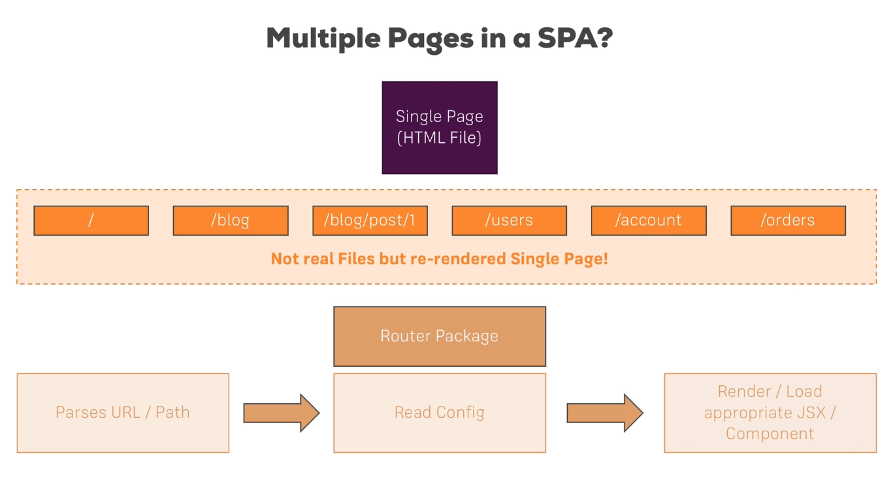
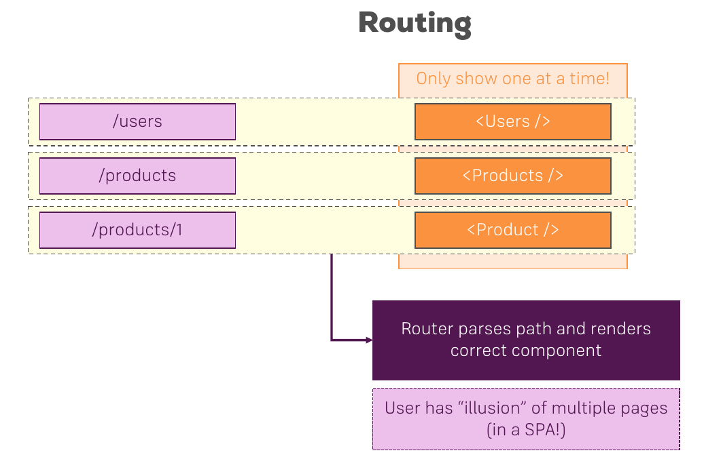

The trick just is that we don't actually have multiple HTML files, but then we instead use JavaScript to render different pages for different paths. So we don't really have different files but simply we **re-render** parts off that single page or maybe the entire single page **depending on which path** the user navigated to in our application.

