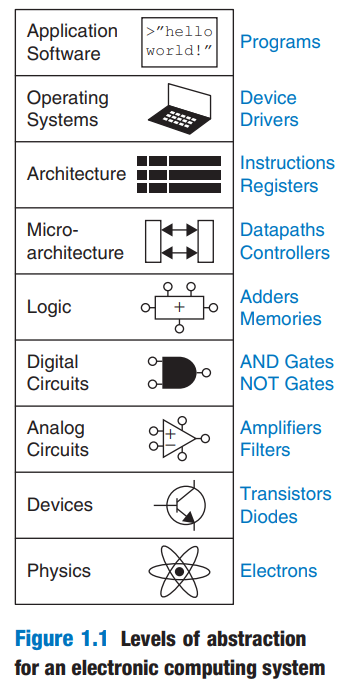

## THE ART OF MANAGING COMPLEXITY

One of the characteristics that separates an engineer or computer scientist from a layperson is a systematic approach to managing complexity. Modern digital systems are built from millions or billions of transistors. No human being could understand these systems by writing equations describing the movement of electrons in each transistor and solving all of the equations simultaneously. You will need to learn to manage complexity to understand how to build a microprocessor without getting mired in a morass of detail.

This concept I found in Harrises book about [Digital Design](../pdf/harris-d-m-harris-s-l-digital-design-and-computer-architecture-2nd-edition-2012.pdf). This concept simple:

- Application Software (Programs)
- Operating Systems (Device Drivers)
- Architecture (Instructions, Registers)
- Micro-architecture (Datapaths, Controllers)
- Logic (Adders, Memories)
- Digital Circuits (AND gates, NOT gates)
- Analog Circuits (Amplifiers, Filters)
- Devices (Transistors, Diodes)
- Physics (Electrons)

It's a beautiful scheme!

Scheme `levels of abstraction`.

More over...

Figure 1.1 illustrates levels of abstraction for an electronic computer system along with typical building blocks at each level. At the lowest level of abstraction is the physics, the motion of electrons. The behavior of electrons is described by quantum mechanics and Maxwell’s equations. Our system is constructed from electronic **_devices_** such as transistors (or vacuum tubes, once upon a time). These devices have well-defined connection points called **_terminals_** and can be modeled by the relationship between voltage and current as measured at each terminal. By abstracting to this device level, we can ignore the individual electrons. The next level of abstraction is **_analog circuits_**, in which devices are assembled to create components such as amplifiers. Analog circuits input and output a continuous range of voltages. **_Digital circuits_** such as logic gates restrict the voltages to discrete ranges, which we will use to indicate 0 and 1. In logic design, we build more complex structures, such as adders or memories, from digital circuits.

**_Microarchitecture_** links the logic and architecture levels of abstraction. The **_architecture_** level of abstraction describes a computer from the programmer’s perspective. For example, the Intel x86 architecture used by microprocessors in most **_personal computers_** (PCs) is defined by a set of instructions and registers (memory for temporarily storing variables) that the programmer is allowed to use. Microarchitecture involves combining logic elements to execute the instructions defined by the architecture. A particular architecture can be implemented by one of many different microarchitectures with different price/performance/power trade-offs. For example, the Intel Core i7, the Intel 80486, and the AMD Athlon all implement the x86 architecture with different microarchitectures.

Moving into the software realm, the operating system handles lowlevel details such as accessing a hard drive or managing memory. Finally, the application software uses these facilities provided by the operating system to solve a problem for the user. Thanks to the power of abstraction, your grandmother can surf the Web without any regard for the quantum vibrations of electrons or the organization of the memory in her computer.

From book [Digital design](https://papa31.github.io/hm/assets/files/harris-d-m-harris-s-l-digital-design-and-computer-architecture-2nd-edition-2012-278aad41bbd5750ed2461b2011414915.pdf)

[Digital design(rus)](../pdf/digital-design-and-computer-architecture-russian-translation_July16_2016.pdf)

[Abstraction](../pdf/harris-d-m-harris-s-l-digital-design-and-computer-architecture-2nd-edition-2012.pdf) page #2
