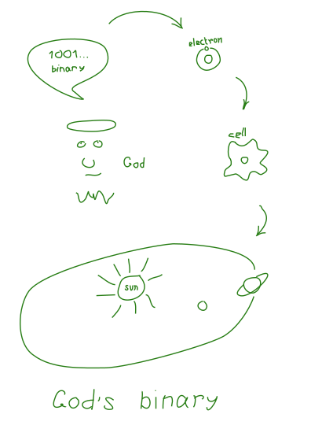

Binary numbers are very simple. In ancient Egypt and China, people coded some kind of logic using binary numbers. Leibniz saw in this the mystery of God: it is something from which the World is created _from nothing -> something_. **Creatio ex nihilo** (Latin for "creation out of nothing").

- 0 - no light
- 1 - there is light

<div style={{width: "fit-content", margin: "auto", border: "1px solid #277d14" }}>



</div>

## Binary/Boolean Logic

Boole compiled truth table later. AND, OR, NOT etc.

## Useful Counter

This counter shows how to count in binary from numbers zero through thirty-one.

[0-31<sub>10</sub>]


## Addition

Addition is performed with carry. If 1 + 1.

```sh
  1 1  <- carry

   10101  = 21
+
    1110  = 14
  ------
  100011  = 35
```

**Addition Table:**

|       | **0** | **1** |
| ----- | ----: | ----: |
| **0** |     1 |     1 |
| **1** |     1 |    10 |

## Subtraction

```sh
   0111 = 7
-
   1010 = 10
   ----
 1 1101  WTF?
```

Binary subtraction cannot subtract a large negative number from a small positive number (7-10)?????

You need to choose a different representation.

Subtraction with [two's complement](twos-complement) representation:

```
A - B = A + not B + 1
```

From: [Binary Numbers (Wikipedia)](https://en.wikipedia.org/wiki/Binary_number)
