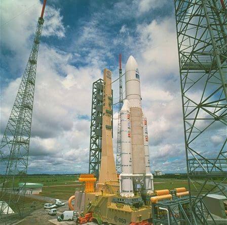

  
photo from: [http://www.capcomespace.net/](http://www.capcomespace.net/)

The 7 billion dollars Ariane-5 explodes due to overflowing his 16-bit computer.
The equipment was tested with Ariane-4 engines. But
the new Ariane-5 engines were more powerful. This caused the computer system to [overflow](twos-complement-overflow) and the rocket exploded. (This is result of reusing code <a href='https://ru.wikipedia.org/wiki/%D0%9F%D0%BE%D0%B2%D1%82%D0%BE%D1%80%D0%BD%D0%BE%D0%B5_%D0%B8%D1%81%D0%BF%D0%BE%D0%BB%D1%8C%D0%B7%D0%BE%D0%B2%D0%B0%D0%BD%D0%B8%D0%B5_%D0%BA%D0%BE%D0%B4%D0%B0#%D0%94%D0%BE%D1%81%D1%82%D0%BE%D0%B8%D0%BD%D1%81%D1%82%D0%B2%D0%B0_%D0%B8_%D0%BD%D0%B5%D0%B4%D0%BE%D1%81%D1%82%D0%B0%D1%82%D0%BA%D0%B8_%D0%BC%D0%B5%D1%82%D0%BE%D0%B4%D0%B0_%D0%BF%D0%BE%D0%B2%D1%82%D0%BE%D1%80%D0%BD%D0%BE%D0%B3%D0%BE_%D0%B8%D1%81%D0%BF%D0%BE%D0%BB%D1%8C%D0%B7%D0%BE%D0%B2%D0%B0%D0%BD%D0%B8%D1%8F' class='external'>ru.wikipedia.org</a>)

[Harris D. M., Harris S. L. - Digital Design and Computer Architecture, 2nd Edition - 2012](../../pdf/harris-d-m-harris-s-l-digital-design-and-computer-architecture-2nd-edition-2012.pdf)  
1.4.6 Signed Binary Numbers - 16 page

## Resources

- [Three Ideas of Signed Binary Numbers](three-ideas-signed-binary-numbers)
- [Weird Number](weird-number)
- [Two's Complement Overflow](twos-complement-overflow)
- [Range Number Systems](range-number-systems)
- [Sign Extension](sign-extension)
