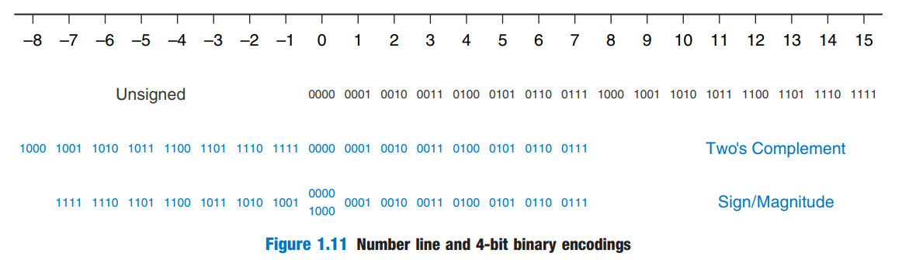

System|Range|N=8
-|-|-
Unsigned|[0,2N-1]|[0,255]
[Sign/Magnitude](sign-with-magnitude) & [Ones' Complement](ones-complement) |[-(2N-1-1),2N-1-1]|[-127,127]
[Two's Complement](twos-complement)|[-2N-1,2N-1-1]|[-128,127]

Sign/Magnitude and ones' complement have two zeros.
There is a [weird number](weird-number) (100..0002) in two's complement.

[Harris D. M., Harris S. L. - Digital Design and Computer Architecture, 2nd Edition - 2012](../../pdf/harris-d-m-harris-s-l-digital-design-and-computer-architecture-2nd-edition-2012.pdf)  
1.4.6 Signed Binary Numbers - 19 page

## Resources

- [Three Ideas of Signed Binary Numbers](three-ideas-signed-binary-numbers)
- [Weird Number](weird-number)
- [Crash Due to Overflow](crash-due-to-overflow)
- [Twos Complement Overflow](twos-complement-overflow)
- [Sign Extension](sign-extension)