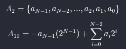

Two's complement numbers are identical to unsigned binary numbers, except that the two's binary numbers have the most significant bit with FUCKING value of -2<sup>N-1</sup>. It's not clear!

**Example:** Convert two's complement 1101<sub>2</sub> to decimal
```
         1101 -> 4-bits
values: -8421 <- -8 is msb
result: -8x1+4x1+2x0+1x1
        -8+4+1=-3
``` 

This -8 is the msb (most significant bit) of the number (1101): -2<sup>3</sup> = -2<sup>4-1</sup> (i.e., -2<sup>N-1</sup>)

This is understandable!

And a fucking math formula:



<!-- $$
  A_{2} = \{a_{N-1}, a_{N-2},..., a_2, a_1, a_0\}
$$

$$
  A_{10} = -a_{N-1}(2^{N-1}) + 
  \sum_{i=0}^{N-2} a_i2^{i}
$$ -->


A<sub>2</sub> = 1101  
A<sub>10</sub> = -1x2<sup>3</sup>+1x2<sup>2</sup>+0x2<sup>3</sup>+1x2<sup>3</sup> = -8+4+0+1 = -3

## Addition

Recall that when adding N-bit numbers, the carry out the Nth bit (i.e., the N + 1th result bit) is discarded.

**Example:** Compute -7<sub>10</sub> + 7<sub>10</sub>

```
   1001 = -7
 + 0111 = 7
   ====
 1 0000 <- Carry Discarded
   0000 <- Result
```
### Overflow

Adding numbers (both negatives) or (both positives) may cause [overflow](twos-complement-overflow).

---

From: [Harris D. M., Harris S. L. - Digital Design and Computer Architecture, 2nd Edition - 2012](../../pdf/harris-d-m-harris-s-l-digital-design-and-computer-architecture-2nd-edition-2012.pdf)  
1.4.6 Signed Binary Numbers - 17 page
## Subtraction

Subtraction is performed by *taking the two’s complement* of the second number, then adding.

Briefly formula:
```  
A - B = A + not B + 1
```
**Example:** 3<sub>10</sub> - 5<sub>10</sub>

First, you need to *take the two's complement* of 5<sub>10</sub>: 

```sh title="Taking the two's complement"
      5 = 0101
invert -> 1010
        +    1
         -----
          1011 = -5
```
and now do the addition: 3<sub>10</sub> + (- 5<sub>10</sub>)

```sh title="3+(-5)"
  0011 =  3
+
  1011 = -5
  ----
  1110 = -8+4+2= -2
```
To check result, you can take two's complement again:

```
  1110 = -2
  0001 <- invert
+    1
  ----
  0010 = 2     
```

From: [Signed Number Representation (Wikipedia)](https://en.wikipedia.org/wiki/Signed_number_representations#Two's_complement)

## Overflow

