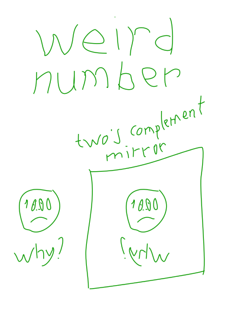

The binary number 100..000<sub>2</sub> is called a _weird number_ because after inverting and adding 1 (taking the two's complement) it does not change.

```
100..000  inverting
011..111
+ 1
------------
100..000
```

This number (100..00<sub>2</sub> = -2<sup>N-1</sup>) is the _most negative_ of two's complement numbers. And it has no positive counterpart.

[Harris D. M., Harris S. L. - Digital Design and Computer Architecture, 2nd Edition - 2012](../../pdf/harris-d-m-harris-s-l-digital-design-and-computer-architecture-2nd-edition-2012.pdf)  
1.4.6 Signed Binary Numbers - 15 page

## Resources

- [Three Ideas of Signed Binary Numbers](three-ideas-signed-binary-numbers)
- [Crash Due to Overflow](crash-due-to-overflow)
- [Twos Complement Overflow](twos-complement-overflow)
- [Range Number Systems](range-number-systems)
- [Sign Extension](sign-extension)
