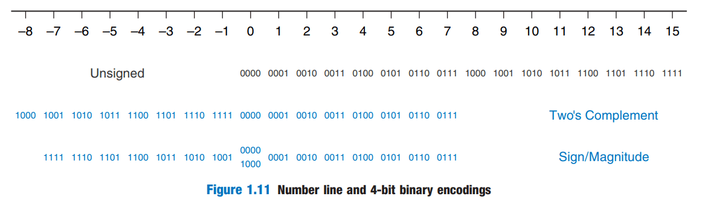

## Exercise 1.31 Repeat exercise 1.29, but convert to 8-bit sign/magnitude numbers

My:

(a) 42<sub>10</sub> = 1x32(2<sup>5</sup>) + 0x16(2<sup>4</sup>) + 1x8(2<sup>3</sup>) + 0x4(2<sup>2</sup>) + 1x2(2<sup>1</sup>) + 0x1(2<sup>0</sup>) = 0010 1010<sub>2</sub>

(b) −63<sub>10</sub> = 1x32(2<sup>5</sup>) + 1x16(2<sup>4</sup>) + 1x8(2<sup>3</sup>) + 1x4(2<sup>2</sup>) + 1x2(2<sup>1</sup>) + 1x1(2<sup>0</sup>) = 1011 1111<sub>2</sub>

(c) 124<sub>10</sub> = 1x64(2<sup>6</sup>) + 1x32(2<sup>5</sup>) + 1x16(2<sup>4</sup>) + 1x8(2<sup>3</sup>) + 1x4(2<sup>2</sup>) + 0x2(2<sup>1</sup>) + 0x1(2<sup>0</sup>) = 0111 1100<sub>2</sub>

(d) −128<sub>10</sub> = overflow

(e) 133<sub>10</sub> = overflow

Harrises:

(a) 0010 1010; (b) 1011 1111; (c) 0111 1100; (d) overflow; (e) overflow

## Exercise 1.32 Repeat exercise 1.30, but convert to 8-bit sign/magnitude numbers

My:

(a) 24<sub>10</sub> = 0001 1000<sub>2</sub>

(b) −59<sub>10</sub> = 1011 1011<sub>2</sub>

(c) 128<sub>10</sub> = overflow

(d) −150<sub>10</sub> = overflow

(e) 127<sub>10</sub> = 0111 1111<sub>2</sub>

Harrises:

(a) 0001 1000; (b) 1011 1011; (c) overflow; (d) overflow; (e) 0111 1111

## Exercise 1.33 Convert the following 4-bit two's complement numbers to 8-bit two's complement numbers

My:

(a) 0101<sub>2</sub> = 0000 0101<sub>2</sub>

(b) 1010<sub>2</sub> = 1111 1010<sub>2</sub>

Harrises:

(a) 00000101; (b) 11111010

## Exercise 1.34 Convert the following 4-bit two's complement numbers to -8-bit two's complement numbers

My:

(a) 0111<sub>2</sub> = 0000 0111<sub>2</sub>

(b) 1001<sub>2</sub> = 1111 1001<sub>2</sub>

Harrises:

(a) 0000 0111; (b) 1111 1001

## Exercise 1.35 Repeat exercise 1.33 if the numbers are unsigned rather than two's complement

My:

(a) 0101<sub>2</sub> = 0000 0101<sub>2</sub>

(b) 1010<sub>2</sub> = ~~1000 1010~~<sub>2</sub>

Harrises:

(a) 00000101; (b) 0000 1010

:::caution
Unsigned! And I think sign/magnitude! Sorry!
:::

## Exercise 1.36 Repeat exercise 1.34 if the numbers are unsigned rather than two's complement

My:

(a) 0111<sub>2</sub> = 0000 0111<sub>2</sub>

(b) 1001<sub>2</sub> = 0000 1001<sub>2</sub>

Harrises:

(a) 0000 0111; (b) 0000 1001

## Exercise 1.37 Base 8 is referred to as *octal*. Convert each of the numbers from exercise 1.25 to octal

My:

(a) 42<sub>10</sub> = 5x8(8<sup>1</sup>) + 2x1(8<sup>0</sup>) = 52<sub>8</sub>

(b) 63<sub>10</sub> = 7x8(8<sup>1</sup>) + 7x1(8<sup>0</sup>) = 77<sub>8</sub>

(c) 229<sub>10</sub> = 3x64(8<sup>2</sup>) + 4x8(8<sup>1</sup>) + 5x1(8<sup>0</sup>) = 345<sub>8</sub>

(d) 845<sub>10</sub> = 1x512(8<sup>3</sup>) + 5x64(8<sup>2</sup>) + 1x8(8<sup>1</sup>) + 5x1(8<sup>0</sup>) = 1515<sub>8</sub>

Harrises:

(a) 52; (b) 77; (c) 345; (d) 1515

## Exercise 1.38 Base 8 is referred to as *octal*. Convert each of the numbers from exercise 1.26 to octal

My:

(a) 14<sub>10</sub> = 1x8(8<sup>1</sup>) + 6x1(8<sup>0</sup>) = 16<sub>8</sub>

(b) 52<sub>10</sub> = 6x8(8<sup>1</sup>) + 4x1(8<sup>0</sup>) = 64<sub>8</sub>

(c) 339<sub>10</sub> = 5x64(8<sup>2</sup>) + 2x8(8<sup>1</sup>) + 3x1(8<sup>0</sup>) = 523<sub>8</sub>

(d) 711<sub>10</sub> = 1x512(8<sup>3</sup>) + 3x64(8<sup>2</sup>) + 0x8(8<sup>1</sup>) + 7x1(8<sup>0</sup>) = 1307<sub>8</sub>

Harrises:

(a) 0o16; (b) 0o64; (c) ~~0o339~~; (d) 0o1307

:::info
339<sub>10</sub> = 339<sub>8</sub>? Nonsense!
:::

## Exercise 1.39 Convert each of the following octal numbers to binary, hexadecimal, and decimal

My:

(a) 42<sub>8</sub> = 100 010<sub>2</sub> = 0010 0010<sub>2</sub> = 22<sub>16</sub> = 2x16 + 2 = 34<sub>10</sub>

(b) 63<sub>8</sub> = 110 011<sub>2</sub> = 0011 0011<sub>2</sub> = 33<sub>16</sub> = 3x16 + 3 = 51<sub>10</sub>

(c) 255<sub>8</sub> = 010 101 101<sub>2</sub> = 1010 1101<sub>2</sub> = AD<sub>16</sub> = 10x16 + 13 = 173<sub>10</sub>

(d) 3047<sub>8</sub> = 011 000 100 111<sub>2</sub> = 0110 0010 0111<sub>2</sub> = 627<sub>16</sub> = 6x256 + 2x16 + 7 = 1575<sub>10</sub>

:::tip
To convert *octal* to binary you need convert each octal digit with 3 binary digit (in hexadecimal, you change each hex digit with 4 binary digit)
:::

Harrises:

(a) 100010<sub>2</sub>, 22<sub>16</sub>, 34<sub>10</sub>; (b) 110011<sub>2</sub>, 33<sub>16</sub>, 51<sub>10</sub>; (c) 010101101<sub>2</sub>, AD<sub>16</sub>,
173<sub>10</sub>; (d) 011000100111<sub>2</sub>, 627<sub>16</sub>, 1575<sub>10</sub>

## Exercise 1.40 Convert each of the following octal numbers to binary, hexadecimal, and decimal

My:

(a) 23<sub>8</sub> = 010 011<sub>2</sub> = 0001 0011<sub>2</sub> = 13<sub>16</sub> = 1x16 + 3 = 19<sub>10</sub>

(b) 45<sub>8</sub> = 100 101<sub>2</sub> = 0010 0101<sub>2</sub> = 25<sub>16</sub> = 2x16 + 5 = 37<sub>10</sub>

(c) 371<sub>8</sub> = 011 111 001<sub>2</sub> = 1111 1001<sub>2</sub> = F9<sub>16</sub> = 15x16 + 9 = 249<sub>10</sub>

(d) 2560<sub>8</sub> = 010 101 110 000<sub>2</sub> = 0101 0111 0000<sub>2</sub> = 570<sub>16</sub> = 5x256 + 7x16 = 1392<sub>10</sub>

Harrises:

(a) 0b10011; 0x13; 19; (b) 0b100101; 0x25; 37; (c) 0b11111001; 0xF9;
249; (d) 0b10101110000; 0x570; 1392

## Exercise 1.41 How many 5-bit two's complement numbers are greater than 0? How many are less than 0? How would your answer differ for sign/magnitude numbers?

My:

a) 01111 = 15

b) 10000 = 16 (or 15 + 1)

c) 15 and 15 (one number less)

Harrises:

15 greater than 0, 16 less than 0; 15 greater and 15 less for sign/magnitude

## Exercise 1.42 How many 7-bit two's complement numbers are greater than 0? How many are less than 0? How would your answers differ for sign/magnitude numbers?

My:

a) 0111111 = 2<sup>6</sup>-1 = 63

b) 1000000 = 2<sup>6</sup> = 64

c) 63 and 63

Harrises:

(2<sup>6</sup>-1) are greater than 0; 2<sup>6</sup> are less than 0. For sign/magnitude numbers,
(2<sup>6</sup>-1) are still greater than 0, but (2<sup>6</sup>-1) are less than 0.

## Exercise 1.43 How many bytes are in a 32-bit word? How many nibbles are in the word?

My:

a) 4 ; b) 8

Harrises:

4, 8

## Exercise 1.44 How many bytes are in a 64-bit word?

My: 8

Harrises: 8

## Exercise 1.45 A particular DSL modem operates at 768 kbit/sec. How many bytes can it receive in 1 minute?

My: 768x60 = 46080 kbits = 5760KB = 5760000 bytes

Harrises: 5760000

## Exercise 1.46 USB 3.0 can send data at 5Gbits/sec. How many bytes can it send in 1 minute?

My: 5 x 60 = 300 Gbits/min = 37,5 GBytes/min = 37 500 000 000 bytes/min

Harrises: (5 × 10<sup>9</sup> bits/second)(60 seconds/minute)(1 byte/8 bits) = 3.75 × 10<sup>10</sup> bytes

## Exercise 1.47 Hard disk manufacturers use the term "megabyte" to mean 10<sup>6</sup> bytes and "gigabyte" to mean 10<sup>9</sup> bytes. How many real GBs of music you can store on a 50GB hard disk?

My: 

1 Kbytes = 2<sub>10</sub> = 1024 bytes

1 Mbytes = 2<sub>20</sub> = 1 048 578 bytes

1 Gbytes = 2<sub>30</sub> = 1 073 741 824 bytes

50 000 000 000 / 1 073 741 824 = 46.566 Gbytes 

Harrises: 

46.566 gigabytes

## Exercise 1.48 Estimate the value of 2<sup>31</sup>

My:

2<sup>30</sup> ~ 2x10<sup>9</sup> ~ 2 000 000 000

Harrises:

2 billion

## Exercise 1.49 A memory on the Pentium II microprocessor is organized as a rectangular array of bits with 2<sup>8</sup> rows and 2<sup>9</sup> columns. Estimate how many bits it has without using a calculator?

My:

2<sup>8</sup> x 2<sup>9</sup> = 2<sup>17</sup> = 128 Kbits = 16 Kbytes

Harrises:

128 kbits

## Exercise 1.50 Draw a number line analogous to Figure 1.11 for 3-bit unsigned, two's complement, and sign/magnitude numbers

|[](../binary-numbers/number-line-and-4-bit-binary-encodings.png)|
|-|

My: Table

||-4|-3|-2|-1|0|1|2|3|4|5|6|7
-|-|-|-|-|-|-|-|-|-|-|-|-
|unsign|||||000|001|010|011|100|101|110|111
two's|100|101|110|111|000|001|010|011
Sign/M||111|110|101|000 100|001|010|011

Harrises: same

## Exercise 1.51 Draw a number line analogous to Figure 1.11 for 2-bit unsigned, two's complement, and sign/magnitude numbers

My: Table

||-2|-1|0|1|2|3|
-|-|-|-|-|-|-
|unsign|||00|01|10|11
two's|10|11|00|01
Sign/M||11|00 10|01

## Exercise 1.52 Perform the following additions of unsigned binary numbers. Indicate whether or not the sum overflows a 4-bit result

My:

(a) 1001 + 0100 = 1101 (no overflow)

```
  1001
+ 0100
  ====
  1101   
```

(b) 1101 + 1011 = ~~11110~~ (there is an overflow)

```
  1101
+ 1011
  ====
1 1110
```

Harrises:

(a) 1101; (b) 11000 (overflows)

## Exercise 1.53 Perform the following additions of unsigned binary numbers. Indicate whether or not the sum overflows an 8-bit result

My:

(a) 10011001 + 01000100 = 11011101 
```
  10011001
+ 01000100
  ========
  11011101
```

(b) 11010010 + 10110110 = ~~100001000~~ (overflows)

```
  11010010
+ 10110110
  ========
 100001000  <- overflow
```

Harrises:

(a) 11011101; (b) 110001000 (overflows)

:::info
When 1+1+1 I forget that it is 1 and not 0
:::

## Exercise 1.54 Repeat exercise 1.52, assuming that the binary numbers are in two's complement form 

My:

(a) 1001 + 0100 = (-8+1) + 4 = -3 (no overflow)

```
or with two's complement numbers:
  1001
  0110 <- invert
+    1 <- increment
  ====
  0111 = 7 (-7)
```

(b) 1101 + 1011 = (-8+4+1) + (-8+2+1) = -3 + -5 = -8 (no overflow)

:::info Two's Complement Overflow
When adding numbers in the two's complement form overflow is discarding. See [two's complement overflow](binary-numbers/twos-complement-overflow)
:::

```
adding two negative numbers:

  1101 = -3
+ 1011 = -5
  ====
1 1000 <- carry discarded
  result: -8
```

Harrises:

(a) 1101, no overflow; (b) 1000, no overflow

## Exercise 1.55 Repeat exercise 1.53, assuming that the binary numbers are in two's complement form

My:

(a) 10011001 + 01000100 = 11011101
```
  10011001
+ 01000100
  ========
  11011101
```

(b) 11010010 + 10110110 = 10001000

```
  11010010
+ 10110110
  ========
 110001000  <- no overflow
  10001000  -> result
```

Harrises:

(a) 11011101; (b) ~~110001000~~

:::info 
If that fucking range is 8 bits, then 9 bits is 1 fucking bit more than it!
:::

## Exercise 1.56 Convert the following decimal numbers to 6-bit two's complement binary numbers and add them. Indicate whether or not the sum overflows a 6-bit result

My: 

(a) 16 + 9
```
   010000
+  001001
   ======
   011001 = 25
```
(b) 27 + 31
```
   011011 = 16+8+2+1=27
+  011111 = 16+8+4+2+1=31
   ======
   111010 = 5̶8̶ 
```
:::info
I'm wrong! If mbr is inverted after summation, it's an overflow! 
:::

(c) −4 + 19
```
   111100
+  010011
   ======
 1 001111 -> discard carry
   001111 = 15
```
(d) 3 + −32
```
   000011
+  100000
   ======
   100011 = -32+2+1=-29
```
(e) −16 + −9
```
   110000 = -32+16=-16
+  110111 = -32+16+4+2+1=-7
   ======
 1 100111 -> discard carry
   100111 = -32+4+2+1=-25
```
(f) −27 + −31 -> overflow
```
   100101 = -32+4+1=-27
+  100001 = -32+1=-31
   ======
 1 000110 -> discard carry
   000110 -> changed msb
   overflow!
```

Harrises: 

(a) 010000 + 001001 = 011001;
(b) 011011 + 011111 = 111010 (overflow);
(c) 111100 + 010011 = 001111;
(d) 000011 + 100000 = 100011;
(e) 110000 + 110111 = 100111;
(f) 100101 + 100001 = 000110 (overflow)

## Exercise 1.57 Repeat exercise 1.56 for the following numbers

My:

(a) 7 + 13
```
   000111
   001101
   ======
   010100
```
(b) 17 + 25
```
010001
011001
======
101010 -> overflow
```
(c) −26 + 8
```
100110
001000
======
101110
```
(d) 31 + −14
```
 011111
 110010
 ======
1010001
 010001
```
(e) −19 + −22
```
 101101
 101010
 ======
1010111
 010111 -> overflow
```
(f) −2 + −29
```
 111110
 100011
 ======
1100001
 100001 = -31
```

Harrises:

(a) 000111 + 001101 = 010100
(b) 010001 + 011001 = 101010, overflow
(c) 100110 + 001000 = 101110
(d) 011111 + 110010 = 010001
(e) 101101 + 101010 = 010111, overflow
(f) 111110 + 100011 = 100001

## Exercise 1.58 Perform the following additions of unsigned hexadecimal numbers. Indicate whether or not the sum overflows an 8-bit (two hex digit) result

My:

(a) 7 + 9 = 10<sub>16</sub>
```
 0111 
 1001
 ====
10000
```
(b) 13 + 28 = 3B
```
0001 0011
0010 1000
=========
0011 1011
```
(c) AB + 3E = E9
```
1010 1011
0011 1110
=========
1110 1001
```
(d) 8F + AD = overflow
```
 1000 1111
 1010 1101
 =========
10011 1100 -> overflow
```

Harrises:

(a) 10; (b) 3B; (c) E9; (d) 13C (overflow)

## Exercise 1.59 Perform the following additions of unsigned hexadecimal numbers. Indicate whether or not the sum overflows an 8-bit (two hex digit) result

My:

(a) 22 + 8 = 2A<sub>16</sub>
```
0010 0010
0000 1000
=========
0010 1010
```
(b) 73 + 2C = 9F
```
0111 0011
0010 1100
=========
1001 1111
```
(c) 7F + 7F = FE
```
0111 1111
0111 1111
=========
1111 1110
```
(d) C2 + A4 = 166 overflow
```
 1100 0010
 1010 0100
 =========
10110 0110
```

Harrises:

(a) 0x2A; (b) 0x9F; (c) 0xFE; (d) 0x66, overflow

## Exercise 1.60 Convert the following decimal numbers to 5-bit two's complement binary numbers and subtract them. Indicate whether or not the difference overflows a 5-bit result

(a) 9 − 7 
```
   01001
-  00111
   =====
   00010
```
(b) 12 − 15
```
   01100     01100
-  01111   + 10001
   =====     =====
   11101  =  11101
```
(c) −6 − 11
```
  11010      11010
+ 10101    - 01011
  =====      =====
1 01111 -17  10111  -9
   
   both error !!
```
(d) 4 − −8
```
00100
01000
=====
01100
```

Harrises:

(a) 01001 - 00111 = 00010; (b) 01100 - 01111 = 11101; (c) 11010 - 0̶1̶0̶1̶1̶ = 0̶1̶1̶1̶1̶; (d) 00100 - 11000 = 01100

:::info
They screwed up again!
:::