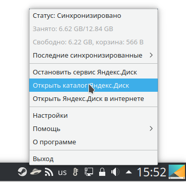
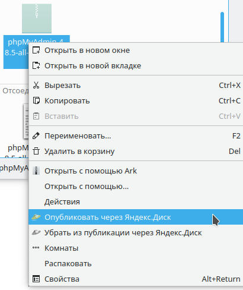
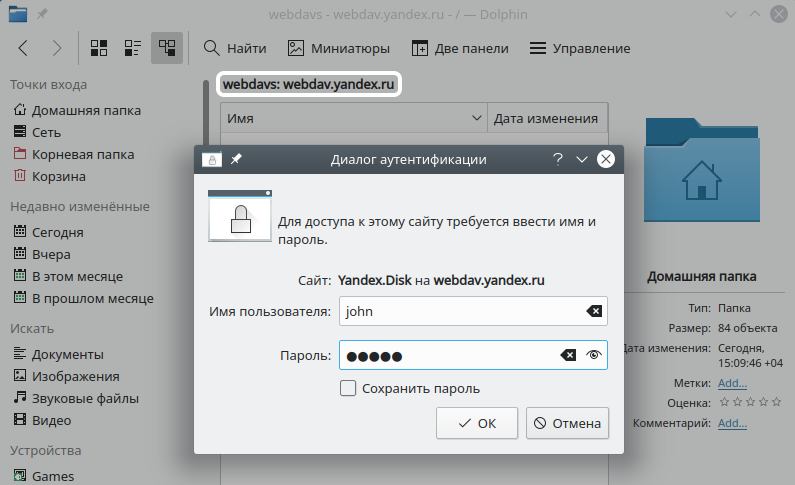
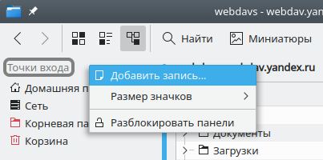

source: https://itproffi.ru/yandeks-disk-ispolzovanie-oblachnogo-hranilishha-v-linux/

В настоящее время очень популярным инструментом для доступа и управления файлами являются так называемые облачные хранилища. Они предполагают размещение пользовательских данных на доступных через интернет удалённых серверах т.е. в «облаке» и доступ к нему посредством специального программного обеспечения (ПО) и протоколов. Компании-разработчики облачных хранилищ и сред поддерживают практически все популярные платформы и операционные системы (ОС) для взаимодействия пользователей с облаком. Не стала исключением и компания «Яндекс», которая вместе с предоставляемым ею сервисом «Яндекс.Диск» предлагает пользователям и одноимённый продукт для удобного пользования, собственно, самим сервисом. В этой статье речь пойдёт об утилите Яндекс.Диск и её использовании в Linux.

Загрузка и установка пакета Яндекс.Диск
---------------------------------------

Сама утилита представляет собой демон, постоянно работающий в памяти и следящий за изменениями определённых файлов и каталогов в локальном и удалённом хранилище (облаке) и реагирует на определённые события (добавление, удаление, переименование и/или изменение файлов/каталогов), запуская синхронизацию, которая актуализирует данные в облаке и локальных хранилищах.

Утилита является бесплатной и, как указывают сами разработчики, написана на языке C++ в IDE Kdevelop. Распространяется Яндекс.Диск в виде пакетов *.deb и *.rpm, которые можно скачать и установить как вручную (используя менеджер пакетов apt например), так и при помощи системы управления пакетами используемой ОС.

Для Debian-ориентированной системы для установки Яндекс.Диск через систему [управления пакетами (СУП)](https://itproffi.ru/ustanovka-programm-v-linux/) нужно выполнить следующие команды:

    sudo echo "deb http://repo.yandex.ru/yandex-disk/deb/ stable main" | sudo tee -a /etc/apt/sources.list.d/yandex-disk.list > /dev/null
    sudo apt-get update
    sudo apt-get install yandex-disk

В результате в системный репозиторий будет добавлен новый источник «deb http://repo.yandex.ru/yandex-disk/deb/ stable main» со стабильными сборками Яндекс.Диск, из которого будет производиться установка и последующие обновления утилиты.

Для RPM-ориентированных систем порядок установки с помощью СУП несколько иной. Нужно для начала вручную создать и отредактировать файл источника для добавления его в системный репозиторий:

    sudo nano /etc/yum.repos.d/yandex.repo

Запустится текстовый редактор nano (который сразу создаст файл yandex.repo по указанному пути), в котором нужно ввести следующее содержимое:

    \[yandex\]
    name=Yandex
    failovermethod=priority
    baseurl=http://repo.yandex.ru/yandex-disk/rpm/stable/$basearch/
    enabled=1
    metadata_expire=1d
    gpgcheck=1
    gpgkey=http://repo.yandex.ru/yandex-disk/YANDEX-DISK-KEY.GPG

Далее, сохранить сделанные изменения, нажав сочетание клавиш , подтвердить сохранение (Enter), закрыть редактор [nano](https://itproffi.ru/tekstovyj-redaktor-nano/) (Ctrl + X) и выполнить следующие команды:

    sudo rpm --import http://repo.yandex.ru/yandex-disk/YANDEX-DISK-KEY.GPG
    sudo yum install yandex-disk

Все эти действия выполняются и при использовании пакетных менеджеров, если сначала вручную скачать пакеты Яндекс.Диска через веб-браузер (или утилиту wget), например для deb-пакетов:

    sudo dpkg -i yandex-disk\_latest\_amd64.deb

Для rpm-пакетов:

    sudo rpm -ivh yandex-disk\_latest.x86\_64.rpm

Сами пакеты для нужных платформ и под соответствующую архитектуру можно скачать по адресу: [https://disk.yandex.ru/download#pc](https://disk.yandex.ru/download#pc).

Также может потребоваться импортировать с помощью [wget](https://itproffi.ru/utilita-wget-v-linux/) открытые GPG-ключи для проверки цифровой подписи пакетов, если это по какой-либо причине не произошло автоматически при использовании СУП или менеджера пакетов. Для Debian:

    wget -O YANDEX-DISK-KEY.GPG http://repo.yandex.ru/yandex-disk/YANDEX-DISK-KEY.GPG
    sudo apt-key add YANDEX-DISK-KEY.GPG

Для RPM:

    sudo rpm --import http://repo.yandex.ru/yandex-disk/YANDEX-DISK-KEY.GPG

Управление демоном из командной оболочки
----------------------------------------

Разработчики Яндекс.Диска в реализации этого проекта постарались максимально придерживаться принципов так называемой концепции UNIX-Way, которая предполагает при разработке ПО соблюдение следующих принципов:

*   программа должна быть очень (насколько это возможно) небольшой;
*   программа должна выполнять только одну простую задачу, но выполнять её хорошо;
*   программа должна легко взаимодействовать с другими программами.

Утилита Яндекс.Диск, как уже говорилось, работает как демон (в хорошем смысле…), а потому основной метод управления ею — это дискретные команды с соответствующими опциями и параметрами. Эти команды могут выполняться как непосредственно пользователем в командной оболочке, так и другими программами, которые могут быть графическими оболочками для демона Яндекс.Диска, как в виде оконных приложений, так и в виде виджетов и/или апплетов рабочего стола. Некоторые достойные реализации (YD-tools, Yandex.Disk ServiceMenu) графического пользовательского интерфейса (GUI) давно существуют.

Для управления клиентом Яндекс.Диск предназначена команда yandex-disk, её общий синтаксис следующий:

yandex-disk внутренняя_команда \[ОПЦИИ\]

Внутренними командами утилиты yandex-disk являются команды управления демоном синхронизации, а также команды его настройки, которые приведены в следующей таблице:

<td />Начальное конфигурирование демона.

| **Команда** | **Назначение** |
|-------------|----------------|
| start | Запускает как демон и начинает синхронизацию каталога. В файл «.sync/status» каталога синхронизации записывается текущий статус синхронизации. |
| stop | Останавливает демон. |
| status | Выводит статус демона: статус синхронизации, ошибки, последние синхронизированные файлы, состояние дискового пространства. |
| token | Получает OAuth-токен, шифрует и сохраняет его в специальном файле (по умочанию — /.config/yandex-disk/passwd). Если не указаны опции -p PASSWORD или —password PASSWORD, то выводит приглашение ввести пароль из STDIN. |
| sync | Синхронизирует каталог и завершение работы (если демон запущен, дождается окончания синхронизации). Требуется для ручной синхронизации по требованию. |
| publish | Делает файл/каталог публичным и выводит ссылку в STDOUT. Сам объект будет скопирован в синхронизируемый каталог. Для перезаписи существующих объектов следует использовать опцию —overwrite. |
| unpublish | Удаляет публичный доступ к файлу/каталогу. |
| setup | Начальное конфигурирование демона. |
|||

Начальное конфигурирование демона.
----------------------------------

Соответственно, сами эти команды могут выполняться в следующем виде:

    yandex-disk start \[OPTION\]
    yandex-disk stop \[OPTION\]
    yandex-disk status \[OPTION\]
    yandex-disk sync \[OPTION\]
    yandex-disk token \[-p, --password=PASSWORD\] \[OPTION\] USERNAME \[FILE\]
    yandex-disk publish \[OPTION\] FILE
    yandex-disk unpublish FILE

В следующей таблице приводится описание всех доступных для yandex-disk опций:

| **Опция** | **Описание** |
|-----------|--------------|
| --config=FILE, -c FILE | Читает опции из конфигурационного файла. Файл должен содержать строки вида имя=значение. Путь к файлу по умолчанию ~/.config/yandex-disk/config.cfg. |
| --dir=DIR, -d DIR | Задаёт путь к каталогу Яндекс.Диска. |
| --auth=FILE, -a FILE | Читает данные токена из файла. Файл должен быть сгенерирован командой token. Путь к файлу по умолчанию ~/.config/yandex-disk/passwd. |
| --exclude-dirs=DIR1,DIR2,… | Исключает из синхронизации указанные каталоги. |
| --read-only | Указывает не загружать локальные изменения в облако. Измененные локально файлы будут переименованы. |
| --overwrite | Указывает в режиме «read-only» перезаписывать локально измененные файлы. |
| --no-daemon, -D | Запускает демон без возможности управления через командную оболочку. Чтобы вернуть управление, демон необходимо остановить, запустив в другой консоли команду yandex-disk stop или закрыв текущую консоль. |
| --version, -v | Выводит информацию о версии. |
| --proxy=PARAM | Задаёт настройки прокси-сервера. Допустимые параметры: auto — использовать системные настройки прокси-сервера —  используется по умолчанию, no — не использовать прокси сервер. protocol,address,port,login,password — настроить вручную. Пример настройки прокси-сервера вручную: proxy=socks4,my.proxy.local,1080,login,password |
|||

Как можно видеть, разработчики подошли к реализации утилиты Яндекс.Диск, что называется — «по-настоящему», ярко отразив в ней философию маленькой, эффективной, простой и удобной UNIX-программы. Все команды и опции говорят сами за себя и настройка демона Яндекс.Диск не вызывает никаких сложностей.

Первое, что необходимо выполнить в командной строке, после установки утилиты Яндекс.Диск — это запустить начальную настройку её демона с помощью команды:

    $ yandex-disk setup

Далее нужно проследовать несложному процессу, в ходе которого будет предложено создать защищённый токен на основе учётных данных, задать настройки прокси-сервера (если предполагается его использовать), указать путь к каталогу синхронизации, а также определить опции автозапуска демона при входе в систему:

    $ yandex-disk setup
    Использовать прокси-сервер? \[y/N\]: N
    Авторизация
    Если у вас ещё нет аккаунта на Яндексе, его можно завести по ссылке https://passport.yandex.ru/passport?mode=register
    Введите логин: mylogin
    Введите пароль:
    Токен сохранен в /home/john/.config/yandex-disk/passwd
    Настройка Яндекс.Диска
    Введите путь к папке Яндекс.Диска (Оставьте пустым для использования папки '/home/john/Yandex.Disk'): /media/john/Yandex.Disk/Disk/
    Запускать Яндекс.Диск при входе в систему? \[Y/n\]: Y
    Запуск демона...Готово

В приведённом примере производится настройка демона синхронизации для учетной записи _mylogin_ без задействования прокси-сервера. Каталогом для синхронизации в данном случае является каталог Disk на отдельном разделе (или устройстве) Yandex.Disk.

Интеграция с файловым менеджером
--------------------------------

Поскольку сервис Яндекс.Диск поддерживает работу по протоколу WebDAV, то синхронизацию легко настроить для приложений, которые поддерживают эту технологию. В Linux таковыми являются например файловые менеджеры Dolphin (для среды [KDE](https://itproffi.ru/graficheskie-sredy-gnome-i-kde/)), а также Nautilus – для среды [GNOME](https://itproffi.ru/graficheskie-sredy-gnome-i-kde/).

Сама настройка файлового менеджера для работы через WebDAV совсем несложна и на примере Dolphin выглядит следующим образом:

*   Для начала в адресной строке файлового менеджера нужно перейти по адресу webdavs://webdav.yandex.ru.
*   Далее, в появившемся диалоговом окне требуется ввести имя пользователя и пароль для доступа к облачному хранилищу.

*   После успешной авторизации Dolphin отобразит содержимое облачного хранилища, как-будто это локальный каталог.
*   По желанию можно добавить данный адрес в список точек «быстрого входа» в Dolphin, чтобы каждый раз не вводить адрес вручную.

Как можно видеть, благодаря грамотной реализации для Linux-систем и поддержке современных технологий для работы и защиты данных в удалённых хранилищах, утилита Яндекс.Диск легко и гибко способна организовать синхронизацию файлов. Для системных администраторов она примечательна ещё и тем, что полностью соответствует принципам администрирования UNIX/Linux систем. И если в это позволяет политика и регламент безопасности сети организации, то утилита Яндекс.Диск — это отличный вариант предоставить пользователям инструмент для синхронизации их данных с облаком.
