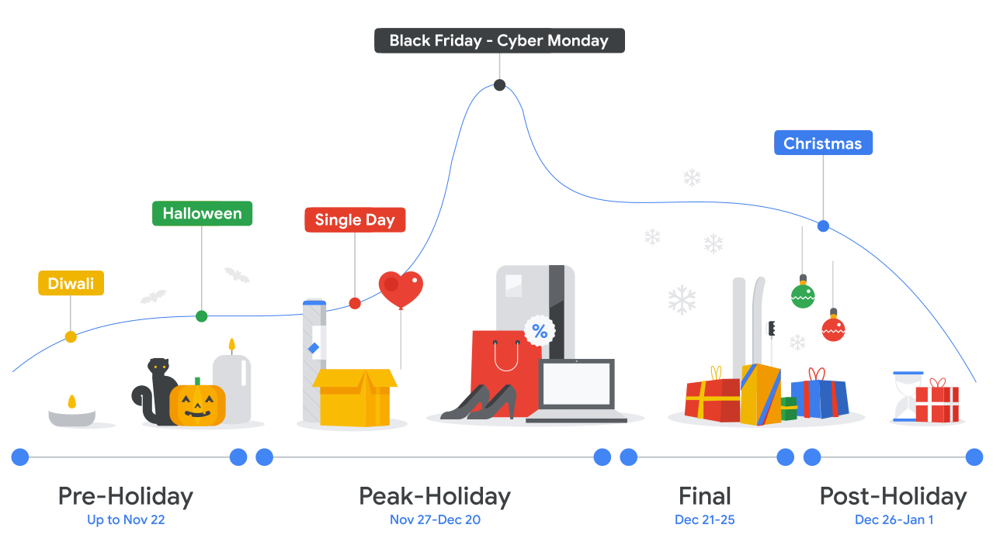
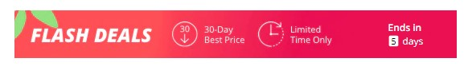
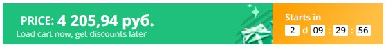
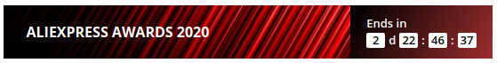
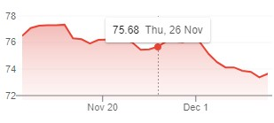
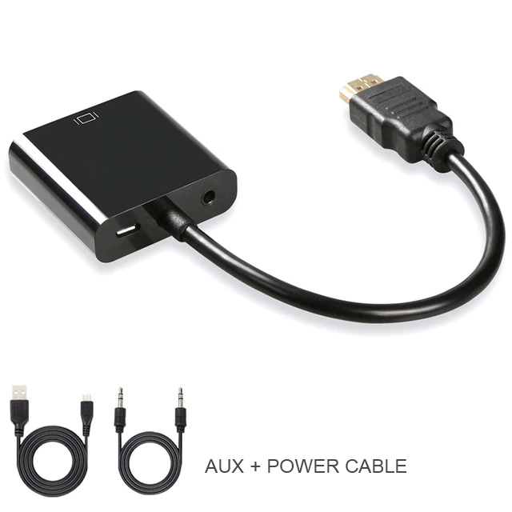

[cashback Umoney](https://yoomoney.ru/promo/offer/4164-aliexpress?viewId=35ed027c-5ff6-c4e4-ce58-2dbb000f0000)

Guideline for planning according to seasonality.



```mdx-code-block
import MonthCalendar from '@site/src/pages/MonthCalendar';

export const year = new Date().getFullYear();

<h3>{year}</h3>

<MonthCalendar _year={year} _month={11} />
<MonthCalendar _year={year} _month={12} />
```

## November 26, 2020 (Thursday)

I just ordered (26.11.2020) three items on Aliexpress.

The starting point!

0 (0%)

:::note

The SSD seller reported that after two days discounts will end.

:::

## November 29, 2020 (Sunday)

Today (29.11.2020) this SSD has become cheaper!

- M.2 NVMe SSD 512Gb - 4184₽

A discount of almost 200₽!

-196₽ (4.5%)



:::info

Extra discounts If you buy something for at least 5065₽ (for example, a 1Tb SSD for 7295₽), you get a 467₽ discount. (6-9%)

Apart from this you can also buy another 155₽ discount for 20 coins. (3.5%)

:::

## December 03, 2020 (Thursday)

Today I saw that price has increased.

- M.2 NVMe SSD 512Gb - 4438₽

+58₽ (+1,3%)

But the prices on the other two positions decreased slightly:

-3₽

## December 05, 2020 (Saturday)

Today the price has dropped again.

- M.2 NVMe SSD 512Gb - 4299₽

-81₽ (1.8%)

The seller posted a banner:



Two other items:

-7₽

## December 08, 2020 (Tuesday 2:00 AM)

Discount again today.

Maximum discount?

- M.2 NVMe SSD 512Gb - 4178₽ (>1000 pieces available)

-202₽ (4.6%)

My two other goods

-9₽

All three seller have this banner:


## December 08, 2020 (Tuesday 2:00 PM)

Another discount.

- M.2 NVMe SSD 512Gb - 4146₽ (75 pieces available)

-234₽ (5.3%)

Another SSD:

- M.2 NVMe SSD 128Tb - 1639₽ (164 pieces available)
- M.2 NVMe SSD 256Tb - 2403₽ (132 pieces available)
- M.2 NVMe SSD 1Tb - 7230₽ (121 pieces available) -65₽

My other two goods:

-12₽

:::info

Extra discounts If you buy something for at least 11328₽, you get a 604₽ discount.

:::

## December 9, 2020 (Wednesday)

- M.2 NVMe SSD 512Gb - 4149₽ (33 pieces available)

+3₽

Another SSD:

- M.2 NVMe SSD 128Tb - 1640₽ (115 pieces available) +1₽
- M.2 NVMe SSD 256Tb - 2404₽ (62 pieces available) +1₽
- M.2 NVMe SSD 1Tb - 7235₽ (103 pieces available) +5₽

:::info

Seller coupon Save up to 604₽ on orders over 11 335₽ (5%)  
Save up to 1511₽ on orders over 75 495₽ (2%)  
Valid: Dec 8 - Feb 1

:::

:::info

Instant discount Buy 10 get 1% off  
Buy 15 get 2% off

:::

## December 10, 2020 (Thursday)

- M.2 NVMe 512Gb - 4169₽ (241 pieces available)

+20₽

Another SSD:

- M.2 NVMe SSD 128Tb - 1648₽ (286 pieces available) +8₽
- M.2 NVMe SSD 256Tb - 2415₽ (264 pieces available) +11₽
- M.2 NVMe SSD 1Tb - 7269₽ (227 pieces available) +34₽

## December 17, 2020

- M.2 NVMe 512Gb - 4281₽ (934 pieces available)

+135₽

:::info

Store Promo code Promo code: MEBGEDOSOBIY (-75₽) 75₽ off per 2 270₽

:::

## December 24, 2020

- M.2 NVMe 512Gb - 4254₽ (697 pieces available)

+108₽

## December 29, 2020



- M.2 NVMe 512Gb - 4189₽ (36 pieces available)

+43₽

:::info

Seller coupon Save up to 455₽ on orders over 4 932₽ (9%)  
Save up to 758₽ on orders over 37 939₽ (2%)  
Valid: Dec 25 - Jan 5

:::

## January 07, 2021

- M.2 NVMe 512Gb - 4198₽ (1323 pieces available)

:::info

Seller coupon Get 76,05 руб. off on orders over 1 521,02 руб.

:::

---

## Dollar-Ruble exchange rate

:::danger

Dollar fell by 2 rubles (26.11-17.12)

 

:::

---

## Aliexpress Photos & Links

And this are the prices that were at the time of purchase (26.11.2020). And there are no additional discounts.

1. [M.2 NVMe SSD 512Gb](https://aliexpress.ru/item/32847169083.html?cv=815660&af=205380&utm_campaign=205380&aff_platform=link-c-tool&utm_medium=cpa&sk=mr6wR6CC&aff_trace_key=8fdfbd25346e41a1999b627179d14b1e-1606479893486-02170-mr6wR6CC&dp=25ba1848a13d9061635b53c8f8eedc4b&terminal_id=b5d4c8214650400883a6bb062ce6397f&utm_source=admitad&utm_content=815660) - 4380₽

---

[](KingSpec-M2-NVMe-ssd-PCIe.jpg)

2. [Heat Sink (for M.2 NVMe SSD)](https://aliexpress.ru/item/4001062118667.html?spm=a2g0s.9042311.0.0.384533edvvLOiB) - 162₽

---

[](M-2-NGFF-heat-sink.jpg)

3. [HDMI->VGA adapter (+audio, +power plugs)](https://aliexpress.ru/item/32864796089.html?spm=a2g0s.9042311.0.0.384533edvvLOiB) - 380₽

---

[](hdmi-vga-adapter.jpg)
