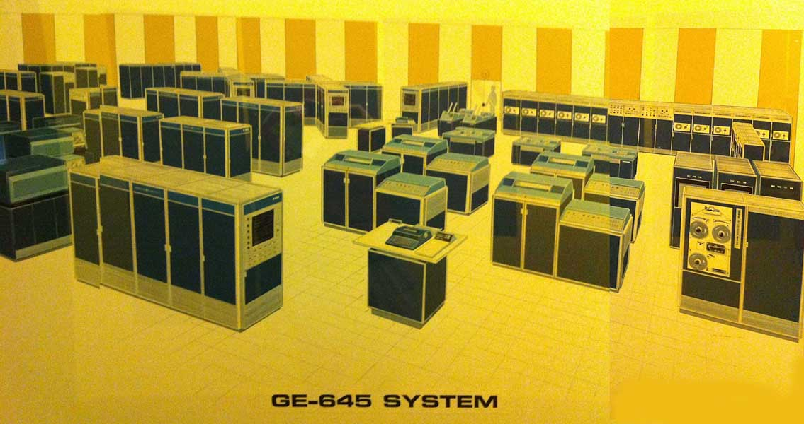

import styles from '@site/src/css/markdown.module.css'

<div className={styles.colorRed}>

<dl>
  <dt>Start develop</dt><dd>1964</dd>
  <dt>Developer</dt><dd>MIT, General Electric, Bell Labs</dd>
  <dt>Language</dt><dd>Assembler -> <abbr title="Programming Language One">PL/I</abbr></dd>
</dl>

</div>

## 1960s - Mainframe computers era

In the late 1960s, Bell Labs was involved in a project with MIT and General Electric to develop a multitasking operating system called <abbr title="Multiplexed Information and Computing Service">Multics</abbr> for the <abbr title="General Electric 645 mainframe computer">GE-645</abbr>, allowing multiple users to access the mainframe at the same time.



<details>
  <summary>GE 645 (photo description)
  </summary>
<a href='https://multicians.org/645artist.html' class='external'>GE 645</a>

The operator console is front and center, with a <abbr title="IBM mechanism for typewriters and computer terminals. The character set was on a plastic 'golf ball' that struck the paper through a typewriter ribbon. This mechanism was used in the IBM 1050 and 2741 terminals, in various third-party terminals, and in the console typewriter of the 6180. There were three grades of this mechanism OEM'd by IBM, light, medium, and heavy duty; the 6180 console had a heavy duty model.">Selectric</abbr> mechanism and a little panel to the right that has the speedometer and the boot button. Front left is a <abbr title="Computer system that Multics first ran on, produced by General Electric. Derived from the GE-635, a 36-bit word machine with accumulator, quotient register, and 8 index registers like the 7094. Basic execution speed was about 435 KIPS.">GE-645</abbr> CPU. Another CPU is near the back of the room by the door. To the left of the rear CPU are two x-shaped configurations of cabinets: these are <abbr title="Generalized I/O Controller. This box did all the I/O for the 645. Some programmers pronounced this by spelling it out, but the field engineers tended to say 'gee-yock.'">GIOCs</abbr>. I guess those are memory boxes to the left of the GIOCs. The three-bay cabinets behind the front CPU, on the left side, may be <abbr title="The 'Firehose drum.' A large, fixed-head (head per track, hence indistinguishable from a drum), disk used on 645 Multics first as simply the highest-speed secondary storage device, then as a storage device targeted for user temporary segments such as stacks, and finally as the first paging device. See page multilevel.">Librafile</abbr> ('firehose') drums, with drum controllers behind them. The MIT configuration had two PRT202 printers (not four), two card readers, two punches. I have no idea what the device is on the extreme right front, that appears to have three tape reels. I also do not see the <abbr title="The initial 645 configuration shipped to MIT included an RCA RACE unit in GE skins. This was a datacell-like device, about 15 feet long, containing bins, each bin filled with magnetic strips about one foot wide by two feet long. In operation, the device transported a particular bin to the reading station, selected a strip using notches at the top of the strip, picked the strip out of the bin and wrapped it around a drum, and treated it as a sort of magnetic drum storage.">RACE</abbr> file which was installed in the Tech Square machine room for a while but never used. See the <abbr title="sites: MIT and BTL Hardware (1967)">detailed configuration memo</abbr> from 1967.

</details>

<details>

<summary>MISTRAM</summary>

The GE-600 line of computers was developed by a team led by [John Couleur](https://en.wikipedia.org/wiki/John_Couleur 'During the Korean War, he served as a lieutenant in the United States Air Force. Couleur joined the General Electric Company. In 1953, at GE's Heavy Military Electronics Department (HMED) in Syracuse, New York, he served as lead architect on the development of the MISTRAM tracking system for the Atlas Missile.') out of work they had done for the military [MISTRAM](https://en.wikipedia.org/wiki/MISTRAM 'MISTRAM (MISsile TRAjectory Measurement) was a high-resolution tracking system used by the United States Air Force (and later NASA) to provide highly detailed trajectory analysis of rocket launches. ') project in 1959. MISTRAM was a [radar](https://en.wikipedia.org/wiki/Radar 'Radar (Radio Detection And Ranging) is a detection system that uses radio waves to determine the distance (ranging), angle, and radial velocity of objects relative to the site. It can be used to detect aircraft, ships, spacecraft, guided missiles, motor vehicles, weather formations, and terrain. ') tracking system that was used on a number of projects, including [Project Apollo](https://en.wikipedia.org/wiki/Project_Apollo 'The Apollo program, also known as Project Apollo, was the third United States human spaceflight program carried out by the National Aeronautics and Space Administration (NASA), which succeeded in preparing and landing the first humans on the Moon from 1968 to 1972.').

</details>

## Birth of Unix

Bell Labs, frustrated by the size and complexity of Multics but not its aims, slowly pulled out of the project. Their last researchers who left Multics decided to redo the work, but on a much smaller scale.

```mdx-code-block
import DocCardList from '@theme/DocCardList';
import {useCurrentSidebarCategory} from '@docusaurus/theme-common';

<DocCardList items={useCurrentSidebarCategory().items}/>
```
