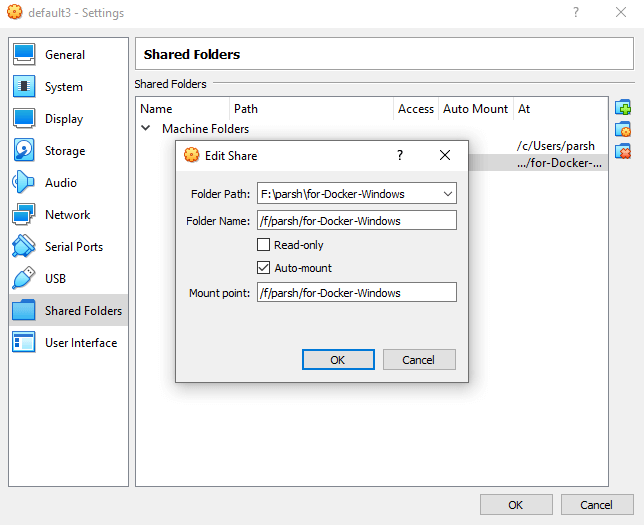

import Tabs from '@theme/Tabs'
import TabItem from '@theme/TabItem'

<a href='https://docs.docker.com/get-docker/' class='external'>Install Docker (docs.docker.com)</a> on your machine and add it to the system path.

## Linux

On Linux, you should also <a href='https://docs.docker.com/engine/install/linux-postinstall/' class='external'>enable Docker CLI for the non-root user account</a> that will be used to run VS Code.

## Windows

### Install Virtual Box

Run in elevated PowerShell terminal:

```PowerShell title="PowerShell (as admin)"
C:\ choco install virtualbox
```

## Docker Engine Setup

### Install Docker Machine

> Docker Machine: a CLI tool for installing Docker Engine on virtual hosts

Execute this command inside an elevated PowerShell terminal (alternatively, you can install `Docker Machine` by following instructions on this <a href='https://docs.docker.com/machine/install-machine/' class='external'>page (docs.docker.com)</a>):

```shell title="PowerShell (as admin)"
C:\ choco install docker-machine
```

### Install Docker Engine

Using Git Bash terminal, use Docker Machine to install `Docker Engine`. This will download a Linux image containing the Docker Engine and have it run as a VM using VirtualBox. Simply execute the following command:

```bash title="Git-Bash"
docker-machine create --driver virtualbox default
```

### Set up Oracle VM VirtualBox

We need to allow Docker to mount volumes located on your hard drive. To add your path, open `Oracle VM VirtualBox`. Select the desired VM (in my case `default3`), go to `Settings > Shared Folders` and create or edit entries:



If your working directory is `F:\parsh\for-Docker-Windows/`, make `/f/parsh/for-Docker-Windows` (in Unix sintax) the mount point.

## Set up Docker environment variables

Configure Docker environment to use Docker VM:

<Tabs defaultValue="powershell" values={[
  { label: "PowerShell", value: "powershell" },
  { label: "Git-Bash", value: "gitbash" }
]}>
<TabItem value="powershell">

```powershell title="PowerShell"
docker-machine env default
```

and then:

```powershell title="PowerShell"
& "C:\ProgramData\chocolatey\lib\docker-machine\bin\docker-machine.exe" env default | Invoke-Expression
```

To avoid setting environment variables every time, you start a new PowerShell terminal, run this line:

```powershell title="PowerShell"
docker-machine env default
```

Copy `env` output:

```powershell
❯ docker-machine env default
$Env:DOCKER_TLS_VERIFY = "1"
$Env:DOCKER_HOST = "tcp://192.168.99.101:2376"
$Env:DOCKER_CERT_PATH = "C:\Users\parsh\.docker\machine\machines\default"
$Env:DOCKER_MACHINE_NAME = "default"
$Env:COMPOSE_CONVERT_WINDOWS_PATHS = "true"
# Run this command to configure your shell:
# & "C:\ProgramData\chocolatey\lib\docker-machine\bin\docker-machine.exe" env default | Invoke-Expression
```

:::important

Take note that there’s a chance the IP address assigned might be different from the one you saved every time you start the default VM.

:::

And insert this block into `Microsoft.PowerShell_profile.ps1` (to open it run: `notepad $profile`)

</TabItem>

<TabItem value="gitbash">

```bash title="Git-Bash"
eval $(docker-machine env default --shell linux)
```

To avoid setting environment variables every time, you start a new Git-Bash terminal, run this line:

```bash title="Git-Bash"
docker-machine env default
```

Transform `env` output to:

```bash {2-3}
export DOCKER_TLS_VERIFY="1"
export DOCKER_HOST="tcp://192.168.99.100:2376"
export DOCKER_CERT_PATH="C:\Users\[username]\.docker\machine\machines\default"
export DOCKER_MACHINE_NAME="default"
export COMPOSE_CONVERT_WINDOWS_PATHS="true"
```

:::important

Take note that there’s a chance the IP address assigned might be different from the one you saved every time you start the default VM.

:::

And insert this block into `.bashrc`.

</TabItem>
</Tabs>

### Certificates Error

If you encounter a certificate error, just re-generate the certificates with the command:

```shell
docker-machine regenerate-certs default
```

And then rerun the `env` command.

## Docker Tools Setup

These tools are packaged inside the Docker for Windows installer, we’ll install these programs individually using Chocolatey. Run this in elevated PowerShell:

```powershell title="PowerShell"
C:\ choco install docker-cli
C:\ choco install docker-compose
```

Then run in PowerShell or Git-Bash:

```shell
# Start Docker VM
docker-machine start default

# Confirm Docker VM is running
docker-machine ls

# Confirm Docker is connected. Should output Docker VM specs
docker info

# Run hello-world docker image. Should output "Hello from Docker"
docker run hello-world
```
