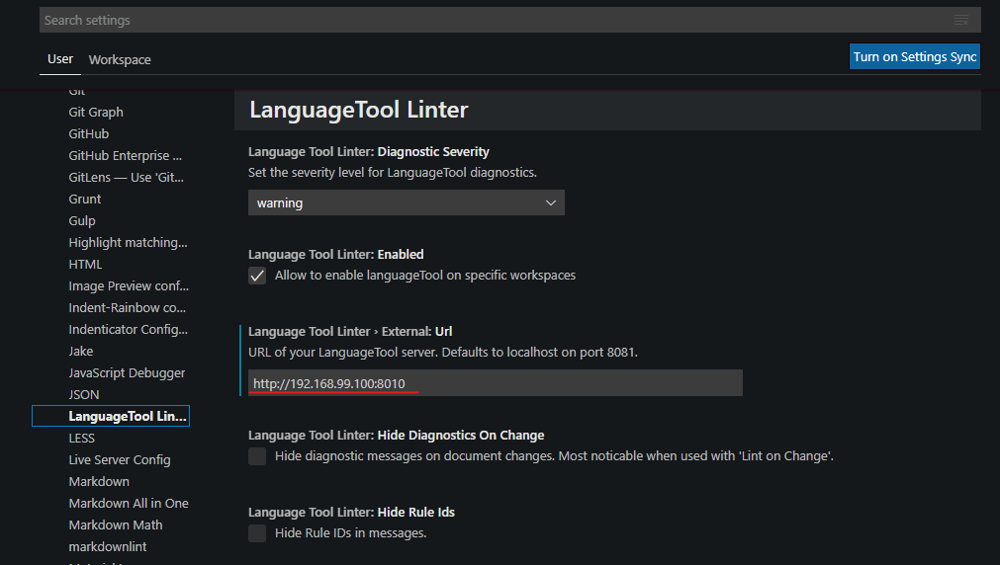

## VS Code LanguageTool Linter

<a href='https://github.com/davidlday/vscode-languagetool-linter' class='external'>GitHub.com: VS Code Languagetool Linter</a>

First, install the VS Code `LanguageTool` extension (Grammar, Style and Spell Checking in VS Code via <a href='https://www.languagetool.org/' class='external'>LanguageTool (languagetool.org)</a>. Support Markdown, MDX, HTML, and plain text files.):

<a href='https://marketplace.visualstudio.com/items?itemName=davidlday.languagetool-linter' class='external'>marketplace.visualstudio.com: Languagetool Linter</a>

## Install Docker software

Then you need to [install `Docker` software](install-docker-software) on your system.

## Run Container in Shell

<a href='https://github.com/silvio/docker-languagetool' class='external'>GitHub.com: Docker Languagetool</a>

Pull the `Dockerfile` (to get the languagetools running on a system without `java`):

```shell
docker pull silviof/docker-languagetool
```

Run it:

```shell
docker run --rm -p 8010:8010 silviof/docker-languagetool
```

## Run Container in VS-Code

<a href='https://gnulinux.ch/languagetool-in-vs-code' class='external'>gnulinux.ch: Languagetool In VS Code</a>

Install the `Docker` extension.

> To install the extension, open the Extensions view, search for **_docker_** to filter results and select Docker extension authored by Microsoft.

> The extension recognizes workspaces that use most popular development languages (C#, Node.js, Python, Ruby, Go, and Java) and customizes generated Docker files accordingly.

Open the Docker view. Click on `languagetool` image. Right-click on `latest`. Select `Run`.

## Docker Extension Settings

Open VS-Code settings with `Ctrl+,`. In the `Extensions -> LanguageTool Linter` submenu find the `External: Url` field and insert the server IP-address and the port of your previously configured Docker container. In my case: `192.168.99.100:8010`.



:::caution

If Docker container was launched on the local computer, not on a server, you need to use the address `http://localhost:8010` (or `http://127.0.0.1:8010`).

:::

## Auto run

Add this code to the end of the `Microsoft.PowerShell_profile.ps1` file (to open it, run in PowerShell: `notepad $profile`)

```powershell title="PowerShell"
# Preferable alternative: Start-ThreadJob 1
$job = Start-Job { docker-machine start default3}

$Env:DOCKER_TLS_VERIFY = "1"
$Env:DOCKER_HOST = "tcp://192.168.99.101:2376"
$Env:DOCKER_CERT_PATH = "C:\Users\parsh\.docker\machine\machines\default3"
$Env:DOCKER_MACHINE_NAME = "default3"
$Env:COMPOSE_CONVERT_WINDOWS_PATHS = "true"
# Run this command to configure your shell:
& "C:\ProgramData\chocolatey\lib\docker-machine\bin\docker-machine.exe" env default3 | Invoke-Expression

# Preferable alternative: Start-ThreadJob 2
$job = Start-Job { docker run --rm -p 8010:8010 silviof/docker-languagetool }
```

After that, when you start PowerShell, it first starts the `docker-machine` and then `languagetool linter` container in the background.
