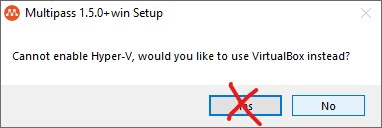
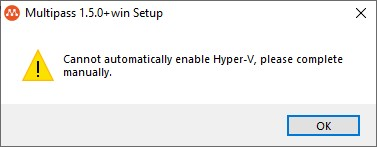
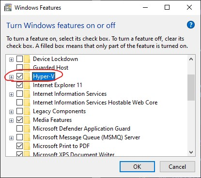
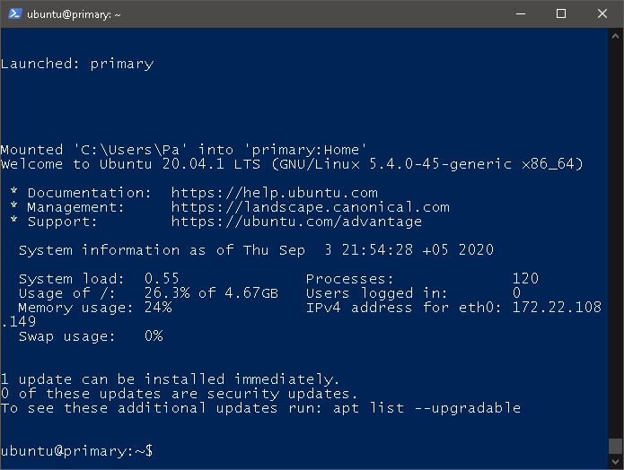
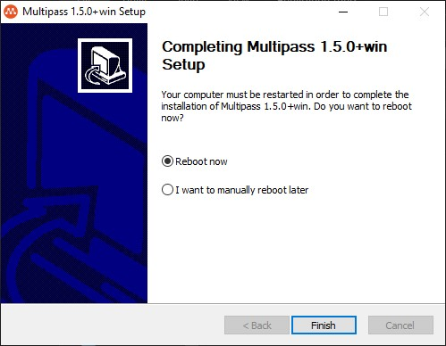

> [Multipass](https://multipass.run/) is a great new tool from the folks at Canonical (who make Ubuntu). It's a super easy way to spin up and spin down little VMs to try things out. - _Brian Holt from Microsoft_


This steps are for **Windows 10 Pro**, if you have a different version of Windows or are using macOS, you better [read this](lets-run-linux). 


## Installing Multipass

Direct download link:  
[multipass-1.5.0+win-win64.exe](https://github.com/canonical/multipass/releases/download/v1.5.0/multipass-1.5.0+win-win64.exe)

Taken from: https://github.com/canonical/multipass/releases

But there is an official page with a download link: https://multipass.run/


## Auto-Enabling Hyper-V

Hyper-V is an operation system component that is initially disabled.

The Multipass installer will automatically try to enable Hyper-V.

If you've already enabled Hyper-V, you can see a confusing message during install:

[](cannot-enable-hyper-v.jpg)

Click `No` if you have already enabled Hyper-V.  

And press OK:

[](please-complete-manually.jpg)

:::tip
If for some reason Hyper-V does not automatically turn on, you can manually turn it on later.
:::

### Enabling Hyper-V manually

 Advanced users can enable it with a single PowerShell command:

```shell title="PowerShell"
Enable-WindowsOptionalFeature -Online -FeatureName Microsoft-Hyper-V -All 
```
Or, if you prefer a graphical interface, press `Win+R`, type **OptionalFeatures** and press `Enter`.

[](enabling-hyper-v.jpeg)

In the window that opens, check the `Hyper-V` box.

## Wait for the setup to finish 

After a very long 5-15 minutes of "retrieving image" and "configuring primary" you should see:

[](multipass-first-start.png)

This proccess is completely automatic. 👍

## Reboot 

After enabling Hyper-V, a system reboot is required: 

[](finish-install-reboot.jpeg)

## Start Multipass

You can start Multipass by running this command in PowerShell:

```shell title="PowerShell"
multipass shell
```

Or you can right-click on the orange tray icon and choose `Open shell`, which is identical.

## Errors

If you see an error in PowerShell terminal:

:::danger
```
Microsoft.PowerShell_profile.ps1 cannot be loaded because running
scripts is disabled on this system.
```
:::

You need to right-click on the orange tray icon, select `Stop`, wait for Multipass to stop and click `Quit`. Launch Multipass again from the Windows Start menu. 


## Additional resources

- [Working with Multipass instances](working-with-multipass-instances)
- [Local K3s Cluster Made Easy With Multipass](local-k3s-cluster-multipass)