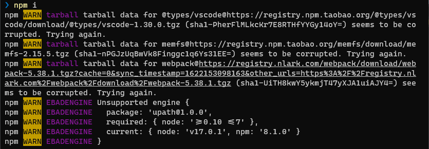
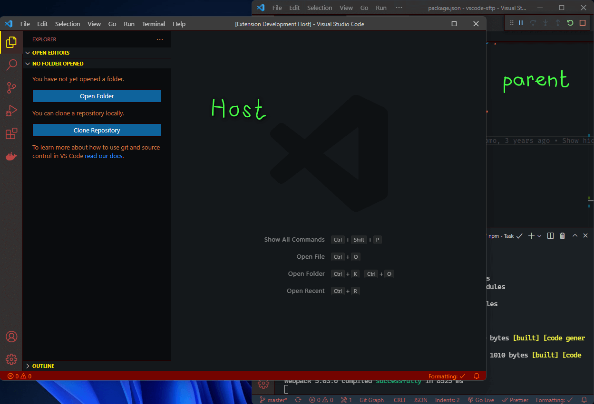
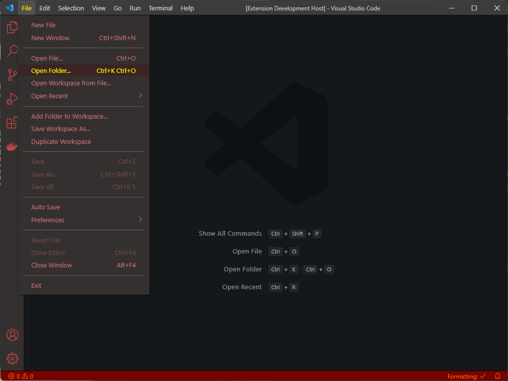
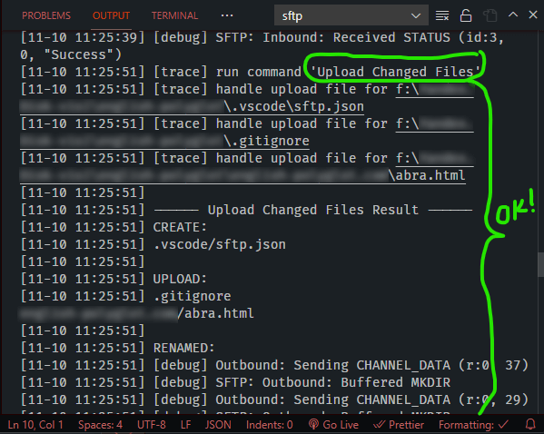
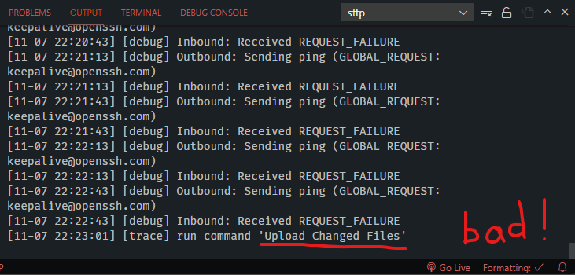

In this article, I show you how to rebuild a `VS-Code extension` using the `SFTP` extension as an example.

## `SFTP` extension

Let's say you are using a nice extension, but you want to add some functionality or fix a bug.

:::info

`SFTP` extension syncs your local directory with a remote server directory, but it has an annoying bug - the `Upload Changed FIles` command does not work.

:::

## Workaround `Upload Changed Files` Bug

### 1. Clone or fork of an extension repo

Clone or fork this repo (this is a fork of the wandway repo (and this is a fork of the liximomo repo)): <a href='https://github.com/soul-core/vscode-sftp' class='external'>github.com: vscode-sftp</a>.

:::tip

Use any terminal (I used PowerShell or Git-Bash on Windows; and Konsole on MX Linux).

:::

### 2. Install latest stable node

:::note

Skip this step if you have installed the last stable version of node.

:::

Open the folder where you cloned the `vscode-sftp` extension and, on Windows (make sure you install the [nvs](https://papa31.github.io/hm/blog/2021/09/19/nvs-one-node-version-per-terminal-in-windows) - equivalent to [nvm](../../node/nvm-per-project-folder)), run:

```sh
nvs
```

You should see a menu with node versions. Select the node version: 17.0.1 (if you do not see this node version, choose `Download another version` menu item and install it).

:::info

On Linux, you can work with any of a node version older than 10. Just use [nvm](../../node/nvm-per-project-folder).

:::

### 3. Install extension dependencies

After installing the required node version, run the command:

```sh
 npm i
```

This command should install all the extension dependencies.

:::warning

If you are using `npm` and you get this error:



Try removing the `yarn.lock` file from the root folder and running `npm i` command again.

:::

:::caution

Everytime you rerun the `npm i` command, you must delete `node_modules` folder and `package-lock.json` file.

:::

:::tip

If you can't rebuild an extension on Windows, try doing the same on Linux (you can rebuild an extension on Linux and use it later on Windows). In my case, it was so. Until I installed the latest stable version of node using [nvs](https://papa31.github.io/hm/blog/2021/09/19/nvs-one-node-version-per-terminal-in-windows) on my Windows machine.

:::

### 4. Fix `SFTP` extension bug

Let's make `Upload changed files` command visible.

Open `VS-Code` editor from terminal from extention root folder with command:

```sh
code .
```

Locate the `package.lock` file in the extension root folder, open it in `VS Code` editor and find these two lines:

```json {4}
...
        {
          "command": "sftp.upload.changedFiles",
          "when": "false"
        },
...
```

Replace the last line above with the last line below:

```json {3}
        {
          "command": "sftp.upload.changedFiles",
          "when": "sftp.enabled"
        },
```

### 5. Add `SFTP` extension functionality

Let's add keyboard shortcut to the `Upload changed files` command.

Add this highlighted block before the `jsonValidation` line (or wherever it is correct) in the `package.lock` file:

```sh {2-8}
    },
    "keybindings": [
      {
        "command": "sftp.upload.changedFiles",
        "key": "ctrl+alt+u",
        "when": "sftp.enabled"
      }
    ],
    "jsonValidation": [
```

Save the `package.lock` file.

### 6. Avoiding compiler error

When compiling an extension, you may receive a `Can't resolve 'minimal'` error. To avoid this error, replace this line in the `./.vscode/tasks.json` file:

```json
23  "args": ["run", "dev", "--", "--display", "minimal"],
```

with:

```json
23  "args": ["run", "dev"],
```

### 7. Launch the extension in dev mode

Press `F5` in VS Code (let's call that VS-Code window - parent window). This will compile and run the extension in a new `Extension Development Host` window.



:::caution

Make sure you uninstall the installed instance of the `sftp` extension, otherwise you will run two copies of this extension and cause a conflict.

:::

Wait for сompilation to stop.

:::tip

To verify that the compilation was successful, run the command `Tasks: Show Running Tasks` in the Command Palette (Ctrl+Shift+P) in the parent VS-Code window.

:::

### 8. Open your project to test uploading

In the `Extension Development Host` window that opens, open the folder with your local project (via the `File` menu), which you want to connect to the remote server:



:::caution

If you have opened this project folder in another VS-Code window, close it and try to open it again from the `Extension Development Host` window.

:::

If you already have the `sftp.json` config file, you should see the `sftp` extension icon in the Activity bar:


And then you can skip the next two steps.

### 9. Create `sftp` config file

If you don't have an `sftp.json` config file, press `F1` or `Ctrl+Shift+P` to open Command Palette and enter the command:

```sh
SFTP: Config
```

If you see this command listed, run it.

After running the `SFTP: Config` command, a new `sftp.json` config file will be created and you should see its initial content:

```json title="sftp.json"
{
  "name": "My Server",
  "host": "localhost",
  "protocol": "sftp",
  "port": 22,
  "username": "username",
  "remotePath": "/",
  "uploadOnSave": true
}
```

At the same time, you should see the `sftp` extension icon in the Activity bar:


### 10. Setup your sftp connection

Populate the `sftp.json` using your host credentials as so:

```json title="sftp.json"
{
  "name": "does-not-matter", // any name
  "host": "my-host.com", // the name of your remote host
  "protocol": "sftp",
  "port": 22,
  "username": "my-username", // login
  "remotePath": "/home/my-username/", // root your remote host
  "uploadOnSave": false
}
```

:::tip

You can optionally use `ssh-agent` and the keys pair (two files) generated with `ssh-keygen` to connect to remote host. Read about <a href='http://mah.everybody.org/docs/ssh' class='external'>using ssh-agent with ssh</a>.

:::

### 11. Test `Upload Changed Files` command

Make sure you are in the Extension Development Host window.

Change some file and save it.

Press `F1` or `Ctrl+Shift+P` to open Command Palette and type:

```sh
SFTP: Upload Changed Files
```

You should see this command in the list of SFTP commands:


Try using the `Upload Changed Files` command with the `Ctrl+Alt+U` keyboard shortcut.

:::tip

To see the result of your action, open `sftp` output window by pressing `sftp` button:


:::

After running the `Upload Changed Files` command, you should see many, many lines after the `run command 'Upload Changed Files'` line in the log output:



If you see only one line, then the command is not working:



:::warning

If the `Upload Changed File` command does not work, remove the `dist` folder from the extension root and run compilation again. If that doesn't help, make sure you are using the last stable version of node. And maybe start from the beggining. If nothing helps, download my finished build file: <a href='https://github.com/soul-core/vscode-sftp/raw/master/sftp-workaround-upload-bug.vsix' class='external'>github.com: sftp-workaround-upload-bug.vsix</a> and skip to step 14.

:::

### 12. Prepare build script

If the `Upload Changed File` command works, you can start rebuilding the `sftp` extension.

Let's simplify the build script first. Close Extension Development Host window, open `package.lock` file again and locate the `scripts` block. Find the `pub:debug` script:

```json {8}
...
  "scripts": {
    "vscode:prepublish": "npm run compile",
    "compile": "webpack --mode production",
    "dev": "webpack --mode development --watch",
    "test": "jest",
    "package": "vsce package",
    "pub:debug": "rm -rf _debug && mkdir _debug && vsce package --out _debug/sftp-debug.vsix && cd _debug && git init && git commit --allow-empty -m 'update debug package' && git checkout -b debug-pacakge && cp ../INSTALL_DEBUG.md README.md  && git add . && git commit -am 'update debug package' && git push git@github.com:liximomo/vscode-sftp.git debug-pacakge --force"
  },
...
```

Replace the last `pub:debug` script with `build` one (see below):

```json {7}
  "scripts": {
    "vscode:prepublish": "npm run compile",
    "compile": "webpack --mode production",
    "dev": "webpack --mode development --watch",
    "test": "jest",
    "package": "vsce package",
    "build": "vsce package --no-yarn --out sftp-workaround-upload-bug.vsix"
```

:::caution

If you are using `yarn` instead of `npm`, remove `--no-yarn` option from the `build` script above.

:::

### 13. Build `.vsix` extension

:::info

Make sure you already install the `Visual Studio Code Extension(vsce)` manager:

```sh
npm i -g vsce
```

:::

Make a new build of the `sftp` extension using the `build` script:

```sh
npm run build
```

If everything is ok, you'll see the green `DONE` label in your terminal:


You have just created the `sftp-workaround-upload-bug.vsix` file in the root folder of the `sftp` extension.

### 14. Install `.vsix` extension

Open `VS-Code`, press `F1` and enter the command in Command Palette:

```sh
Extension: Install from VSIX...
```

Press Enter.

Locate the `.vsix` file in the dialog box and press `Install` button.

Enjoy!
