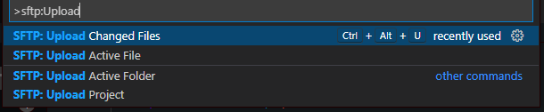

Works in Windows & Linux (I don't know about Mac).

1. Clone this repo <a href='https://github.com/wandway/vscode-sftp' class='external'>github.com: vscode-sftp</a>

2. On Windows (make sure you install the `nvs` equivalent to nvm) run:

```sh
nvs
```

You will se the menu. Select node version: 17.0.1 (if this node version is not installed, choose `Download another version` menu item and install it).

:::info

On Linux, you can work with any of a node version older than 10.

:::

3. Open folder where you cloned `vscode-sftp` extension and using any kind of terminal (I used PowerShell or Git-Bash in Windows; and Konsole in MX Linux) run the command:

```sh
 npm i
```

4. Open the `package.lock` file in the `VS Code` editor and locate these two lines :

```json {4}
...
        {
          "command": "sftp.upload.changedFiles",
          "when": "false"
        },
...
```

Change the last line with this last one:

```json {3}
        {
          "command": "sftp.upload.changedFiles",
          "when": "sftp.enabled"
        },
```

5. Add this highlighted block before `jsonValidation` line in the `package.lock` file:

```sh {2-8}
    },
    "keybindings": [
      {
        "command": "sftp.upload.changedFiles",
        "key": "ctrl+alt+u",
        "when": "sftp.enabled"
      }
    ],
    "jsonValidation": [
```

Save the `package.lock` file.

6. Run the script `npm run dev` (alias of command: `webpack --mode development --watch`):

```sh
npm run dev
```

The extension will launch in developer mode.

7. Press `f5` in VS Code to debug.

:::caution

Make sure you uninstall the working copy of the `sftp extension`, otherwise you will run two copies of this extension and cause a conflict.

:::

You will see an extra pop-up window with a working extension. Open the folder with your local project (using the files menu) that you want to connect to the remote one with the sftp protocol.

Press `F1` or `Ctrl+Shift+P` to open Command Pallete and type:

```sh
SFTP:Upload Changed Files
```

You will see that the command already exist.



Try to use it.

:::caution

When I tried to test this command in developer mode, it only worked when selected in Command Pallete, but it didn't work with the keyboard shortcut. This issue will be resolved when you create a production build of this extension.

:::

8. After debugging, open `package.lock` file again and locate the `scripts` block. Find the `pub:debug` script:

```json {8}
...
  "scripts": {
    "vscode:prepublish": "npm run compile",
    "compile": "webpack --mode production",
    "dev": "webpack --mode development --watch",
    "test": "jest",
    "package": "vsce package",
    "pub:debug": "rm -rf _debug && mkdir _debug && vsce package --out _debug/sftp-debug.vsix && cd _debug && git init && git commit --allow-empty -m 'update debug package' && git checkout -b debug-pacakge && cp ../INSTALL_DEBUG.md README.md  && git add . && git commit -am 'update debug package' && git push git@github.com:liximomo/vscode-sftp.git debug-pacakge --force"
  },
...
```

9. And change it with `build` one. See below:

```json {7}
  "scripts": {
    "vscode:prepublish": "npm run compile",
    "compile": "webpack --mode production",
    "dev": "webpack --mode development --watch",
    "test": "jest",
    "package": "vsce package",
    "build": "rm -rf _debug && mkdir _debug && vsce package --no-yarn --out _debug/sftp-debug.vsix"
```

10. Make a new build of the `sftp` extension using the command:

```sh
npm run build
```

You have just created an `sftp-debug.vsix` file in the `_debug` folder at the root of the project.

Close all instancies of VS Code.

11. Open VS Code again. Press `F1` and enter the command in Command Pallete:

```sh
Extension: Install from VSIX...
```

Run it.

Find the `sftp-debug.vsix` file (which you just created) in the dialog box and install it.

Try using the `Upload Changed Files` command with the `Ctrl+Alt+U` keyboard shortcut.

Enjoy!
