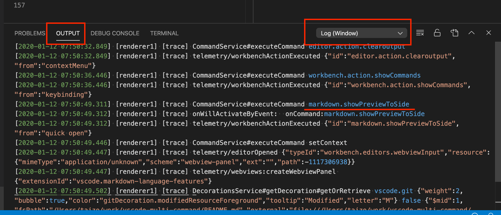

Find the name of the command you want to execute.

1. Execute `Developer: Set Log Level...` and select `Trace` in the command palette.
2. Execute command of you want to know the name.
3. You can see the name of process in the output terminal `Log(Window)`  (you can set the process for output in the rightside of the output terminal).

import Image from '@theme/IdealImage';
import thumbnail from './command-name-output.png';

<!-- // your React code -->
<Image img={thumbnail} />

<!-- // or -->
<Image img={require('./command-name-output-1.png')} />

Source: <a href='https://marketplace.visualstudio.com/items?itemName=ryuta46.multi-command' class='external'>marketplace.visualstudio.com: Multi-Command</a>
