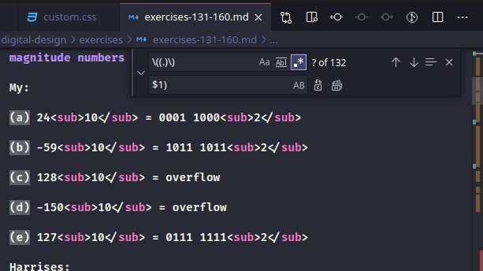

I was faced with the need of massively change `(a)` to `a)`, `(b)` to `b)` and so on. After I changed `(a)` to `a)` using Fined/Replace, instead of continuing the tedious manual replacement letter by letter, I remembered about `regular expressions`.

I had some experience with regular expressions in bash and I was able to make the required expression pretty soon.

There are some differences in how **_regex_**(regular expressions) work in VS Code though.

As mentioned in [Regarding Find/Replace with Groups](https://stackoverflow.com/questions/42179046/what-flavor-of-regex-does-visual-studio-code-use#42184299) the grouping is done a little differently:

- instead `\( \)` you need to use `( )`
- and instead `\1` you need to use `$1`

And my finished regex was like this:

- Find: `\((.)\)`
- Replace: `$1)`

## More Examples

|     | Find          | Replace | Was             | Is              |
| --- | ------------- | ------- | --------------- | --------------- |
| 1   | `b>(..</su)b` | `p>$1p` | `10` | `10` |
