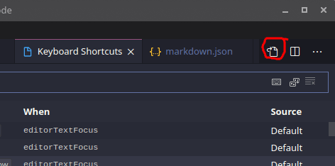

I started reading [Digital Design and Computer Architecture](../../pdf/harris-d-m-harris-s-l-digital-design-and-computer-architecture-2nd-edition-2012.pdf) and in order to finish all exercises in the book, especially in Chapter 1, with a lot of numbers in different number systems and powers (for example 657<sub>10</sub> or 2<sup>0</sup>) I needed to create a simple and fast way to enter the <sup>superscript</sup> and <sub>subscript</sub> of text and above all numbers.

How to create a shortcut to add tags around selected text in VS Code? This is achieved by creating a snippet that is triggered by a keyboard shortcut.

First of all, lets create a user snippet!

## User Snippet in VS Code

Find `markdown.json` in `File > Preferences > User Snippets` and open it.

:::caution
I created this snippet to work with `markdown` files. If you want work with other types of documents, you need to choose the appropriate option from the menu. For example, if you want to work with `javascript` files, you must select `javascript.json` file, and so on.
:::

Add this to the end of markdown.json:

```json title="markdown.json"
"wrap_sup": {
    "prefix": "wrap_sup",
    "body": [
        "<sup>$TM_SELECTED_TEXT</sup>"
    ],
    "description": "Wrap selected with <sup>"
},
```

You can run this snippet in any markdown file by pressing `Ctrl + Space` and typing 'sup' ("prefix" key letter).

But this method is not always convenient for working with numbers. For example, if you type 23, and select the last digit 3 (to turn it into a power) and press Ctrl + Space, you get something like "no suggestion" or something.

To work better with numbers, we just need to make a keyboard shortcut and bind it to the snippet. And this combination will allow you to work even a little faster.

## Keyboard Shortcut in VS Code

Open the Keyboard Shortcuts from `File > Preferences > Keyboard Shortcuts`. Then find the secret button at the top right to open `keybindings.json`.

[](open-keybindings-json.png)

Add this to the end of keybindings.json:

```json title="keybindings.json"
{ "key": "ctrl+e up", 
    "command": "editor.action.insertSnippet", 
    "args": { "name": "wrap_sup" } 
},
```

Save your edited files and try this first combination (for superscript) of the two needed. The second combination (this time for subscript) is done in the same way.

And this is one of giant [exercise files](../../digital-design/exercises/exercises-101-130.md) of the book mentioned above. Without these improvements, the learning process is more tedious. You get a little distracted from learning, but at the same time, you learn to work with very useful features of VS Code that will come in handy for more efficient study and work.

## Source

<a href='https://stackoverflow.com/questions/49192210/vscode-wrap-selected-text-in-mark-mark#49202205' class='external'>stackoverflow.com</a>
