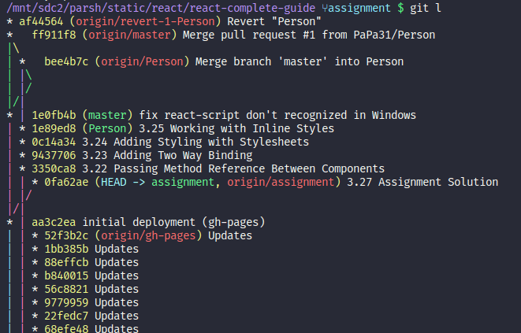
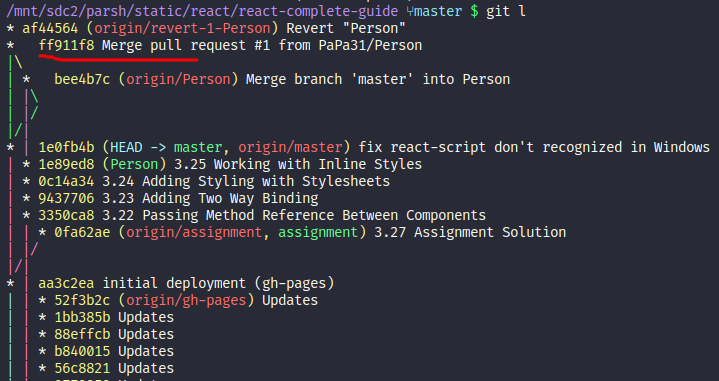

After branching the entire project into branches, I got several pull requests on GitHub. I opened the first pull request and `merged` the two branches, removing the conflicting code.

Then I `revert` pull request, then ran `git pull` and saw awful picture:



:::info
By the way, my alias `git l` it is <a href='https://stackoverflow.com/questions/1057564/pretty-git-branch-graphs#35075021' class='external'>A DOG</a>:

```sh
git log --all --decorate --oneline --graph
```

:::

I thought it was irreparable. But then I found this link <a href='https://stackoverflow.com/questions/18318097/delete-a-closed-pull-request-from-github#63405794' class='external'>stackoverflow.com</a> and remove the extra pull requests.

## Fight

1. First of all, I ran `git checkout af44` and put the HEAD on the treetop

2. Then I made two times `git reset HEAD^`, and moved down to **master** branch

After that I run `git push origin +HEAD` but got an error!

3. Then I ran `git checkout master`

4. And repeat `git push origin +HEAD`
  
One remote was gone.



Then I did all the manipulations described in the mentioned post.

Namely:

- reopen the pull request
  
`reopening` the pull request is simply opening a new pull request.

- `git checkout Person`
- `git push --force`
- `git pull`

After that the second remote was gone.

Then I went to GitHub, closed another pull request (about 'revert'), and after that I removed the  `revert-1-Person` branch and temporarily the `gh-pages` branch.

After doing this, I `cloned` the remote repo, did `npm run deploy` to bring back the `gh-pages` branch, and saw that the unneeded pull requests were gone.

Maybe it will be helpful, link to my GitHub repo: <a href='https://github.com/PaPa31/react-complete-guide/tree/gh-pages' class='external'>github.com</a>
