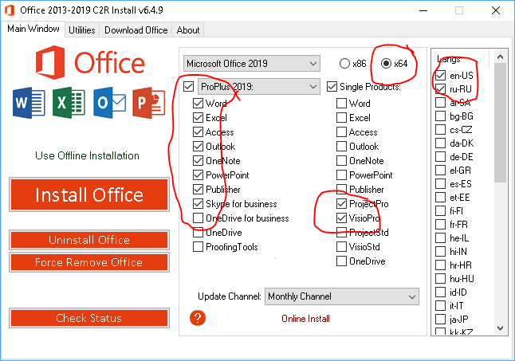

Source: [My OneNote](https://onedrive.live.com/redir?resid=B5BE86AE1FCCBFB5%2163344&page=Edit&wd=target%28Windows%2010.one%7C4cdd20c0-19ad-4684-83a4-e219018be944%2FMicrosoft%20Office%202016-2019%20RUS-ENG%20x86-%7C4a1e26e8-ae9f-4d29-bf42-aea54891702a%2F%29)

1. Download [7-zip](https://www.7-zip.org/download.html)
2. Turn off Virus & Threat Protection of Windows
3. Goto the [Ratiborus](http://forum.ru-board.com/topic.cgi?forum=2&topic=5693&start=2060) programs list > click **KMS Tools Portable** > download **KMS Tools Portable 25.12.2020 password 2020.7z**
4. Unpack and start **KMSTools.exe**
5. Select **Office 2019 Install**

You'll see:

1. Select: **Microsoft Office 2019**
2. Choose components (for example: **Word, Excel, PowerPoint**)
3. Architecture (**x64**)
4. Languages (**en, ru**)

## Activation

1. Open KMSTools.exe again
2. Choose **Utilities** tab
3. Check box: **Office reactivation task** (forever activation)
4. Select **Online KMS**
5. Press one of the active buttons (Word, Excel, PowerPoint)
6. Wait for the app to open
7. Close the open app
8. Press **Office RETAIL=>VL** button
9. Wait for the integration VL-keys
10. Press **Activate Office** button
11. Close KMSTools.exe and enjoy Office!
