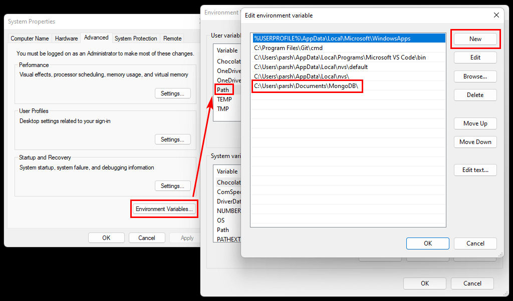

- Press **_WinKey_** 🪟 or click **_Start_** button
- Start typing on your keyboard: _env_
- Select **_Edit the System Environment Variables_**
- Click **_Environment Variables_**
- Double click **_Path_**
- Click **_New_**
- Enter the _path_ to the folder with the executable file
- Click **_OK_** a few times

