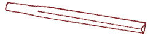

/kjuːˈniːɪfɔːrm/ kew-NEE-i-form or  
/kjuːˈneɪ.ɪfɔːrm/ kew-NAY-i-form or  
/ˈkjuːnɪfɔːrm/ KEW-ni-form

(from the Latin word for "wedge-shaped")

While a `clay` was soft, the person impressed the marks with a sharpened reed stylus. The cut of the reed stem is wedge-shaped.

The origins of writing appear during the start of the pottery phase of the <a href='https://en.wikipedia.org/wiki/Neolithic' class='external'>Neolithic (en.wikipedia.org)</a>, when `clay tokens` were used to record specific amounts of livestock or commodities.

## From counting to writingg

Originally, a token system was used to count items in Sumer and Elam. The token represent one object (one cow, one sheep etc).
The shape of the token reflected the object. Then the size and shape of the tokens are changed. Soon marks (fingerprints, notches, recognizable geometric shapes) began to appear on them.

These tokens were stored in round clay envelopes. To find out the number of livestock in the herd, you need to break the clay envelope and count the tokens.

By 3300 BC on the surface of the envelopes began to appear notches, reflecting the number of tokens.

Gradually, the tokens disappeared, only the impressed marks remained. And the round clay envelop turned into a flat tablet.

Read more: <a href='https://ru.wikipedia.org/wiki/%D0%9A%D0%BB%D0%B8%D0%BD%D0%BE%D0%BF%D0%B8%D1%81%D1%8C' class='external'>ru.wikipedia.org: Клинопись</a> and <a href='https://en.wikipedia.org/wiki/Cuneiform' class='external'>en.wikipedia.org: cuneiform</a>
