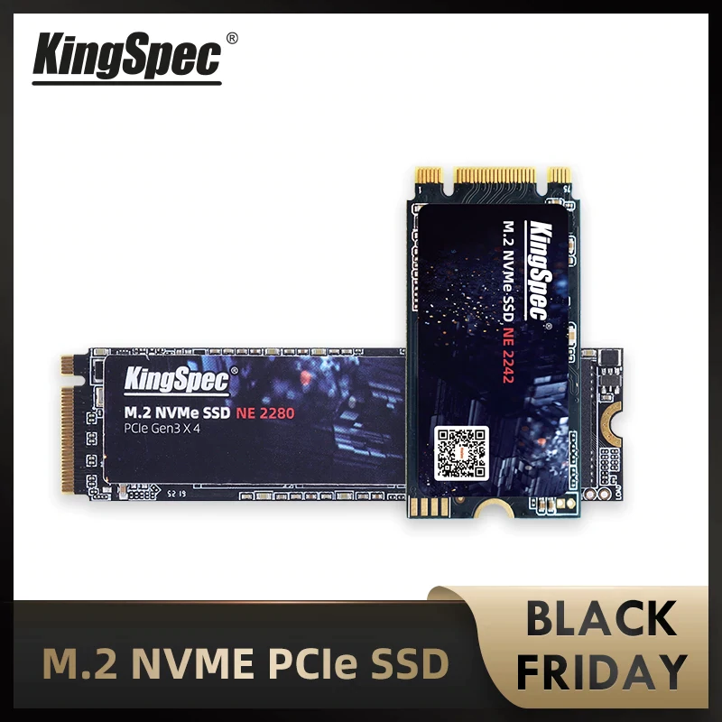
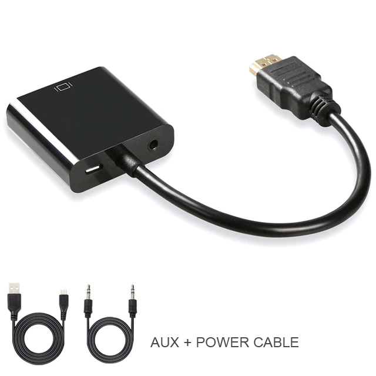

# Black Friday Orders
I just ordered (26.11.2020) three items on Aliexpress:  
    1. [M.2 NVMe SSD 512Gb - 4380₽](#m2-nvme-ssd-512gb---4380)  
    2. [Heat Sink -162₽](#heat-sink-for-m2-nvme-ssd---162)  
    3. [HDMI->VGA adapter - 380₽](#hdmi-vga-adapter-audio-power-plugs---380)

1. M.2 NVMe SSD 512Gb - 4380₽  
----

2. Heat Sink (for M.2 NVMe SSD) - 162₽
---- 

3. HDMI->VGA adapter (+audio, +power plugs) - 380₽
---- 

[My Aliexpress order list](https://trade.aliexpress.ru/orderList.htm?spm=a2g0o.cart.1000002.13.5dcd3c00IvXwEr&tracelog=ws_topbar&tsp=1606407098548)
